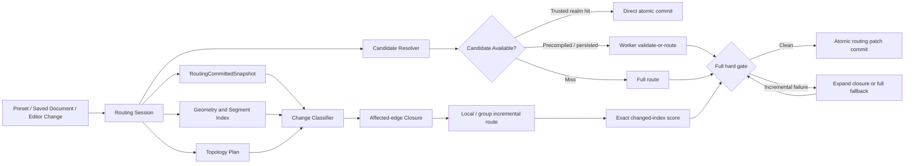

# Vizly 首次打开与增量调整统一路由方案

状态：质量、会话、拓扑、缺陷调度与 standalone 渲染协议主链已落地；共享主干保真和净空增强已推送 main `b2329827`；语义泳道本地已通过 Logistics、WMS Demand 与最新 WMS Process 连续切换，尚未提交；两张大图首屏资源预算本地通过，扩大回归、性能专项和最终完整矩阵尚未闭环
适用范围：`BaseReactFlow` Canvas 最终显示路由、内置标准图、用户保存图、节点拖拽及局部编辑
关联标准：`docs/edge-routing-goals.md`

## 0. 最新推进状态（2026-08-30）

### 当前交付检查点（2026-08-31，优先于下方历史记录）

当前状态表（优先于后续过程记录；本批正在提交，远端验证不沿用旧提交）：

| 范围 | 已验证 | 剩余交付条件 |
| --- | --- | --- |
| 会话、统一质量门禁、快照与渲染协议 | 主链已落地 | 随最终提交回归 |
| 泳道语义及连线质量 | Logistics、WMS Demand、WMS Process 浏览器 TB → LR → TB；8 项完整布局/Worker、657 项质量回归通过 | 多预设 16 布局、反向与连续切换最终矩阵 |
| 发布静态检查 | `verify:static`、TS6 已通过；本次分块调整 29 项回归及构建/bundle 通过 | 新提交远端 CI |
| 首屏资源 | 最终两图 smoke 通过：WMS `106/108`、`4838.8/4900KB`、`2999/6500ms`；企业架构 `107/108`、`4845.4/4900KB`、`2611/6500ms` | 随最终提交桌面/移动 smoke |
| 性能 | 原失败 WMS cold CI 组及布局组定向复验通过 | 最新远端冷路由 p95 `1750/1100ms` 未达标；本批正式 30 样本尚未执行 |
| 导出与 3D | PNG 文件级证据已有 | SVG/PDF 权限及真实文件验收；3D 偶发就绪超时定位 |

- 上一轮最终首屏复核实际失败：企业架构为 `109/108`，并非两图全过。请求清单证实节点样式订阅被拆为约 `0.2KB` 单独资源；现与其已有样式管理启动模块合并，不提前加载完整布线，预算与采样边界不变。上表数字来自修复后的生产构建。
- 三张标准图预编译产物已从生产构建复现成功；最新等价减算保持产物路径不变，仅 manifest source hash 更新。临时资源明细输出已恢复，诊断文件不进入提交。
- GitHub 计费已不是阻塞；`55bc1839` 的远端 CI/性能失败是已执行门禁的真实失败。先交付当前批次，再推进完整矩阵、正式性能和导出/3D；不做无证据的间距/端口美化。

后续收敛增量（以下证据优先于本节旧检查点）：

- 最新八个完整布局/Worker 回归全部通过（Logistics 四方向、WMS nested 两方向、WMS 实测尺寸两方向），测试执行 `55.50s`。这补齐了先前 WMS LR 超时的定向回归，仍不等同最终多预设 16 布局或正式性能采样。当前推进到预编译产物与发布门禁。
- 随后受影响质量 CI 组 18 文件、117 项通过；原失败 WMS 冷路由 CI 组 2 文件、8 项通过（测试执行 `21.57s`，不是单独路由 p95）。完整质量、安全与时限断言保留。下一步生成三张标准图预编译产物、静态发布门禁与提交，不宣称正式冷路由性能已达标。
- 最新完整路由质量组 97 文件、657 项通过。三张标准图由当前生产构建重新生成，路径产物完全一致，仅 manifest 的 routing source hash 更新；相关产物校验通过。TS6 兼容检查通过，完整静态发布门禁继续运行。
- `verify:static` 最终通过：类型/strict-core、零 Lint 错误及历史警告、架构、源码规模、DOM sink、secrets、依赖审计、生产构建和 bundle 均通过；JS 总量 `9375.49KB`，未提高预算。保留既有 LayoutOptimizer 静态/动态导入混用提示。最终预编译浏览器复现及两张大图首屏复核正在运行。

- **最新 WMS 生产浏览器复验通过**：完整 TB → LR → TB 保持显式泳道，44 条边的最终 SVG、商业净空、端点和节点测量几何一致性均通过。CPU 采样后新增两项等价减算：候选固定线段索引及排序分数复用；混合端点桥只重算移动边交叉，保留冻结边交叉。两组新计数器对照旧全扫描覆盖边界、随机、重复/自身线段、非法数值和快照隔离；29 项定向测试、额外 4 项单边计数测试通过，类型/架构/构建通过，全部 1076 测试文件已收录 CI。此为一次本地成功，尚非正式性能或全布局验收；扩大回归正在进行。
- 原全量 `test:ci` 已结束：49 shard 用时 `6052.1s`，47 组通过，WMS cold performance 与 routing-layout-strategies 两组失败。该运行跨越开发中的多个源码版本，不能当作最终提交门禁；当前针对失败组和受影响质量组复验，不重启无关的全量测试。

- 已核对 `55bc1839` 远端终态：CI 五组测试、覆盖率、静态与构建通过，企业架构 decoded `4903.4/4900KB` 导致 route smoke 失败；性能专项增量与交互通过，冷路由 p95 `1750/1100ms` 失败。计费不是当前阻塞。
- 已证明语义布局的输入顺序问题：同样的实测节点尺寸，原始 JSON 边顺序与生产切换后边顺序会让 Dagre 生成不同横轴槽位；使用真实请求边顺序可逐节点重现浏览器几何。显式泳道现按节点声明顺序稳定排列边，相关 5 项回归通过。该修复后 WMS Process 真实浏览器首次 TB 成功，TB → LR 仍因 30 秒 Worker 超时回滚；未将其记为完整交付。
- 首屏边界收敛已有生产证据：显示质量辅助函数不再经完整 `edgeRoutingPipeline` 桶导入，避免牵入重型布局依赖。29 项定向回归及生产构建通过；两张大图 smoke 均通过：WMS `4837.7KB`、`107/108`，企业架构 `4844.3KB`、`108/108`。这是当前本地构建证据，尚未推送；未提高预算。
- WMS LR 细分测量发现短端点修复累计约 `4.65s`，其中存在预算耗尽后仍提前计算全图 strict sweep 候选的问题。现仅在原有评估顺序真正访问该候选时计算，不改候选顺序、预算或质量判断；18 项回归通过，含 0/6/7/8/100 个 companion 的预算边界。最终 WMS LR 与生产连续切换仍在复验。
- 原全量测试已确认旧实现的 WMS 生产尺寸 LR 超时，其余该 shard 的 134 项通过；全量进程继续完成剩余 shard，不能记为全绿。临时性能测量输出已移除。当前类型、架构、CI 测试收录（1074 文件）通过；发布产物、完整矩阵与最终性能验收继续待闭环。

- main 与远端均为 `55bc183977f33f1402f1d5c935d58445ac519026`：已独立提交多预设矩阵扩展、终态错误优先于旧成功响应的诊断及安全回归；[CI 33371351246](https://github.com/cbhandsun/Vizly/actions/runs/33371351246) 与 [性能专项 33371351258](https://github.com/cbhandsun/Vizly/actions/runs/33371351258) 已触发，最终结果待核对。前批质量增强 `b2329827` 的 [CI 33367114674](https://github.com/cbhandsun/Vizly/actions/runs/33367114674) 五组测试、覆盖率、静态检查和构建均成功，但企业架构首屏 decoded `4903.4KB` 超过 `4900KB`，整体失败，移动 smoke 未执行。
- [性能专项 33367114713](https://github.com/cbhandsun/Vizly/actions/runs/33367114713) 增量和交互绘制通过；5 个独立冷路由样本 p95 `1917ms`，仍高于 `1100ms`。旧 CI 计费阻塞已解除，不能继续列为当前阻塞；既有 30 样本不代表本批已验收。
- 工作区语义实现采用全局流程层级、跨域邻接排序和分支通道错位；生产浏览器 Logistics 与 WMS Demand 的 TB → LR → TB 连续切换通过。最终 SVG、商业净空和测量几何一致性均通过；Logistics 首次 TB 单次提交 `887ms`、视觉稳定约 `1135ms`，只是单次观测，不作为 p95 达标证据。原四方向 Worker 测试虽通过，但随后发现其绝对坐标投影错误，不能沿用为生产等价证明，已改为复用真实投影重跑。
- 扩大验证发现 WMS Process（44 条边）TB 浏览器事务失败。测试原先把子节点改成绝对位置却保留 parentId，后续投影重复累加父级；因此原“横向约 2.4 万像素”的诊断与对应完整 Worker 失败报告作废。已增加语义输出到真实 Worker 投影的逐节点位置一致性回归。紧凑同层排布实验在修正后的测试中 WMS TB/LR 通过，但 Logistics TB/LR/RL 失败；该实验已撤回，原语义槽位与所有业务/质量回归保留，当前重新验证。未提交的实现不能按已交付计数。
- 首屏加载边界修复正在验证：将交互种子准备与完整布线实现分离，后者按需加载；同机初始对照 WMS `4903.8KB`、企业架构 `4910.4KB`，分离后分别 `4893KB`、`4899.5KB`，但企业架构资源数仍 `109/108`。尚需最终分块版本复验，未调整任何预算。相关布局测试 26 项、诊断与分块测试 33 项及架构门禁通过。
- 原有 49 shard 全量测试仍在同一进程继续，质量、Logistics、Worker 边界等已通过；未结束前不记全量成功。下一批顺序：解决 WMS Process 语义/质量共同约束和首屏资源门禁 → 重新生成预编译产物 → 扩大回归与静态门禁 → 分批提交推送。完整 16 布局多预设矩阵、正式性能采样、导出权限验收和 3D 偶发就绪超时继续保留待验。
- 本轮新增根因修复（尚未提交）：终端净空候选只检查对角拐点，漏掉整段出线贴近节点边缘；已补横向/转置回归，并只在原有简单候选无解时增加该类绕行，保留旧共享分支的简单路径。质量整组 96 文件、653 项通过；针对性布局/诊断 6 文件、50 项通过。一次并发构建期间的 WMS LR 用例曾超过 30 秒，后续通过不作为正式性能达标证据。类型、定向 Lint、架构、CI 测试覆盖和源码规模通过。
- WMS 真实浏览器故障仍未闭环：新增精确错误分类证明部分运行是 `worker-timeout`；后续能返回的运行仍为 `hard-quality-rejected`（端点未对齐、9 条最低净空违规、1 处 hairpin）。已在忽略的本地诊断文件中捕获内置预设实际 Worker 请求，Node 回放重现同样失败。新增无人工子域、实测尺寸的 WMS TB/LR 测试最初通过，但 `ensureMeasuredForNodes` 会重新测量文字并覆盖输入尺寸，因此仍受测试字体近似影响；已在尺寸计算边界使用生产实测值，最新 TB 通过、LR 超过 30 秒。实际请求与重建测试的流程轴相同，但横轴位置仍不同，正在定位布局输入与局部排序差异。不得宣称 WMS 仅剩性能问题。
- 已撤回无效的 startup 分块实验。最新正常生产构建的资源复验：WMS `4893.2KB`、`108/108` 通过；企业架构 `4901.2KB`、`110/108` 仍失败。预编译 manifest 尚未随未提交生产源码重生成，本批尚不具备完整发布条件。
- `55bc1839` 的 CI 已结束：五组测试及覆盖率通过；失败仍在 route smoke，静态/构建步骤通过。不能把本次脚本提交称为完整 CI 已恢复。全量本地测试继续沿用原进程，当前已进入属性面板组。

### 已有证据

- 已提交基线 `470625c9` 的 [CI 33334648950](https://github.com/cbhandsun/Vizly/actions/runs/33334648950) 成功，包含静态/构建/桌面与移动 smoke、五组测试、覆盖率和汇总检查。此前“计费导致任务无法启动”的记录已不代表当前状态。
- 泳道修复已提交并推送 main：`3a28721a`。保持显式 `domain-lanes`，不再用 compound ELK 的成功冒充泳道成功；连线种子允许进入 Worker 完整修复，但最终质量门禁不降低。Logistics 本地 TB → LR → TB 三次提交的 14 条最终 SVG 均通过完整几何与 48px 商业净空检查；164 项相关测试及 `verify:static` 通过。
- `3a28721a` 的 [CI 33362737849](https://github.com/cbhandsun/Vizly/actions/runs/33362737849) 已完成失败：routing、flow、UI、foundation 通过；core 的旧事务测试仍要求显式泳道失败后改成 compound，已定位为过期行为契约。后续测试修复保留普通 domain-dagre 的 fallback 覆盖，同时增加 TB/LR 显式泳道失败时不换策略、不写图、不记历史且释放预览的断言；14 项事务测试及定向 Lint 通过。smoke 的 warehouse-3d 就绪耗时 `4904ms` 超过 `4000ms`，资源数量和体积仍在预算内；该项尚未定位根因。不能把本地静态通过表述为完整 CI 通过。
- [Routing performance 33362737900](https://github.com/cbhandsun/Vizly/actions/runs/33362737900) 基于 `3a28721a`：交互绘制通过；5 个冷路由样本 p95 为 `1575ms`，仍高于 `1100ms` 预算。增量验收把 58 条阶段进度加 1 条最终响应计为 59 次响应；实际该事务为 1 次 Worker 启动、0 中止且 hard-clean。修复已提交并推送 `782c5f45`：只排除合法阶段通知，保留重复最终响应、错误和非法消息的失败断言；51 项采集/性能/几何测试、定向 Lint、源码规模、CI 测试覆盖和 secrets 门禁通过。[新专项 33363412243](https://github.com/cbhandsun/Vizly/actions/runs/33363412243) 已启动，最终结果待核对，不据此提前宣布性能达标。
- 第 19 节记录跨域业务排序试验及撤回原因；目前仅名称含义和稳定切换落地，业务阶段排序未完成。不得将既有 CI 或两方向单图抽样称为最新改动的完整矩阵验收。

### 按交付价值推进的批次

补充复验证据（2026-08-30 后续批次）：

- `782c5f45` 的专项 `33363412243` 已完成：增量路由和交互绘制通过，冷路由 p95 `1333ms` 仍超 `1100ms`。本批没有修改生产算法，不能将冷路由数值下降归因于采样计数修复；5 样本通过也不能代替正式 30 样本稳定性验收。
- 同提交的 CI 静态/构建/桌面与移动 smoke 整组通过；3D 就绪分别为 `3049ms`、`1602ms`。此前 `4904ms` 超时尚未定位根因，保留稳定性观察，不因一次复验通过称为已修复。
- `4d2ce3bb` 已推送显式泳道失败回滚回归；本地对应 CI 整组 98 文件、594 项通过。远端类型门禁发现测试错误访问 React setter 的 mock 内部字段，`59821085` 改用等价调用断言并补跑类型检查；[最新 main 完整 CI 33364102905](https://github.com/cbhandsun/Vizly/actions/runs/33364102905) 已成功，包含覆盖率。核对时本地与 origin/main 同为 `5982108591764e0f7a3f09d94e7c490cba8b8ad3`。
- 当前质量批次：在完整图 Worker 的最终事务内增加有界外围绕行与共享干线原子净空修复；保留手动端口约束，不修改增量冻结边，最终 exact 质量审核失败即返回原结果。早期候选通过了质量 CI shard 8 文件 41 项、`verify:static`、TS6 兼容和 1070 文件工作区 CI 覆盖门禁；三张预编译产物从生产构建重新计算并复现成功。随后新增“未锁定端口的共享组”测试发现候选顺序问题，现优先尝试共享干线原子修复，并在外围候选与最终接受前保护源/目标 buddy 身份。新增保护后的最终版本需重新完成对应验证，不沿用早期候选的通过结论。全量 49 shard `test:ci` 已启动但尚未结束；工作区仍含未提交的纵向语义失败用例，因此不宣称全量通过。构建仍报告既有 LayoutOptimizer 静态/动态导入混用警告。
- 语义试验的新证据：早期 TB 的外围绕行改动了 `edge-tms-visibility` 的出入口，拆开 TMS 源端与 Visibility 目标端两个既有共享组。仅检查几何、交叉和 48px 净空会漏掉这一点。增加 buddy 身份保护后，LR 仍通过，TB 安全回滚，说明默认语义布局还需要解决共同布局/布线问题，而不是放宽主干保真要求。未提交的原型和失败回归保留在工作区，下一批继续处理。
- 最终质量批次复验（2026-08-31）：14 项 perimeter/shared-stem 专项测试通过，覆盖源/目标两种共享角色；对应质量 CI shard 最新结果为 8 文件、45 项通过。最新 `verify:static` 全部通过（含类型、严格 Core、Lint、架构、安全审计、生产构建与 bundle），三张预编译路由已按加入 buddy 保护后的生产构建重新生成并通过校验。此次仅提交通用质量修复及其回归，不提交仍失败的语义试验；全量工作区测试与本批远端 CI 均需后续核对。

1. **稳定修复交付**：泳道修复和增量采样误报修复均已推送，main 完整 CI 已恢复；完成当前连线质量批次的扩大回归与发布门禁后独立提交。3D 就绪偶发超时保留稳定性待验项。不得提高预算或删除失败断言。
2. **业务语义与质量**：全局流程轴加跨域同层排序原型目前仍仅在测试 fixture 中，尚未接入默认泳道；增加共享主干保真检查后 LR 通过、TB 失败。下一批先解决 TB 主链与共享组共同约束，再接入生产策略，补齐显式域顺序、子域归属、反向布局、边界及实际浏览器连续切换；不将早期几何通过写成用户体验已经修复。不得重复进行无证据的端口枚举或间距试探。
3. **完整验收与性能**：最终版本覆盖 16 个布局方向、多预设、连续切换；针对专项失败先分类事务/采样问题与真实计算超预算，再做有证据的修复和复验。
4. **收尾**：确认 main/远端同步、CI 通过；补齐受限导出文件级证据，记录仍需产品权限的外部条件。共享干线美观、标签细节等非阻塞打磨后置。

下方保留历史收敛记录用于追溯；涉及旧性能数字、远端计费或尚未实施的架构描述，以本节与最新验证结果为准。

## 0.1 历史收敛状态（2026-08-27）

本轮 production-build 验收结论：

- routing version 15 已把 corridor lane/capacity 的原子预留投影为 edge-owned waypoint axes；只有已有节点净空风险的边会进入昂贵候选评分，不会因为拥有预留车道而宽泛提升 sibling/peer；
- final endpoint 审计现按精确 route signature 和 terminal policy 在单次 Worker 请求内有界复用；outer-port 与 measured-repair 共用同一 request-local hard-report session，并通过 changed-index parity 评估候选，最终独立 exact hard gate 仍保留；
- `post-render-residual` 与 `strict-primary-overlap` 已由显式 `RoutingDefectPlan` 调度，无对应缺陷时生成带父阶段、独占耗时和零扫描量的确定性 skip trace；
- 三张 v15 预编译产物可从同一 production build 重现；最新 WMS Demand Allocation 产物与 manifest 已按当前 routing source 重新生成，连续 production reproduction 通过，浏览器直接命中 `validated-candidate`，最终 signature 为 `route-v2:26:164:d8711ac2fc858b00`；同 identity 再开 WMS 为 `workerStart=0`；
- 最新 production-browser 矩阵覆盖三张 canonical preset、TB/BT/LR/RL、compound 和十类拓扑编辑，最终 SVG 的非正交、障碍命中、商业净空、严格交叉、非法 overlap、短 stub、tiny dogleg、hairpin、低对比、重复 marker/交互路径和标签节点相交均为零；
- 交互 trace 浏览器门禁已从允许 `95%` 覆盖收紧为至少 `99.5%`（仅为 SVG line-jump 长度测量保留 `0.5%` 下偏差）；共享全矩阵曾出现 selected paint `119.8ms` 调度离群值，新增 interaction-only fresh-profile 入口后连续 5 个 production 样本全部通过，light/dark/high-contrast 最大值分别为 `86.6/82.4/66.9ms`，每次完整 SVG 障碍与商业净空均为零。专用性能工作流现于 main push 跑 5 个、定时/手动跑 30 个独立样本，仍不放宽 `<=100ms` 门槛；
- 最新单轮真实拖拽中 TMS/WMS/L-OMS 的 local route 为 `117/59.6/110.4ms`，release-to-final 为 `295/144/224ms`，均满足 `<150ms/<300ms`；PNG 文件级导出通过，SVG 已验证 entitlement 前的安全预览，PDF 因产品 entitlement 未能做真实文件级导出审计；
- port-policy 与 container expand 被浏览器矩阵固定为 `incremental-route`、`fallbackLevel=none`；首次 container collapse 仍在同一 Worker job 内安全 full fallback，不降低任何最终门禁；
- `hidden`/`collapsed` 已进入受限 Worker 投影与协议校验，`collapsed:false` 与缺省 expanded 状态使用同一 identity；Worker 私有 session 可按完整 identity 回放返回旧 topology，仍重新校验 route signature、hard report、全图节点净空和冻结边界；
- 同 realm committed snapshot、外部候选和 Worker 私有 session 继续保持不同信任边界；未采用把主线程 committed candidate 重新透传给 Worker 的重复协议；
- 最新同一 production build、固定 viewport、全新浏览器 profile 的 30 个独立 Logistics 动态完整冷路由样本为 median `1675ms`、p95 `2011ms`、max `2078ms`；Worker compute p95 为 `1999.9ms`，页面/消息开销 p95 仅 `14ms`。30/30 均为一次 Worker start、零 abort、单次 `full-route-repaired` 最终事务，剩余耗时集中在 Worker 内 crossing sweeps、endpoint closure 与 finalizer 的 accepted 全质量候选。
- 后续针对同一 Logistics 冷路径的 5 个 fresh-profile 聚焦复验为 median `2346ms`、p95/max `2443ms`，Worker compute p95 `2421.7ms`、页面/消息开销 p95 `24.3ms`，5/5 仍为一次 start、零 abort、`full-route-repaired`。这证明仓库 `1100ms` 门槛和产品方可接受的约 `1.03s` 参考水平都尚未达到；两次高思考只读审计均未找到可在不减少 accepted 候选或降低质量门禁前提下安全落地的短优化，因此停止无证据性能试探，但不把该项标为完成。
- reconnect 排名改为稳定的流式 bounded top-K 后，最新 30 个全新 profile 的 production-browser 增量样本全部保持一次 Worker start、零 abort、零 full fallback；此前第 27 次 WMS 候选数漂移未再复现。L-OMS local/release-to-final/worker-to-final p95 为 `120.8/245/253ms`，WMS 为 `76.9/176/180ms`，均通过预算；TMS local route 通过 `<150ms`，release-to-final/worker-to-final p95 为 `315/317ms`，仅剩最终提交预算分别超出 `15/17ms`。TMS Worker compute p95 为 `310.8ms`，响应后的提交开销不是主因。
- 最新共享评估批次的类型、Lint、current/TS6/strict-core 类型、explicit-any、架构、源码规模、DOM sink、secrets、生产构建、bundle 和预编译产物门禁通过。GitHub Actions 已触发但所有 job 在执行任何 step 前被账户付款/额度阻止，不能作为代码失败或通过证据。
- Canvas display routing 与自动布局现共用同一个 Canvas-scoped Routing Session runtime、Worker ref 和提交 epoch；所有 route/validate/incremental/repair 请求经 Worker transport 后都收窄为 identity 已验证类型，hard-clean 响应缺少完整 session/commit receipt 无法进入主线程提交边界。底层 committed snapshot mutation 只能由 runtime 在当前 `commitJob` scope 调用，架构门禁禁止其他生产模块导入该 primitive。
- layout intent 现在在首次动态 import/ELK `await` 前同步取得 epoch，并贯穿 tree/force/domain route、hard-quality retry 和最终 React commit；异步等待期间一旦 display job 抢占，旧 ELK 结果不会启动 stage、不会写 snapshot，也不会更新 nodes/edges。commit callback 抛错会保留同一 retry epoch，正常返回才消费，避免 fallback 通过新建 job 覆盖外部更新。
- Canvas 与 standalone custom edge 现在只消费同一份 realm-local committed render proof；proof 同时绑定 Worker protocol、routing/visual version、完整 hard report 及其 digest、Worker session ref、output signature 和逐边 source/target/handle/renderer，以及 `computedPath`、`elkPath`、`treeRouting.points` 三组有界精确坐标快照。任一路由几何变化均 fail closed，style、marker、label、selection 变化不污染 proof；签发后修改原数组也不能扩大 authority。重建或克隆的 baseline、digest-only 旧快照和伪造 session 仍会被拒绝；生产代码中原始 authority issuer 只允许由 Canvas Routing Session adapter 导入，custom edge 不得导入 Worker、committed store、session runtime 或 `EdgeRoutingCoordinator`。
- 上述等值投影修复经 production build 复验：初始三图全部命中 `validated-candidate`，最终完整 SVG 障碍与商业净空审计恢复为零；其后正式 30-profile 增量矩阵保持 90 次初始事务与 90 次拖拽事务零 fallback、零 abort，三类 local-route 均通过预算。唯一未达标项为 TMS release-to-final/worker-to-final p95 `315/317ms`；一次后续 5-profile 预检降至 `299/300ms`，但 phase trace 未证明候选流水线发生确定性跳过，因此未把该波动当作已完成优化，也未放宽门禁。
- 新增独立 `Routing performance` 工作流：路由相关 main push 对冷路由和增量路由分别执行 5 个短样本；每周和手动任务默认分别执行 30 个全新浏览器 profile 样本。两个场景使用各自的 production build/preview job，输出 aggregate report artifact，避免冷启动、预编译和拖拽样本互相污染。工作流代码与契约测试已通过，本轮仍因 GitHub 账户计费无法取得远端执行结果。

因此，迭代 1–2 与迭代 5 的统一门禁、Routing Session 和渲染协议主链已经闭环；迭代 0、3、4 仍为部分完成。迭代 0 已具备独立、隔离和默认 30 样本的专用性能任务，但远端未能执行；迭代 3 的拓扑编辑、正确性、未受影响路径稳定性和零 fallback 已通过正式 30-profile 矩阵，只剩 TMS 最终提交 p95 超预算 `15–17ms`；迭代 4 的 corridor lane/capacity 分配和缺陷驱动阶段跳过已经落地，产品方接受约 `1.03s` 的动态完整冷路由参考水平，不再以原 `<750ms` 阻塞收敛，但当前正式样本仍高于仓库的 `1100ms` p95 门槛。迭代 5 已完成 routing-only 文档快照、旧 edge-owned 管线删除、Canvas layout/display 共享 runtime，以及 standalone 对完整 Worker protocol、hard report、routing version、session ref 和逐边几何身份的同源 proof 消费；digest-only 旧 proof 安全失效并回退，不会成为第二个路由事实来源。剩余外部阻塞为 GitHub Actions 计费/额度导致 job 未启动，以及 SVG/PDF entitlement 限制下的真实文件级导出审计；仍禁止通过跳过 accepted 修复阶段或降低质量门禁宣称完成。

## 0.2 首批实施记录（2026-07-27）

已经落地：

- 完整路由、最终修复和 hard report 已收敛到同一个 Worker job；
- 增加 L0 同 realm 已提交快照、可信 patch 解析和提交身份校验；
- 预编译 manifest 升级并加入 Logistics 路由产物与 preset 预取；
- 首次打开使用字体、节点实测和 quiet window 组成的自适应 geometry barrier；
- 增加 `incremental-route` 协议、previous/current identity 校验、change set、incident closure 和同 Worker 全量回退；
- 节点拖动期间暂停 Worker，松手后仅启动一次增量/回退事务；
- 增加阶段级 trace、候选 hard-report trace、Worker 启动/中止计数；
- 增量候选允许修复 incident edge 及扫掠区域内的必要 context edge，但闭包外 Edge 必须保持对象引用不变；
- context edge 只有在其路径确实穿过 changed node 障碍时才精准提升；一次事务最多提升8条，超量直接进入完整回退；
- strict crossing 联合搜索会从实际交叉线段边界推导端口切线候选，不再依赖固定图坐标或扩大整片 context；
- 首轮 incident reconnect 使用 beam=1，只有出现有证据的 residual strict crossing 才对对应 incident participant 使用有界 beam=8；
- 增加 `npm run verify:display-routing-browser`，在 production preview 中真实拖动 TMS/WMS/L-OMS，并核对 Worker response、phase trace、最终 route signature 和14条 SVG edge/path；
- 所有增量、严格交叉扩张和 context repair 候选仍执行整图 hard gate，未通过时不得提交。

当前 production-build 实测：

- Logistics 首次打开保持 1 次 Worker、0 次中止并命中 `validated-candidate`。当前独立 Chrome 冷样本多数约49–119ms，但也观测到208–1,388ms的 Worker/系统调度离群值，因此尚不能宣称稳定达到 `<150ms` p95；
- TMS/WMS/L-OMS 的真实 production 拖动分别保持初始 mutable 为6/4/5条，TMS仅精准提升1条穿过移动节点的 context edge，最终 affected 为7/4/5条；
- beam=1 后的代表性局部求解样本为 TMS 109ms、WMS 64.6ms、L-OMS 86.1ms，松手到最终提交上界分别为269/144/134ms；连续冷样本仍出现 WMS 319.2ms、L-OMS 173.7ms 的局部调度离群值，稳定 p95 仍需更多样本和 Worker 调度优化；
- 三类拖动均返回 `incremental-route`、`fallbackLevel=none`、0 abort；整图 hard report 的正交、障碍、端点、strict crossing、异常 overlap、stub、dogleg 和 hairpin 均为零，未提交任何降级路径。

因此首个实施批次已经闭环首次打开的可信候选路径和三类关键节点的增量正确性。下一阶段重点不是降低连线标准，而是补足更广的 arbitrary drag/尺寸/拓扑回归、独立 SVG 几何审计，以及通过 Worker ready handshake、预热前移和采样隔离收敛冷启动与增量 p95。

## 1. 执行摘要

Vizly 已经具备高质量路由所需的大部分基础能力：

- Worker 内完整路由与最终修复；
- 正交、端点、节点避障、严格交叉、异常 overlap 等硬门禁；
- geometry identity、output route signature 和 routing version；
- 内存/持久化候选与预编译路由产物；
- changed-index 精确质量评分；
- 障碍命中缓存；
- 另一套 edge-level 路由中的 dirty-edge、空间索引、Visibility Graph、bus/trunk、并行 Worker 和缓存能力。

当前主要问题不是缺少某个 repair，而是这些能力分散在两条路由路径中：

1. Canvas 最终显示路由质量高，但首次打开和节点松手后主要按整图冷路由处理。
2. `EdgeRoutingCoordinator` 有增量和空间索引基础，但不是 Canvas 最终路由与提交的事实来源。
3. 标准图预编译能力已经存在，但目前只覆盖少量目标。
4. 完整路由仍是较长的修复器流水线；即使小图，也可能重复执行全图评分与修复。
5. Logistics 当前需要主线程发起第二次 `repair` 才能 hard-clean，而预编译生成器只接受单次 hard-clean `route/validate-or-route` 响应。
6. 现有内存缓存会吸收从 `localStorage` 读取的条目，不能据此区分“本 realm 可信结果”和“外部持久化候选”。

本方案统一解决两个用户场景：

- **首次打开**：运输已经通过完整门禁的路由结果，运行时只做可信层级对应的快速校验；真正 miss 时才完整路由。
- **增量调整**：保留上一版 hard-clean 路由快照，根据变化集合只重算受影响边；最终仍执行完整硬门禁，失败才扩大范围或进入全量兜底。

核心原则是：

> 性能来自缩小计算范围和复用已验证结果，质量来自统一硬门禁；不得通过降低门槛、增加不受控缓存或显示低质量首帧换取速度。

实施前必须先满足三个结构条件：

1. 完整路由、最终修复和 hard report 在同一 Worker job 内形成一个最终事务。
2. 主线程可提交快照、Worker 私有会话状态和外部持久化候选使用不同类型与信任边界。
3. 增量路由区分“允许修改的边”和“只参与评分的上下文边”，不能把所有同源/同目标 sibling 都扩成可修改边。

## 2. 目标与非目标

### 2.1 目标

1. 内置标准图首次打开接近即时，不重复执行完整路径搜索。
2. 同一运行时内再次打开相同几何时，可以直接复用可信 hard-clean 快照。
3. 跨会话缓存、预编译产物和导入快照始终经过边界解析与 Worker 校验。
4. 节点拖拽、尺寸变化、折叠展开和局部增删后，只重算受影响边及其必要闭包。
5. 未受影响边保持端口、主通道、bus trunk、标签位置和路径签名稳定。
6. 增量结果与完整评分逐字段一致，最终提交仍满足全部硬门禁。
7. UI 只原子提交一次最终结果；首次打开不展示低质量临时连线再跳变。
8. 路由性能可以按阶段测量，性能优化和质量断言在同一次 production-build 样本中完成。
9. 最终把 Canvas 路由与 edge-level 路由收敛到共享的路由会话和基础设施。

### 2.2 非目标

1. 不在第一阶段整体替换现有路由算法。
2. 不把 React Flow live handle 坐标作为 Worker 最终路径的第二套真相。
3. 不允许未校验的 `localStorage`、云端数据、导入内容或预编译产物直接进入 UI。
4. 不通过延长超时、增加 repair pass 或降低质量阈值掩盖失败。
5. 不要求首次实施就统一所有 standalone custom edge；先保证 Canvas 最终路由单一所有权。

## 3. 当前架构与瓶颈

### 3.1 Canvas 最终显示路由

主要入口：

- `src/core/components/shared/useBaseReactFlowDisplayRouting.ts`
- `src/core/components/shared/baseReactFlowDisplayEdges.worker.ts`
- `src/core/components/shared/baseReactFlowDisplayFullRoutePipeline.ts`
- `src/core/components/shared/baseReactFlowDisplayFullRouteQualityPhase.ts`
- `src/core/components/shared/baseReactFlowDisplayFullRouteStrictPhase.ts`
- `src/core/components/shared/baseReactFlowDisplayFullRouteTerminalPhase.ts`

现有优点：

- Canvas 明确拥有最终显示路由。
- 路由 patch 与最新业务 Edge 合并，不用旧缓存覆盖样式或业务 metadata。
- Worker 结果绑定输入 geometry digest 和输出路径签名。
- 最终 hard-clean 才允许提交和写入缓存。
- Worker 支持预热、取消、超时和响应边界解析。

现有瓶颈：

- 首次打开的 cache miss 进入完整修复流水线。
- Logistics 等图的第一次 Worker full route 可能不 clean，主线程会再发送一次 `repair`；这既增加延迟，也使预编译生成器无法捕获单一最终响应。
- 节点拖拽结束后，新 geometry signature 无法命中旧快照，通常再次进入完整路由。
- `nodeDragFallbackIds` 只控制拖拽显示，没有传入 Worker 作为增量变化集合。
- 最后一次成功路径仅作为当前 signature 的显示 patch；几何变化后没有被保留为增量 baseline。
- 当前 memory cache 可能来自 runtime Worker，也可能来自 `localStorage` 回填，缺少来源证明，不能直接实现 L0 零 Worker 提交。
- 预编译 loader 只按最终 `inputSignature` 索引；在节点完成实测几何前，无法按 preset ID 提前预取 artifact。
- 完整质量阶段包含多次端点修复、trunk 合成、全局 waypoint refinement、overlap、strict crossing 和 polish。
- 当前主要暴露总 `routeMs`，缺少阶段耗时和候选数量，无法持续定位真实热点。

### 3.2 Edge-level 路由

主要入口：

- `src/core/services/EdgeRoutingCoordinator.ts`
- `src/core/services/edgeRoutingIncrementalState.ts`
- `src/core/workers/pathfinding.worker.ts`
- `src/core/workers/core/EdgeRoutingWorker.ts`
- `src/core/workers/core/VisibilityGraphRouter.ts`
- `src/core/algorithms/SpatialIndex.ts`

已有能力：

- node-to-edge、source-to-edge、target-to-edge 索引；
- dirty edge 与 bus peer 扩展；
- Visibility Graph、grid、A*、空间索引；
- Worker module cache、路径缓存和并行 Worker；
- bus/trunk 与通道分配。

问题：

- Canvas ownership 下，edge-level 结果不是最终显示路由的事实来源。
- `IncrementalRoutingManager` 当前没有参与 Canvas 最终路由决策。
- 两套管线分别维护调度、缓存、Worker 和修复语义，增加了重复计算和行为漂移风险。
- Canvas 不能直接实例化或调用 `EdgeRoutingCoordinator`；应抽取 Worker 私有的纯算法与索引模块，避免重新引入双 Worker 和主线程 bundle 膨胀。

因此不应再创建第三套路由器。正确方向是抽取共享能力，形成统一的 `RoutingSession`。

## 4. 统一目标架构



### 4.1 单一事实来源

最终可见路径只能来自：

```text
Routing Session
  → Worker result
  → routing patch merge
  → exact hard gate
  → atomic commit
  → renderer
```

Renderer 不得基于 live handle 小数差异擅自替换已通过门禁的 Canvas-owned 路径。Renderer 只允许：

- 视觉样式；
- marker、label 和选中态；
- 不改变几何语义的显示处理；
- standalone edge-owned 模式下的安全兜底。

任何会改变 path、handle 或 routing metadata 的处理都必须重新生成 output route signature 并执行硬门禁。

## 5. 统一领域模型

建议在 `src/core/routing/session/` 建立纯类型与纯函数模块。

### 5.1 Geometry Identity

```ts
type RoutingGeometryIdentity = Readonly<{
  routingVersion: string;
  inputSignature: string;
  geometryDigest: string;
  environmentContract?: string;
}>;
```

完整 identity 至少覆盖：

- routing version；
- node id、type、parent；
- 绝对位置、实测宽高；
- edge id、source、target、type；
- source/target handle；
- 人工 handle、lock、port policy、quality intent；
- smart-edge 配置和必要布局方向；
- 会改变实测几何的字体/渲染契约。

颜色、marker、className、选中态和普通业务 metadata 不进入路由 identity，由 routing patch 合并到最新 Edge。

### 5.2 三类快照与状态

不能用一个 `RoutingSnapshot` 同时承担主线程提交、Worker 增量上下文和外部持久化。现有精确质量 evaluator 含有 `Symbol`、owner、parent 链和 Edge 引用，不适合 structured clone 或持久化。

#### 5.2.1 主线程已提交快照

```ts
type RoutingCommittedSnapshot = Readonly<{
  identity: RoutingGeometryIdentity;
  nodes: readonly RoutingNodeGeometry[];
  sourceEdges: readonly RoutingEdgeInput[];
  patches: readonly RoutingPatch[];
  outputRouteSignature: string;
  hardReport: RoutingHardReport;
  createdAt: number;
}>;
```

创建条件：

- 只能由本次 JS realm 内的 Worker hard-clean 最终响应创建；
- `nodes` 与 `sourceEdges` 只保留有界、可序列化的路由输入投影，用于前后 diff 和 Worker 重建；
- routing patch 已合并到最新 source Edge；
- 合并结果与 Worker 报告的 output signature 完全一致；
- final commit 已成功；
- copy-in/copy-out，禁止调用方突变；
- 容量有界并使用确定性 LRU/FIFO。

这里的 `RoutingHardReport` 是只含有界 boolean/numeric/count 字段的协议 DTO，不是带 `Symbol` 私有状态的 evaluator 对象。

现有 `displayEdgesMemoryCache` 不能直接作为该快照来源，因为从 `localStorage` 读取的候选也会被写入该 Map。持久化候选只有在本次 Worker 校验并成功提交后，才能生成新的 `RoutingCommittedSnapshot`。

#### 5.2.2 Worker 私有会话状态

```ts
type RoutingWorkerSessionState = {
  committedIdentity: RoutingGeometryIdentity;
  nodes: readonly RoutingNodeGeometry[];
  edges: readonly RoutingEdgeGeometry[];
  topologyPlan: RoutingTopologyPlan;
  obstacleIndex: RoutingObstacleIndex;
  segmentIndex: RoutingSegmentIndex;
  qualityContext: RoutingQualityContext;
  hardReport: RoutingHardReport;
};
```

约束：

- 只存在于 Display Worker 内，不进入主线程协议；
- 复用当前 hard-clean baseline 的质量分解、edge-pair contributions、障碍索引和 topology；
- 以 session ID、committed geometry identity 和 output route signature 共同绑定；
- 增量请求使用 `baselineIdentity` 命中该状态，成功后再原子替换为 `nextIdentity` 对应的新状态；
- Worker 终止、版本变化、baseline identity/signature 不匹配或输入结构变化时失效；
- Worker 重启后允许由主线程 committed snapshot 重建，但不能信任外部保存的内部状态。

#### 5.2.3 外部持久化候选

```ts
type PersistedRoutingCandidate = Readonly<{
  routingVersion: string;
  inputSignature: string;
  geometryDigest: string;
  outputRouteSignature: string;
  patches: readonly RoutingPatch[];
}>;
```

适用于预编译 artifact、`localStorage`、云端文档和导入快照。它始终属于外部输入：

- 必须有界 parse、validate、sanitize；
- 只提取 routing-owned 字段；
- 必须与当前 source graph 合并；
- 必须由 Worker 在当前实测几何上执行完整硬门禁；
- 不得携带 topology、quality context、内部索引或运行时对象引用。

### 5.3 Change Set

```ts
type RoutingChangeSet = Readonly<{
  reason:
    | 'node-drag'
    | 'node-resize'
    | 'node-add'
    | 'node-remove'
    | 'edge-add'
    | 'edge-remove'
    | 'port-policy'
    | 'container-change'
    | 'layout'
    | 'unknown';
  changedNodeIds: readonly string[];
  changedEdgeIds: readonly string[];
  topologyChanged: boolean;
  geometryChanged: boolean;
}>;
```

外部传入的 ID 只是提示，Worker 必须用前后 geometry snapshot 做一次真实 diff：

- 漏报、重复、非法、越界或超量时退回自动 diff；
- 无法证明 changed indexes 完整时，不得走可信增量快路；
- topology 变化必须扩大影响范围。

### 5.4 Routing Patch

只允许包含路由器拥有的字段：

```ts
type RoutingPatch = Readonly<{
  edgeId: string;
  sourceHandle?: string | null;
  targetHandle?: string | null;
  type?: string;
  computedPath: readonly RoutingPoint[];
  routingMetadata?: Readonly<Record<string, boolean | number | string>>;
}>;
```

禁止携带：

- label 内容；
- style、marker、className；
- selected、hidden、animated；
- 用户内容和 Provider/Auth 配置；
- 任意业务 metadata。

### 5.5 Routing Trace

```ts
type RoutingPhaseTrace = Readonly<{
  phase: RoutingPhaseName;
  durationMs: number;
  candidateCount: number;
  changedEdgeCount: number;
  resolution: 'hit' | 'skip' | 'accepted' | 'rejected' | 'fallback';
}>;
```

Trace 只能记录：

- 阶段名；
- 聚合耗时；
- 节点/边/候选数量；
- cache hit/miss；
- fallback 原因代码；
- hard report 数值字段。

不得记录完整路径、节点内容、label、token、headers 或用户数据。

## 6. 首次打开方案

### 6.1 候选信任层级

| 层级 | 来源 | 是否可直接提交 | 必须执行 |
|---|---|---:|---|
| L0 | 当前 JS realm 内、同 identity 的 hard-clean snapshot | 是 | schema/identity 引用检查 |
| L1 | 构建时预编译 artifact | 否 | parse、sanitize、merge、Worker 完整硬门禁 |
| L2 | `localStorage`、云端文档、导入快照 | 否 | 有界 parse、sanitize、merge、Worker 完整硬门禁 |
| L3 | 无候选或候选失效 | 否 | 正式完整路由与完整硬门禁 |

只有 L0 可以 `workerStart=0`。L1/L2 必须至少进入一次 `validate-or-route` Worker job。

L0 必须来自独立的 `RoutingCommittedSnapshot` store，不能通过“现有 memory cache 命中”推断。现有 cache 可能由 `localStorage` 回填，来源已经丢失；把它直接升级为 L0 会绕过外部候选校验。

### 6.2 内置标准图

#### 6.2.1 预编译前置条件

当前 Logistics 首次 full route 可能需要主线程发起第二次 `repair` 才能 hard-clean，而生成器明确拒绝捕获这种后续响应。因此第一步不是直接把 Logistics 加进 targets，而是把以下过程收敛到同一 Worker job：

```text
full route
→ finalizer
→ hard report
→ 不 clean 时执行 measured repair
→ 再次 hard gate
→ 返回一个最终响应
```

建议新增 `routeResolution: 'full-route-repaired'`，并让主线程、响应 parser、预编译 capture 和测试共同识别。该响应仍必须：

- 绑定原始 request ID；
- 使用当前请求的 source graph；
- 返回一次最终 edges/patches；
- hard-clean；
- 只有一个 final commit；
- 不暴露中间失败候选。

构建阶段：

```text
standard preset
→ production preview browser
→ wait for stable measured geometry
→ one final Worker transaction
→ full hard gate
→ routing-only artifact
→ manifest + source hash + geometry digest + output signature
```

运行阶段：

```text
识别 preset ID
→ 并行加载 preset、artifact、字体和 Worker
→ measured geometry ready
→ validate-or-route
→ atomic final commit
```

第一批增加：

- `src/data/standardized/LogisticsStandardData.json`
- 后续按使用频率扩展 `LogisticsPlanningStandardData.json` 和其他标准图。

只有 Logistics 的单 Worker 最终事务可以被生成器稳定捕获后，才把它加入目标列表。

目标配置入口：

- `scripts/lib/precompiled-display-route-targets.mjs`

生成与验证：

```bash
npm run generate:precompiled-routes
npm run generate:precompiled-routes:check
npm run check:precompiled-routes
```

### 6.3 并行候选加载

当前候选加载不应等到节点测量完成后才开始。应在 preset/document identity 可用时：

1. 启动 preset 数据加载；
2. 启动对应 artifact 或保存快照加载；
3. 预热 Worker；
4. 启动字体和必要样式加载；
5. 等待稳定几何屏障；
6. 把已经加载好的候选交给 Worker。

当前生成 loader 只按 `inputSignature` 索引，而该 signature 必须等实测 geometry 完成后才能计算。生成器需要额外输出不具备信任含义的预取索引：

```ts
type PrecompiledRoutePrefetchDescriptor = Readonly<{
  presetId: string;
  sourceHash: string;
  load: () => Promise<unknown>;
}>;
```

`presetId` 只用于提前下载，不能决定候选可用性。geometry ready 后仍必须使用 input signature、geometry digest、source hash、routing version 和 output signature 完成正式 lookup 与 Worker 校验。

候选 Promise 按 preset/source hash 有界缓存；失败、超时或版本不一致安全返回 miss。preset loader 不应反向依赖重量级路由实现，预取应由 diagram route/composition 层调用轻量 registry API。

Display Worker 预热当前已经存在，本阶段只验证它继续与 preset/artifact 加载并行，不重复实现第二套预热机制。

### 6.4 稳定几何屏障

逐步用确定性条件替代无条件固定等待：

- 所有可见业务节点都有有限的绝对位置和实测宽高；
- 容器尺寸有效；
- 字体 ready；
- 没有待提交布局；
- 连续两帧完整 geometry digest 相同。

仍保留最大有界 settle timeout，处理 ResizeObserver、字体和复杂布局抖动。目标是稳定时立即启动，非稳定时吸收变化后只启动一次。

该优化必须排在阶段 trace 和单 Worker 最终事务之后。当前已有约 `320ms` 的 schedule settle；在没有 start/abort 和 geometry digest 变化证据前，不直接删除或缩短它。

### 6.5 用户保存图

保存图表时，同时保存：

- source graph；
- routing version；
- geometry digest；
- output route signature；
- routing-only patches；
- hard-clean 生成标记。

加载时，保存标记只是候选来源信息，不代表可信。必须重新 parse、sanitize，并在当前实测几何上由 Worker 校验。

几何只发生局部变化时，不直接丢弃候选进入全路由。保存候选必须先在当前实测几何上完成 Worker 校验并形成新的 `RoutingCommittedSnapshot`，之后该 committed snapshot 才能作为增量 baseline；外部候选本身不能直接进入增量会话。

## 7. 增量调整方案

### 7.1 交互状态

拖拽流程：

```text
drag start
→ freeze last hard-clean snapshot
→ incident edges use lightweight endpoint-driven fallback
→ no final Worker route during pointer movement
→ drag stop
→ build ChangeSet
→ incremental Worker route
→ full hard gate
→ one atomic final commit
```

拖拽中的轻量路径是明确的 interaction-only 状态，不得写入 snapshot、持久化缓存或最终 route signature。

### 7.2 影响范围闭包

影响范围必须区分两种集合：

```ts
type RoutingAffectedClosure = Readonly<{
  mutableEdgeIds: readonly string[];
  contextEdgeIds: readonly string[];
  escalationLevel: 'incident' | 'peer' | 'group' | 'spatial' | 'full';
}>;
```

`mutableEdgeIds` 是本轮允许改变 path/handle 的边，初始只包含：

1. changed node 的直接关联边；
2. 显式 changed edges；
3. topology 变化时明确新增、删除或端口策略变化的边。

`contextEdgeIds` 不允许改变，只作为障碍、交叉、overlap、bus 和 corridor 评分上下文：

4. 同 source/target 的 sibling；
5. 同一 bus/trunk/sector group 的 peer；
6. 路径与节点旧矩形、新矩形或移动扫掠矩形相交的边；
7. 路径与局部重路由 ROI 相交的边；
8. 容器移动时穿越相关边界或属于相关子树的边。

只有候选明确破坏某个 peer 的共享 trunk、lane order、sector 或 corridor 容量时，才把该具体 peer 从 context 提升到 mutable。不得因为共享 endpoint 就一次性修改全部 sibling。

Logistics 当前拓扑验证：

| 移动节点 | 直接关联、初始 mutable | 按现有宽泛 sibling 规则扩展 | 全图边数 |
|---|---:|---:|---:|
| TMS | 6 | 12 | 14 |
| WMS | 4 | 9 | 14 |
| L-OMS | 5 | 7 | 14 |
| Visibility | 4 | 13 | 14 |
| BMS | 2 | 8 | 14 |

当前精确增量评分上限为8条变化边。incident-only mutable 集合可以覆盖这些关键节点；直接复用现有宽泛 sibling 扩展则会使 TMS、WMS 和 Visibility 接近整图重算。

闭包必须有界。超过以下任一条件进入分组或全量路由：

- mutable edge 数超过精确增量上下文上限；
- topology 大范围变化；
- bus group 大范围重建；
- 多轮扩展仍未 hard-clean；
- 输入结构不可信或 identity 无法建立。

### 7.3 四级增量策略

| 策略 | 使用条件 | 行为 |
|---|---|---|
| `keep` | 路径仍满足当前硬约束且不进入 ROI | 完全保持路径、端口和 metadata |
| `segments-as-needed` | 端点移动，原 corridor 仍安全 | 只重连端点附近2～3段 |
| `path-as-needed` | 原 corridor 局部失效 | 保留端口/bus intent，在有界 ROI 内重算 |
| `reroute` | topology、port policy 或 bus sector 变化 | 重算整条边或相关组 |

### 7.4 局部端点重连

普通节点移动优先：

1. 保留未移动端的 handle、末段和中间 corridor；
2. 在移动端节点边界重新选择允许的 port candidate；
3. 尝试原 side 的稳定 anchor；
4. 尝试相邻合法 side；
5. 在端点附近建立一至三个正交段接回原 corridor；
6. 对候选执行端点、节点、交叉、overlap、stub、hairpin 和稳定性评分；
7. 局部候选失败才升级为整边重路由。

### 7.5 bus 与 corridor

同源/同目标边不能只按 endpoint ID 合并。应按以下 key 建立 topology group：

```text
endpoint + side + directionSector + flowRole + groupId
```

增量更新时：

- 同 sector peer 默认作为冻结上下文，只有共同 trunk 必须移动时才提升为 mutable 并重算；
- 不同 sector 不因同源/同目标强行合并；
- bridge edge 可以同时属于 O2M 和 M2O 两个身份；
- corridor 保留 lane order、容量和最小 gap；
- 只有受影响 group 允许改变 trunk。

### 7.6 精确增量评分

增量候选必须复用：

- `createEdgePathQualityEvaluationContext`
- `createDisplayObstacleHitContext`
- 已分解的 edge segments 和 edge-pair contributions
- terminal validation snapshot

规则：

- 单边或少量 mutable edges 只重算 changed edge 和相关 edge pairs；
- context edges 保留原引用和路径，只参与 affected pair 评分；
- accepted candidate 后更新父子增量状态；
- 最终质量对象必须逐字段等于全量 scorer；
- 调用方无法完整证明 changed indexes 时退回全量评分；
- 最终提交仍执行完整全图 hard gate，增量评分只是候选搜索加速器。

### 7.7 失败升级

```text
local terminal reconnect
→ affected edge reroute
→ bus/sector group reroute
→ spatial closure expansion
→ full route
→ explicit failure
```

每级必须：

- 有明确候选预算；
- 不降低硬门槛；
- 不吞掉错误；
- 不把失败候选写入缓存；
- 输出无敏感内容的 reason code。

## 8. Worker 协议

建议把显示路由 Worker operation 扩展为：

```ts
type DisplayRoutingOperation =
  | 'route'
  | 'validate-or-route'
  | 'incremental-route'
  | 'repair';
```

迁移完成后，主线程正常路径不再通过第二个 `repair` request 补救第一次 full route。`repair` operation 暂时保留给兼容测试和受控诊断；正式 `route` 与 `validate-or-route` 必须在一个 Worker job 内完成 full route、必要 measured repair、最终 hard gate 和单一响应。

`incremental-route` 请求包含：

- 当前 source nodes/edges 的安全投影；
- 上一版 committed snapshot 的 `baselineIdentity` 和 output route signature；
- 本轮输入的 `nextIdentity`；
- 上一版 committed snapshot 的 hard-clean routing patches；
- 上一版可序列化 geometry snapshot；
- sanitized `RoutingChangeSet`；
- 初始 mutable edge IDs；
- quality mode、候选预算和 timeout；
- request ID。

quality context、拓扑索引、edge-pair decomposition 和空间索引不进入请求。Worker 仍存活且 `baselineIdentity`、baseline output signature 与 session state 同时匹配时，直接复用 `RoutingWorkerSessionState`；`nextIdentity` 只用于约束本轮输入和绑定成功后的新状态。Worker 重启或 session miss 时，才用 committed snapshot 的 geometry/patches 重建内部状态。

响应包含：

- routing-only patches；
- hard report；
- output route signature；
- 与请求一致的 next geometry identity；
- route resolution；
- affected edge count；
- bounded phase trace；
- fallback level。

边界约束：

- ID、数组、点数、坐标、对象深度和字符串长度有上限；
- 拒绝 `NaN`、`Infinity`、负尺寸和超大坐标；
- operation 使用判别联合解析；
- 未知字段不进入业务模型；
- 不新增显式 `any`；
- abort、timeout、messageerror 和 stale response 必须显式处理；
- repair/full fallback 必须在同一 Worker job 内完成，减少跨消息重复投影和状态重建；
- Worker response parser 必须有界校验 phase trace、resolution 和 fallback level；
- 不得把 `RoutingWorkerSessionState` 或 symbol-backed quality state structured clone 到主线程。

## 9. Routing Session 生命周期

建议状态机：

```text
idle
→ candidate-loading
→ waiting-geometry
→ validating
→ incremental-routing
→ full-routing
→ hard-gating
→ final-applied
```

失败状态：

```text
candidate-rejected
incremental-expanded
incremental-fallback-full
timeout
stale
final-quality-rejected
```

状态要求：

- 同一稳定 geometry 最多一次正式 Worker start；
- 一次 route request 内部可以执行 full route 和必要 measured repair，但只能返回一个最终响应；
- 新 identity 自动取消旧请求；
- stale response 不得提交；
- final commit 原子更新 handle 与 path；
- `RoutingCommittedSnapshot` 只在 final-applied 且 hard-clean 时创建；
- `RoutingWorkerSessionState` 只保留在 Worker 内，并与 committed output signature 绑定；
- 增量请求只能用 `baselineIdentity` 命中旧状态，响应的 next identity 不匹配时按 stale/invalid response 拒绝；
- node drag fallback 只在新 final commit 后清除；
- full failure 时保留明确交互 fallback，并输出可诊断状态，不伪装成功。

## 10. 性能观测

### 10.1 阶段

至少记录：

```text
candidate-load
candidate-parse
geometry-index
topology-plan
seed
incremental-closure
local-route
global-route
endpoint-repair
overlap-repair
strict-repair
terminal-finalize
hard-gate
patch-merge
final-commit
```

### 10.2 指标

- navigation 到 `final-applied`；
- geometry ready 到 Worker start；
- Worker 总耗时；
- 每阶段耗时；
- candidate count；
- affected edge count/ratio；
- closure expansion count；
- full fallback count；
- worker start/abort/final commit；
- cache trust level；
- hard report 所有字段；
- unrelated path signature retention；
- route output signature。

开发态可通过现有 `__vizlyBaseReactFlowDisplayRouting` 暴露聚合字段；生产路径只进入安全、脱敏的性能监控。

## 11. 性能与质量预算

初始目标：

| 场景 | 目标 |
|---|---:|
| 标准 Logistics 预编译 Worker 校验 p95 | `< 150ms` |
| Logistics geometry ready 到 final commit p95 | `< 250ms` |
| Logistics 动态完整冷路由 | 接受约 `1.03s` 的参考水平；原 `<750ms` 不再作为阻塞门槛，仍需专用任务报告 median/p95/max 且不得降低质量门禁 |
| 同 realm、同 identity 再次打开 | `workerStart=0`，接近即时 |
| 单节点拖拽、影响边不超过8条 p95 | `< 150ms` |
| 拖拽松手到 final commit p95 | `< 300ms` |
| 增量进入完整兜底比例，初期 | `< 5%` |
| 增量进入完整兜底比例，稳定后 | `< 1%` |
| 未受影响边路径签名保持率 | `100%` |
| 冷加载 Worker 生命周期 | `start=1, abort=0, finalCommit=1` |

所有场景同时满足：

- 非正交段 `0`；
- 端点 detached/unanchored `0`；
- 业务节点命中 `0`；
- 普通严格交叉 `0`；
- reverse/unrelated/unexplained overlap `0`；
- short endpoint stub `0`；
- tiny dogleg `0`；
- hairpin `0`。

预算是演进目标，不允许通过放宽硬门禁制造绿色结果。首轮实施前必须先采集三次独立 production cold profile，确认目标与设备基线。当前生产样本约为1.17秒、现有 Logistics 测试预算为3秒；动态完整冷路由预算应在 phase trace 证明热点和优化收益后逐步收紧。

## 12. 分阶段实施

### Phase 0：基线与可观测性

实施状态：单 Worker 最终事务、层级 trace、`full-route-repaired` 和生产预编译 capture 已实现；main 短采样及定时/手动 30 样本的独立性能工作流已进入 CI 配置，冷路由与增量路由使用互相隔离的 production-build job。本地正式 30 样本已能稳定区分 Worker 与页面开销并定位热点；远端执行仍受 GitHub 账户计费阻塞，且 Logistics 冷路由 p95 仍高于仓库预算，因此性能退出条件尚未完成。

交付：

1. Worker 阶段 trace。
2. production browser cold/open/drag benchmark。
3. Logistics、WMS、较大企业架构图的质量与性能同次断言。
4. full fallback、cache trust level 和 affected-edge ratio 指标。
5. 把 full route、必要 measured repair 和最终 hard gate 收敛到一个 Worker request/response。
6. 新增并解析 `full-route-repaired` resolution。
7. 主线程不再把普通 full route failure 作为第二个 `repair` request 发送。
8. 预编译 capture 可以安全接受单一最终 `full-route` 或 `full-route-repaired` 响应。

退出条件：

- 可以定位耗时最高的三个阶段；
- 性能报告不包含用户内容；
- benchmark 可在 CI 或专用性能任务稳定复现。
- Logistics 一次 Worker start、零 abort、一个最终响应和一个 final commit；
- 对冻结 measured geometry，单 Worker 事务的最终 output route signature 与改造前两次请求链路完全一致，并由实际 SVG 回归确认；
- 预编译生成器不再因后续 repair baseline 无法捕获 Logistics。

### Phase 1：标准图首次打开

交付：

1. 预编译 manifest/loader 增加 preset ID 二级预取索引。
2. preset 与 route artifact 并行加载。
3. 验证已有 Display Worker 预热继续与数据和 artifact 加载并行。
4. Logistics 加入预编译目标并生成可复现 artifact。
5. 基于 phase trace 建立稳定 geometry barrier，稳定场景替代固定等待。
6. 首次打开 smoke 与 artifact 复现门禁。

退出条件：

- 标准 Logistics 命中 `validated-candidate`；
- `fullRouteStart=0`；
- Worker 一次 start、零 abort；
- preset ID 只能触发预取，最终命中仍由完整 geometry identity 决定；
- 实际 SVG 几何通过全部硬门禁。

### Phase 2：Routing Session baseline

交付：

1. 新增 `RoutingCommittedSnapshot`、`RoutingWorkerSessionState`、`PersistedRoutingCandidate`、`RoutingChangeSet` 和 `RoutingPatch`。
2. 在 Canvas hook 保留 last committed hard-clean snapshot。
3. Worker 保留与 committed signature 绑定的私有 session state。
4. 前后 geometry 自动 diff。
5. committed snapshot 有界缓存和 copy-in/copy-out。
6. 统一 output signature 与 commit transaction。
7. L0 使用独立 session store，不复用来源不明的现有 memory cache。

退出条件：

- 非数据变化不会丢失 snapshot；
- 同 realm、同 identity 的 committed snapshot 可以安全零 Worker 命中；
- 从 `localStorage` 回填到 memory 的条目仍必须进入 Worker 校验；
- 任何 path/handle 改动都会使旧 hard report 失效。
- symbol-backed quality state 从不进入主线程或持久化协议。

### Phase 3：节点拖拽增量路由

实施状态：单节点 TMS/WMS/L-OMS、arbitrary drag、尺寸/拓扑变化、Worker session 命中/重建和正确性退出条件已满足；最新正式 30-profile 矩阵保持零 abort、零 full fallback、未受影响路径稳定，三类 local-route 均通过预算。L-OMS/WMS 的最终提交 p95 通过，TMS release-to-final/worker-to-final p95 为 `315/317ms`，仍比 `<300ms` 预算高 `15–17ms`。

交付：

1. `incremental-route` Worker operation。
2. 分离 `mutableEdgeIds` 与 `contextEdgeIds` 的 affected-edge closure。
3. endpoint local reconnect。
4. incident-only 初始 mutation。
5. 精确 peer/sector/group 升级。
6. context edges 冻结参与障碍和 edge-pair 评分。
7. changed-index 精确评分。
8. 局部失败逐级升级及同 job full fallback。
9. 拖拽期间 incident-only lightweight renderer。

退出条件：

- Logistics 移动 WMS/TMS/LOMS 等关键节点均在预算内；
- TMS 初始 mutable 为6条而不是宽泛扩展后的12条；
- 未受影响路径签名保持；
- arbitrary drag 的 hairpin、strict crossing 和 obstacle failure 不再长时间悬挂；
- full fallback 可追踪且不污染缓存。

当前验证命令：

```bash
npm run test:ci:core-components-shared-flow
npm run test:ci:core-components-shared-flow-logistics
PRECOMPILED_ROUTE_BASE_URL=http://127.0.0.1:64800 npm run verify:display-routing-browser
```

Windows PowerShell 使用：

```powershell
$env:PRECOMPILED_ROUTE_BASE_URL='http://127.0.0.1:64800'
npm run verify:display-routing-browser
```

### Phase 4：空间索引与拓扑优先

实施状态：Worker 私有节点/线段索引、候选轴、显式 topology plan、side/sector/flowRole 分组、原子 corridor lane/capacity 预留和缺陷驱动阶段调度均已落地；大图保留有界候选与安全全扫描回退。自动回归已证明 O2M topology-first seed 会在 repair 前实际生成硬指标不退化的共享主干，不再只验证 skip/reject 分支；当前剩余缺口是 Logistics 正式冷路由 p95 `2011ms` 仍高于仓库 `1100ms` 预算。

交付：

1. 从 edge-level Worker 提取 Worker 私有的共享障碍/线段空间索引。
2. 复用 Visibility Graph 和 candidate axes。
3. 显式 `RoutingTopologyPlan`。
4. side + sector + flowRole bus 分组。
5. corridor lane/capacity。
6. 用缺陷驱动 stage plan 替代固定 repair pass train。

约束：

- Canvas 主线程不得直接 import 或实例化 `EdgeRoutingCoordinator`；
- 共享能力以纯模块进入 Display Worker 静态闭包；
- 客户端入口、Display Worker 和 pathfinding Worker 的共享 chunk 继续通过构建图与 bundle 门禁验证。

退出条件：

- 没有对应缺陷的阶段可精确跳过；
- 大图候选评估不再反复全扫全部节点/边对；
- topology-first seed 在进入 repair 前已经满足大部分硬门禁。

### Phase 5：用户文档快照与管线收敛

实施状态：功能主链已完成。routing-only schema、外部候选边界、realm-local render authority、Canvas layout/display 共享 runtime 和旧 edge-owned 管线删除均已落地；standalone adapter 不启动第二个 Worker，只消费 Canvas Routing Session 签发并绑定完整 Worker protocol、hard report、routing/visual version、session ref、output signature 与逐边完整路由几何的 render proof。snapshot mutation、authority issuer 与 custom-edge import 边界均由架构门禁固定；pre-stage ELK intent 已纳入同一 epoch，等待期间的外部 display/edit 会使旧布局 fail closed。

交付：

1. 用户文档 routing-only snapshot schema。
2. 云端/本地/导入边界校验。
3. Canvas 与 standalone edge 通过 adapter 复用 Routing Session。
4. 移除不再使用的重复调度、缓存与 repair 状态。

退出条件：

- 只有一个最终路由事实来源；
- 两种渲染模式共享相同 Worker protocol、hard report 和版本；
- 删除旧路径后架构、bundle、CI 和浏览器门禁通过。

## 13. 建议文件边界

建议新增：

```text
src/core/routing/session/
  routingSessionTypes.ts
  routingCommittedSnapshot.ts
  routingPersistedCandidate.ts
  routingChangeSet.ts
  routingAffectedClosure.ts
  routingTopologyPlan.ts
  routingIncrementalRoute.ts
  routingTrace.ts
```

Worker 侧：

```text
src/core/components/shared/
  baseReactFlowDisplayIncrementalRoute.ts
  baseReactFlowDisplayRoutingSession.ts
  baseReactFlowDisplayWorkerSessionState.ts
```

要求：

- `useBaseReactFlowDisplayRouting.ts` 继续只负责编排生命周期；
- 非平凡 diff、closure、策略和评分逻辑放入独立纯模块；
- Worker protocol parse 与业务执行分离；
- `RoutingWorkerSessionState` 必须留在 Worker 私有模块，客户端只看到协议 DTO；
- 不直接从 Canvas hook 依赖 `EdgeRoutingCoordinator`；
- 不把新逻辑堆进 `BaseReactFlow.tsx`；
- 新模块遵守普通源码不超过800行的门禁。

## 14. 测试矩阵

### 14.1 首次打开

- Logistics 单 Worker `full-route-repaired` 最终事务；
- 预编译 capture 拒绝中间失败候选、接受单一最终响应；
- Logistics 预编译命中；
- preset ID 预取成功但 geometry identity miss；
- manifest miss；
- routing version miss；
- source hash miss；
- geometry digest miss；
- output signature miss；
- 畸形 JSON、超量点、非有限坐标；
- 字体/尺寸变化；
- artifact 加载失败或超时；
- 同 realm L0 命中；
- `localStorage` 候选回填 memory 后仍不能按 L0 直接提交；
- 持久化候选不得直接提交；
- 最新 Edge 的 style/marker/label/业务 metadata 不被覆盖。

### 14.2 增量调整

- 单节点水平/垂直移动；
- 多选节点拖动；
- 父容器带子节点移动；
- 节点尺寸变化；
- 新增/删除节点或边；
- 修改 port policy；
- 同源 O2M bus；
- 同目标 M2O bus；
- 双身份 bridge edge；
- 不同 sector bus 拆分；
- 原路径穿过节点移动扫掠区域；
- 一条、两条、八条 changed edges；
- TMS 直接关联6条 mutable、宽泛 sibling 只作为 context；
- WMS、L-OMS、Visibility 和 BMS 的 mutable/context 拆分；
- context edge 引用和 path 保持不变；
- peer 只有在 trunk/sector/corridor 证据存在时升级为 mutable；
- changed indexes 漏报、重复、非法和超量；
- local reconnect 成功；
- group expansion 成功；
- full fallback；
- timeout、abort、stale response；
- Worker session hit、Worker restart 后从 committed snapshot 重建；
- baseline identity/signature mismatch 安全 session miss；
- next identity 回显不匹配时拒绝提交；
- symbol-backed quality state 不进入协议；
- 增量结果与全量 scorer 逐字段 parity；
- 未受影响边引用或路径签名保持。

### 14.3 实际 SVG

浏览器验证必须检查：

- SVG path 是否与 Worker committed patch 一致；
- 非正交；
- 端点进出；
- 业务节点穿越；
- 严格交叉；
- 选中态端点与 path 首尾；
- 拖拽 fallback 只作用于 incident edges；
- final commit 后 fallback 清除；
- 首次打开没有低质量路径跳变。

## 15. 工程门禁

开发阶段按修改范围执行：

```bash
npm run test:ci:core-components-shared-worker-boundary
npm run test:ci:core-components-shared-flow-logistics
npm run check:test-ci-coverage
npm run typecheck
npm run typecheck:strict-core
npm run typecheck:ts6
npm run check:explicit-any
npm run check:architecture
npm run check:dom-sinks
npm run check:secrets
npm run build
npm run check:bundle
```

预编译路由变化额外执行：

```bash
npm run generate:precompiled-routes:check
npm run check:precompiled-routes
```

跨模块、Worker protocol、缓存 schema 或生产路由变化完成后执行：

```bash
npm run verify
npm run smoke:routes:budget
```

需要完整移动端和路由验证时执行：

```bash
npm run verify:full
```

## 16. 发布与回滚

### 16.1 分批开关

建议按能力开关灰度，不按质量门槛灰度：

- `precompiledStandardRoutes`
- `stableGeometryBarrier`
- `routingSessionSnapshot`
- `incrementalDisplayRouting`
- `topologyFirstSeed`

关闭开关只能回到现有完整路由，不得回到未经门禁的简单折线作为最终结果。

### 16.2 回滚条件

任一情况立即停用对应增量能力：

- hard gate failure 增加；
- 未受影响边发生无解释变化；
- stale Worker 结果提交；
- snapshot 覆盖业务 metadata；
- full fallback 比例持续高于预算；
- Worker start/abort 风暴；
- 页面出现最终 fallback 长时间悬挂；
- bundle 或首屏关键资产显著回退。

回滚后保留 trace 和失败 reason code，用于修复根因；不得删除失败测试或提高 baseline。

## 17. 完成标准

方案完成必须同时满足：

1. 完整路由与必要 repair 在同一 Worker job 内返回单一 hard-clean 最终响应。
2. 标准 Logistics 首次打开命中预编译候选并在预算内提交。
3. preset ID 只用于预取，完整 geometry identity 才能决定候选命中。
4. 同 realm 相同 identity 的 committed snapshot 可零 Worker 复用。
5. 持久化、预编译和导入候选全部经过安全边界和正确门禁。
6. 主线程快照、Worker 私有状态和持久化候选的类型与信任边界分离。
7. 增量请求用 baseline identity/signature 命中旧状态，并用 next identity 原子绑定新状态。
8. 节点拖拽后只修改 mutable edge closure，context edges 保持冻结。
9. 未受影响边路径签名100%保持。
10. 增量评分与全量评分逐字段一致。
11. 增量失败可以有界升级并在同一 job 内进入完整兜底。
12. UI 只提交 hard-clean 最终结果。
13. 实际 SVG 的全部硬质量指标为零。
14. 性能与质量在同一次 production browser 样本中达标。
15. Worker protocol、缓存 schema、架构、类型、测试、构建和安全门禁通过。
16. Canvas 路由保持单一事实来源，不再由渲染器或第二套协调器静默改写最终路径。

## 18. 推荐首个实施批次

为了以最小风险获得最大可见收益，首个实现批次建议严格限定为：

1. 增加安全阶段 trace 和 production benchmark。
2. 把 full route、必要 measured repair 和最终 hard gate 合并为单 Worker 最终事务。
3. 扩展 Worker response parser、resolution 和预编译 capture。
4. 拆分 `RoutingCommittedSnapshot`、`RoutingWorkerSessionState` 和 `PersistedRoutingCandidate`。
5. 给生成 manifest/loader 增加 preset ID 二级预取索引。
6. 在单 Worker 最终事务可稳定生成后，把 Logistics 加入预编译目标。
7. preset、artifact 与已有 Worker 预热并行。
8. 基于 trace 建立稳定 geometry barrier。
9. 新增单节点拖拽 `ChangeSet`，初始 mutable 仅包含 incident edges。
10. 其他 sibling/bus peers 只作为冻结 context，先实现 `keep` 与 `segments-as-needed`。
11. 增量失败在同一 Worker job 内回到现有完整路由。
12. 对 Logistics 首次打开和 TMS/WMS/L-OMS 拖动建立真实浏览器回归。

第一批不删除现有高质量全路由，也不直接复用 `EdgeRoutingCoordinator`。它先把完整路由变成单一最终事务，再建立可信快照和 incident-only 增量入口；现有全路由继续作为可信 miss 和增量失败时的兜底。待数据证明增量命中率和质量稳定后，再进入 topology-first 与两套管线收敛。

## 19. 泳道语义优化验收边界（2026-08-30）

本次保留：TB 名称为“泳道 · 域左右并列（域内上→下）”，LR 为“泳道 · 域上下堆叠（域内左→右）”。名称分别描述域排列轴和域内流向，实际 strategy/direction 映射不互换。保留显式泳道切换和既有连线校验修复；不降低门禁，不在失败时静默替换为另一种布局。

**未落地：跨域主流程的全局语义排序。** 当前域顺序仍为净出流启发式，并非业务阶段序。Logistics 的 external 同时包含 upstream、carrier-portal、downstream，所以 logistics 可能排在 external 前。各域独立 Dagre 还会分别从第一层开始，不能保证跨域共享流程层级。

撤回的实验包括：从真实源节点 BFS 推导域进入深度；全图 Dagre 分层后按域分配泳道；全局串行流程槽；完整路由准备、居中对齐、增加流程净空。全局串行版本 TB 曾通过，但 LR 未通过，两种方向未共同满足交付标准。最后一轮 LR（11 个业务节点、14 条边，external/logistics/data 顺序，流程槽间隔至少 192px）完整 Worker 结果：穿节点 0、严格交叉 3、无关重叠 1272px、最小净空违规 1 条（edge-loms-customs）、商业净空违规 3 条。实验模块与生产接线已撤回；原有 TB/LR 路由回归和质量断言保留，没有通过放宽门禁或跳过测试启用实验。

下一步先在独立 fixture 中解决“全局层级 + 有限泳道内分支/汇合通道容量”，不要将并行分支简单压成单列后依赖反复路由修复。验收必须同时覆盖：

- 主链 upstream → l-oms → visibility → downstream 在 TB/LR 分别沿 y/x 递增，真实回流边保留。
- 显式域顺序优先，业务节点/连线身份不变，子域包含正确。
- 两方向完整 Worker 和浏览器最终 SVG 校验通过，含 48px 商业净空。
- 连续 TB → LR → TB 保持请求布局；失败仍保留上一次有效画面。
- 对照当前稳定版本测量布局/路由耗时后，再替换默认实现。

保留版本验证：布局/路由 114 项、菜单/移动端/矩阵脚本 50 项通过；`verify:static`、TS6 兼容检查及 CI 测试覆盖门禁通过。最新 production build 本地 CDP 连续 TB → LR → TB 均 committed/final-applied，14 条最终 SVG 的穿节点、严格交叉、非法重叠和 48px 净空违规均为零。全量 `test:ci` 本轮未执行；构建仍提示既有 LayoutOptimizer 同时静态/动态导入，bundle 预算通过。
