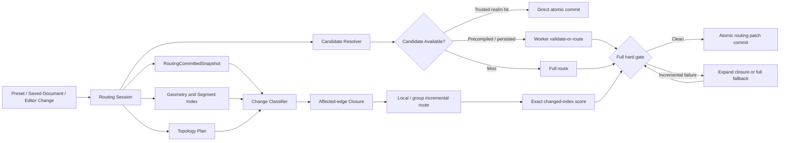

# Vizly 首次打开与增量调整统一路由方案

状态：质量、会话、拓扑、缺陷调度与 standalone 渲染协议主链已落地。四图各 16 项布局、跨引擎连续切换、普通保存恢复、三页新增/复制/切换/重载、SVG/PDF 真实矢量文件及容器样式均已有 production 验收。Logistics 动态拓扑含折叠/展开的 10 类编辑矩阵通过，L-OMS 拖拽 30 个独立样本 `release-to-final p95=294/300ms`、零 fallback/abort，交互尾延迟已达门槛。`ab437cd4` 首轮远端冷路由通过预算，但下一独立运行回到 route p95=`3324/1100ms`、Worker p95=`1414.5/1100ms`、route overhead p95=`1909.5ms`；同轮增量与交互专项通过，说明算法计算与 runner/主线程投递尾部仍需分开收敛。PDF 已完成同场景 SVG/PDF 1:1 文件级复验，最新批次修复嵌入字体在常规、半粗和粗体下的整体字重衰减。3D 仅性能问题继续后置。
适用范围：`BaseReactFlow` Canvas 最终显示路由、内置标准图、用户保存图、节点拖拽及局部编辑
关联标准：`docs/edge-routing-goals.md`

## 0. 最新推进状态（2026-09-04）

### 2026-09-04：PDF 标题渐变保真与 finalizer 工作量归因

- `ab437cd4` 的远端冷路由任务首次在原预算内通过：Logistics route 中位 `1062ms`、p95 `1070/1100ms`，Worker compute 中位 `1009.3ms`、p95 `1035.4/1100ms`，route overhead p95 `89.6ms`；5 次均为 `full-route-repaired`、一次 Worker、零 abort。commercial evaluation 中位 `62ms`、p95 `73ms`，与候选质量复用的结构性减算一致。该结果先记为首轮达标，等待下一次独立远端运行确认，不用单轮绿灯抹去此前波动。
- 同一性能工作流的增量路由与交互本体仍通过：三个拖拽目标各 5 次均为 `validated-candidate`，零 fallback/abort，release-to-final p95 `142ms`、Worker compute p95 `88ms`。任务失败来自初始装载聚合 p95 `2088/750ms`；最慢 WMS 样本 Worker compute 仅 `35.6ms`，但 Worker delivery wait 达 `2039.1ms`，L-OMS/TMS 也出现 `738.4/583.7ms` 投递尾部。下一步把它作为主线程/runner 调度尾延迟单独处理，不回退已达标的交互结论，也不放宽预算。
- `9e5839a1` 已进入并推送 `main`：矢量导出快照现在采集受控节点阴影，SVG 使用过滤器、PDF 使用透明度受限的矢量偏移轮廓恢复画布节点层次；真实 Logistics PDF 无图像对象，节点、连线、中文字体和容器样式保持。该提交本地 80 项聚焦测试、静态、TS6、生产构建与 bundle 通过；远端完整 CI 的独立失败为 `KeyboardShortcutPanel` 4 个可访问性查询未找到，以及 enterprise smoke 关键资产偶发 `109/108`，因此不记录为远端全绿，后续分别修复测试隔离/可访问性和首屏资产抖动。
- commercial loop-shortcut 的严格闭合预检和普通接受判定原先会对同一候选重复执行完整质量计算。现在同一候选共享一次 changed-quality 结果，再分别进入两套判定；候选顺序、质量预算、障碍、固定端点、主干和 hard gate 均不变。确定性诊断从 `153` 次质量计算降至 `129` 次，正好消除 24 次重复；同一 preview 的 3 个基线与 5 个修改后样本中，commercial 中位 `268.5→231.9ms`、独占中位 `189→156.8ms`、route 中位 `2353→2248ms`。一次将 shared-trunk audit 延后到便宜门禁之后的实验收益不足且噪声明显，已完整撤回。最终实现的 43 项聚焦回归、TS6、生产构建、四项预编译重放和未提高的 `9500KB` bundle 门禁通过；冷路由尾延迟仍未达标。
- `a591af47` 的完整 CI 已证明精确 audit 重试有效：依赖安装与 static/build 全部通过，五组测试和覆盖率也全部成功；随后 smoke 揭示矢量 PDF 接入后的独立首屏分块回归。`svg2pdf.js` 及四个专属解析依赖原先落入通用 vendor chunk，使约 `550KB` 被九条路由首屏共同加载；现把 PDF 实现改为点击导出时动态加载，并归入现有 PDF vendor chunk，同时将三个同步、小型场景快照模块与 designer micro chunk 合并。管理页从 `2454.3KB/36` 回到 `1887.4KB/35`，WMS/企业图从 `109/110` 个关键资源降为 `107/105`，解码体积 `4867.5/4745.5KB`，未提高预算；最终九路由 production smoke 全部通过。矢量 PDF 行为回归 26 项通过。
- 同一远端性能任务的增量和交互专项成功，Logistics 五个冷样本仍为 `full-route-repaired`、零 abort；Worker 中位 `1081.3ms`、p95 `1182.5ms`，但一次 `833.5ms` route-side 尾部把 route p95 拉到 `2016ms`。commercial evaluation p95 为 `133.9ms`。该批在依赖安装和其他并行任务上也出现显著外部延迟，因此保留原预算与失败结论，同时把 Worker 内商业闭环和 route-side 尾部作为两个不同问题追踪，不把单个 runner 样本解释成算法退化。
- normal full-route 的 commercial detour 现在与 closure 快路径使用同一组子阶段追踪，且不改变候选顺序、128 次预算、质量门禁或最终路径。一次真实 Logistics production 样本中，四类外层修复合计约 `63.9ms`，而 `final-commercial-evaluation` 总计 `239ms`、独占仍约 `175.1ms`；重新构建后的可复现采样中该父阶段为 `96.2ms`、独占 `62.5ms`。证据表明后续优化应继续进入 loop shortcut/评估闭环，而不是削减净距或端点修复。四项子阶段协议回归、33 项相关 jsdom 测试、类型、Lint、架构、生产构建与 bundle `9499.80/9500KB` 均通过，四项预编译路径不变，仅同步 source hash。
- 对最终同侧端点顺序审计做了独立微基准：真实 Logistics 输入 2,000 次约 `103ms`（单次约 `0.05ms`），收益上限过小，不进入生产改动。另尝试将 obstacle 构建提升到 loop shortcut 事务外复用，但 3+3 个 production 样本没有改善，整体与 commercial 独占耗时反而同时升高，已完整撤回；不以噪声样本提交推测性优化。
- `b46c497f` 的远端性能任务确认增量路由和交互绘制继续通过，三个 production 浏览器分片均正常启动，未触发新的单次启动重试。Logistics 五个冷样本 route 中位 `1173ms`、p95 `1237/1100ms`，Worker 中位 `1155.7ms`、p95 `1217.2ms`，五次均为 `full-route-repaired` 且零 abort；与同源码前一轮 `1138ms` p95 相比是环境波动，但两轮都高于预算，仍不能关闭性能项。本轮最大公开阶段依次为 commercial evaluation p95 `123.2ms`、初始 dogleg refine `95.6ms`、waypoint `82.2ms`、初始 global refine `74.8ms` 和 trunk dogleg `72.8ms`，下一步只针对能证明重复工作的公共热点，不削减质量门禁。
- 同轮完整 CI 的五组测试与覆盖率全部成功，static 在进入构建和浏览器 smoke 前由 npm 安全公告接口 5 分钟网络超时终止。该故障已多次阻断主分支，现将 audit 门禁收敛为一次精确基础设施重试：只有非零退出、无 signal、同时出现 npm 的 `audit network timeout` 与 `audit endpoint returned an error` 才重试；漏洞结果、进程失败、其他网络/解析错误及第二次超时均继续失败。入口通过校验后的 npm CLI 路径以无 shell 方式执行，输出仍原样呈现。5 项边界回归、Node CI 入口 453 项、Lint、TS6、secrets、CI 收录和真实 `0 vulnerabilities` 审计通过。
- `52fbe3a8` 远端五个独立冷样本将 Logistics route 收敛到中位 `1093ms`、p95 `1138/1100ms`，Worker 中位 `1081.9ms`、p95 `1117.7ms`，route overhead p95 仅 `20.3ms`，五次均为 `full-route-repaired` 且零 abort。交互绘制和增量路由任务成功；冷路由只差 `38ms`，但仍按原预算失败，不能记作性能完成。候选商业绕行分的差分缓存实验未改善同机 commercial 阶段且使 bundle 超限 `0.27KB`，已完整撤回；下一批不再投入该低收益点，继续聚焦候选全图质量与主干审计。
- 同一完整 CI 的五组业务测试中 foundation/core/flow/routing 成功，UI 仍由 ShareDialog 旧删除请求跨图回归撞到原 15 秒上限；该用例单独本地实际耗时约 `10.2s`。现直接通过实际 mutation hook 验证“旧请求 → scope 切换 → 新列表 → 旧请求完成”的生命周期，保留状态与无成功提示断言，执行降到约 `19ms`，没有提高超时；远端同配置 17 文件 shard 本地 72/72、类型、Lint 和 CI 收录通过，已作为 `a980227b` 推送。
- Chrome 进程存活、零 stdout/stderr、无错误标记且 `/json/version` 持续 `ECONNREFUSED` 的 15 秒启动态已在独立 CI 浏览器任务重复出现，同时同轮其他 Chrome 任务正常完成，现按已识别基础设施瞬态处理：仅该精确诊断允许一次全新 profile 启动，预编译入口同时重新分配端口；进程退出、spawn/锁/输出/非法响应及页面或业务失败均不重试。66 项启动生命周期与安全诊断测试、TS6、`verify:static:fast`、生产构建与 bundle `9499.99/9500KB` 通过，两个真实浏览器入口正常启动与清理通过。
- 远端 static 失败已确认不是导出或路由代码回归，而是审计库新增的 3 项传递依赖公告：`@humanfs/node <0.16.8`、`browserslist <=4.28.6`、`fflate` 的受影响版本。独立锁文件补丁已解析到 `0.16.8`、`4.28.8`、`0.8.3/0.6.11`，npm 12 审计为 0 漏洞；类型、strict-core、Lint、生产构建和 bundle 均通过。临时目录的第二次干净安装因 npm registry 长时间无输出被中止，仍需由提交后的远端干净安装门禁给出最终确认。
- `d02bbe8b` 的完整 CI 进一步暴露观测层回归：commercial evaluation 包围的四个子阶段仍被声明成 finalizer 的直接子阶段，导致嵌套耗时作为兄弟阶段重复计入，冷路由拒绝“trace 独占总和大于 Worker 总时长”；Worker pipeline 的精确阶段序列也漏掉新阶段。现已把四个子阶段归入 `final-commercial-evaluation`、更新精确协议断言，并增加 140ms 三层嵌套总账回归；本地 52 项相关测试和四个 production 预编译目标的生成/复现通过，路径产物不变、仅 source hash 更新。该修复只校正性能记账，不改变路由候选或图形结果。
- commercial loop shortcut 的每次候选评估原先都会重新审计完全不变的 baseline shared trunks；现将 baseline 审计提升到同一 repair 事务内复用，候选顺序、128 次预算、固定端点、障碍、终端与 hard-quality gate 均不变。5+5 个独立 production 冷样本中，Logistics commercial 中位 `158.4→133.5ms`、p95 `215→201.8ms`；WMS demand 中位基本持平且 p95 `239→208.8ms`；WMS process 中位 `440.5→426.2ms`、p95 受噪声影响 `611.1→643.2ms`。这是可解释的公共重复计算消除，但整体 Logistics route 仍为 `1694ms` 中位、`2057/1100ms` p95，不能记作预算达标。
- `d65e0610` 已进入并推送 `main`：导出快照、场景模型、SVG 与 PDF 现在保留 titleGroup 的受控三段纵向渐变，不再把画布上的渐变标题条压平成单色。真实 Logistics production 导出包含 3 个渐变定义和 3 个渐变填充；PDF 二进制包含矢量 shading、嵌入字体且无图像对象，Poppler 渲染复核颜色、中文、节点和连线均保留。聚焦 79 项、静态快速门禁、生产构建和 bundle 通过，未扩大 `9500KB` 总预算；远端五组测试与覆盖率通过，static job 的依赖审计失败由上一条锁文件补丁处理。
- 上一提交 `9e25bf1e` 的完整 CI 唯一失败是 GitHub runner 访问 npm audit registry 超时；五组测试与覆盖率均通过，不归类为产品代码失败，也不通过跳过 audit 制造绿色结果。对应性能专项仍真实失败：Logistics route 中位 `1094ms`、p95 `1728/1100ms`，Worker 中位 `1080.5ms`、p95 `1217.7ms`，另有一个约 `510.3ms` 的 route-side 尾部样本；预算保持不变。
- finalizer 父阶段过去只报告耗时、工作量恒为零，无法判断剩余独占时间来自何处。父阶段现输出同一请求级评估会话的差分指标，随后补齐正常完整路由缺失的 `final-commercial-evaluation` 边界；同机样本中 finalizer 独占由约 `151.7ms` 收敛为 `21–22.5ms`，缺失时间已归因到 commercial detour（单次 `187.8–469.5ms`）。该阶段固定出现 `64` 次请求级评估、`66` 次缓存命中、`1044` 次节点扫描和 `336` 次边对扫描，下一批直接处理其候选闭环，不再从 finalizer 外层猜测。
- 路由路径产物本身未变化；因观测源码属于路由 hash 范围，四项预编译 manifest 的 `routingSourceHash` 已同步更新并重新通过可复现检查。当前唯一首要性能缺口仍是 Logistics 冷路由 p95；3D 按用户优先级后置。

### 2026-09-03：复用最终质量证据与净距评分，补齐预编译发布产物

- 已分批提交并推送 `3f257520`、`81fefff3`、`f3efcf92`、`ad2e5697`、`57c0ec94`：保留阶段工作量指标、限定端点 fallback 风险、去除 detached crossing 重复检查、向最终收口传递精确质量报告，并让 immutable Edge 副本复用同端点净距评分。Logistics 确定性计数中 post-trunk 节点扫描由 `9928` 降至 `6664`，路径签名与硬质量保持；不同机器/负载下的 wall-clock 波动仍明显，不能把单次约 `1045ms` 记作正式 p95 达标。
- 候选生成诊断显示 post-trunk `3863` 个生成候选中有 `3337` 个唯一候选，重复仅约 `14%`；临时埋点已撤回，不继续投入低收益候选去重。后续只处理有独立阶段证据、能保持候选顺序与完整 hard gate 的公共计算热点。
- `57c0ec94` 远端完整 CI 的 static job 由 `check:precompiled-routes` 确定性拦截：路由源码 hash 已变化而 manifest 未同步，不是测试或算法失败。当前生产构建重新生成四个预编译目标，路径产物完全不变，仅 `routingSourceHash` 更新；独立 reproducibility/check、30 项相关回归、源码规模、1089 文件 CI 收录与 `verify:static:fast` 均已通过，按独立发布修复提交。
- 当前首要未完成项仍为 Logistics 冷路由 `p95 2180/1100ms`；交互路由、布局/连线质量、保存恢复、多页和真实 SVG/PDF 矢量导出已闭环。3D 按产品取舍继续后置，不挤占冷路由与发布门禁收口。

### 2026-08-31：就绪状态与计时同一次采样，3D 远端超限继续追踪

- 本批已提交推送 `32a3fc88`。远端完整 CI `33436580166` 已全部成功：五组测试、覆盖率、static/build/smoke 和最终汇总均通过；桌面及移动端各九条路由通过，3D 就绪分别为 1945/4000ms、1385/4000ms，资源仍为 26/46、2384.6/2800KB；WMS 初始保存恢复和 Logistics 编辑保存后继续布局切换均执行成功。本次生产代码与 `4a8cd0af` 相同，不能把不同运行之间的 9977→1945ms 解释为产品提速，也不能作为未提交评分优化的全量验证。
- `4a8cd0af` 完整 CI `33434955893` 已失败：五组测试、覆盖率、静态检查、构建及 bundle 通过，桌面 smoke 的 warehouse-3d 就绪时间 9977/4000ms 超限；资源数 26/46、解码体积 2384.6/2800KB 未超限。后续移动端和保存恢复步骤被跳过，不能记录为本批全量通过。
- 检查发现公共 smoke 先读取就绪状态，再单独调用 `performance.now()`；两个浏览器任务之间的长任务会被错误计入就绪时间。回归先证明旧实现把 875ms 记录为 9875ms，再将状态与时间戳合并到同一次同步浏览器求值。保留原就绪条件、轮询与时间预算；非法时间戳明确失败且不输出其值。既有 CI 文件内共 38 项测试通过，包含空/未就绪状态、零值、非法时间、求值失败和原超时诊断。
- 当前 production 独立测试浏览器的 3D 单轮就绪 1656ms，第二次取时为 1704ms，间隔约 47ms；原资源与就绪预算均通过。这证明脚本能正确执行，但本轮未复现远端 9977ms，也不能将其归因于计时缺口。采样同时有本地全量测试与静态门禁运行，不用作性能前后对照或 3D 完整交互验收。
- `verify:static:fast` 全部通过，包括 TS7/strict-core、Lint、架构、安全、源码规模、预编译一致性和 1081 文件 CI 收录；仅脚本改动不重复生产构建。诊断脚本和日志保留在忽略目录，不纳入提交。
- 本批仅修复测试计时；评分复用实验的后续全量回归、隔离 WMS 验收与撤回结论见下节。Logistics 冷路由、WMS LR 超时、复杂保存/折叠/多页图、全局业务语义、导出与 3D 完整验收范围保持。

### 2026-08-31：布局验收等待完整事务，保留失败证据

- 本批已提交推送为 `4a8cd0af`。性能专项 `33434955784` 完成：增量路由、交互绘制成功；五个独立冷样本完成，唯一超限为 Logistics p95=1466/1100ms。完整 CI `33434955893` 因 3D 就绪超限失败，五组测试与覆盖率通过，见上节。上次 1845ms 与本次 1466ms 来自不同运行，且生产路由代码相同，不能归因于验收脚本修复，也不能代替未提交评分优化的同条件对照。
- 本批生产浏览器 Logistics 普通图第一次 TB 验收报“请求布局与工具栏不一致”，尚未进入保存刷新；仅补枚举诊断后复验通过，不能把偶发通过作为首次失败已解决的证据。检查发现矩阵解析器只在无 Worker 的缓存路径检查 `layoutTransactionStatus=committed`，有 Worker 响应和候选验证命中路径会在几何 `final-applied`、布局命令仍 running/failed 时提前返回。生产命令在最终几何提交后才更新选择并标记完整事务 committed。
- 收紧带新布局 job 边界的所有返回路径：边界和 job 必须是合法整数、job 必须更新、事务必须 committed，路由 requestId 必须属于该 job。没有增加固定等待、预算或业务重试；菜单不一致诊断只输出已知布局枚举或 unrecognized，不输出 DOM 原文或图内容。该确定性验收缺口可导致提前检查菜单，但尚不能证明首次浏览器失败全部由此造成。
- 回归先证明旧实现错误接受 running/failed/过期 job，再修复；Worker 和无 Worker 候选两条分支分别断言，含合法提交、非法边界、失配 job。矩阵解析与命令共 38 项测试通过，脚本 Lint 通过，均在已有 CI 文件内。
- 修正等待后，生产 Logistics TB→LR→编辑保存→刷新→继续 TB/LR 全链通过；14 节点/14 边、编辑标签保留，恢复 SVG 的穿节点、严格交叉、非法重叠、净空风险均零，节点几何一致，指定主链语义通过。该轮 TB 1341ms、LR 4671ms 是功能验收记录，不是隔离性能对照。
- 验收脚本修复按独立批次提交；下述公共评分实验后续已完成全量及隔离验证，但因没有稳定整段收益而撤回。不能将验收等待修复称为生产 Worker 慢路径修复。

### 2026-08-31：单/双边交叉评分复用实验（整体收益未证实，已撤回）

- 最终取舍：全量回归与独立 WMS 验收完成后，六个全新进程按旧→新→新→旧→旧→新执行相同 WMS 生产尺寸 LR 请求。旧实现 11271.7/10351.4/10420.4ms，中位 10420.4ms；新实现 10976.7/10036.4/10617.7ms，中位 10617.7ms。六次硬质量与精确路径签名均通过，但区间重叠、末组新实现反而较慢，不能证明整段收益。因此撤回本轮计数器、调用方、实验回归及 manifest 改动，生产源码恢复与 `32a3fc88` 完全一致；以下为历史实验记录，不代表当前已交付能力。已有忽略目录中的新旧对照脚本在撤回后不再代表两个不同实现，不应直接重跑解释为新证据。
- 独立浏览器的阶段记录将下一步重点指向严格修复和端点收尾，而非继续评分微调：`strict-primary-endpoint-target` 1320ms、`terminal-finalize-outer-port` 1158ms、`finalizer-outer-port` 826ms。阶段返回 skip/fallback 不等于内部没有必要工作，应先分解调用与缺陷前提，不能直接跳过。Logistics 八个中间观测点仍有硬缺陷，也排除了简单提前返回。
- 恢复基线后的只读 WMS Worker 分解进一步定位到短端点修复：约 840ms 中，全图 `finalStrictDisplaySweep` 占 835ms；侧移路径生成 1.3ms/20 项、companion 生成 0.2ms/6 项，并非候选生成本身耗时。扫描生成了不同结果，但外层短端点修复最终返回原边集合。另一个 strict bypass 调用约 308ms。两次诊断均保持硬质量与原精确路径签名；计时含诊断开销，不是正式性能验收。下一步先核实扫描候选被拒绝的具体约束及是否存在重复状态，再决定收敛方式，不能直接删除扫描或放宽质量规则。
- 撤回后重新生产构建通过，bundle 为 230 JS/41 CSS、总 JS 9392.53KB；三份预编译产物静态一致性通过，运行中的 preview 与恢复后的 dist 匹配。保留既有 LayoutOptimizer 动静态导入警告。工作区生产源码与 `32a3fc88` 无差异，诊断脚本/捕获/日志继续留在忽略目录。
- Logistics 冷请求新增只读阶段审计：拓扑、结构修复和后续全局细化直到 quality-complete 的八个观测点均未达到硬质量标准（中途仍有严格交叉、反向/非关联重叠、净空或端点缺陷）；完整 Worker 最终 hardClean=true，路径签名仍为 `route-v2:14:61:7cb06f918279772f`。因此不能把这些阶段简单视为可跳过的美化工作，也未新增提前返回。审计含额外评估且与全量测试并行，耗时不作为性能样本。
- 混合端点桥候选不再为每个双边变化重新提取整图线段和计算全部交叉。共享快照计数器保留未变化边之间的交叉，只重算两条变化边及其相互交叉；第二变化边上下文最多缓存 16 组，超限仍精确计算。单边候选的 blocker 查询只检查变化边，保留原全图交叉列表的首次出现顺序，不能用按边编号排序替代。
- 新旧候选生成器使用同一 WMS LR 实际回归输入交替先后调用。仅双边评分版本 54 次调用累计 1290.9→1238.8ms；加上局部 blocker 查询后，两次独立进程各 54 次调用累计 1446.1→1269.2ms、1275.6→1154.0ms，返回的完整候选数组与顺序逐次一致。这是约 10–12% 的局部环节收益，不代表整次布局或冷启动已明显提速。此前仅双边评分三次完整 Worker 回放中位 10335.1ms，与原实现 10488.1ms 范围重叠，未证明稳定整体收益。
- 已有 CI 测试文件新增双边/全图评分对照、半像素/短段/非法数值、空路径、随机多折线、快照隔离、缓存上限，以及 blocker 首次出现顺序和实际混合桥候选内容/顺序回归。两个文件共 21 项通过；最初新增集成 fixture 漏传节点尺寸导致空候选，补全测试尺寸后通过，没有改动生产逻辑或削弱断言。
- 缓存上限回归进一步由空路径替换为 20 条真实交叉路径：第 17–19 个上下文不缓存时，仍逐次等于完整图评分，复用已缓存上下文与再次计算超限上下文也保持一致；保留索引创建次数断言。相关 21 项及该测试文件 Lint 再次通过，没有新增生产改动。
- TS7 类型、TS6 兼容、`verify:static`（含 strict-core、Lint、架构、安全审计、生产构建、bundle）及 1081 文件 CI 收录检查通过。三张预编译图已用新构建重新生成并独立 `generate:precompiled-routes:check` 通过，路径产物完全不变，仅 manifest 源码 hash 更新。全量 `test:ci` 已完成：49/49 分片通过，3536.1s；运行期间更新的验收脚本另有独立回归覆盖，缓存超限强化用例也在随后执行的路由质量组中通过。
- 生产 WMS LR 浏览器验收失败，错误为 `layoutTransactionErrorCode=worker-timeout`，未获得此次切换的最终质量结果。该轮同时运行了全量测试和预编译完整回放，不能作为隔离性能样本，也不能据此排除真实慢路径。保留失败，不提高 Worker/布局超时；待其他计算完成后独立复验。命令原计划 LR 后继续 TB，实际尚未走到后续切换。
- 全量回归终态后，在相同 production 构建、1600×1200 独立浏览器中复验 WMS LR→TB 成功：LR routeMs=12026、输入至视觉稳定约 13953ms；后续 TB routeMs=169。两方向各一条主链、五步方向审计通过，最终 SVG 几何、端点、净空、节点几何一致性及可见性检查通过，LR 路径签名保持 `route-v2:44:176:0a71de4eeebd4894`。此次没有 Worker 超时，但 LR 仍明显慢；不能将先前并发超时归因已明或将本轮通过解释为优化提速，最终新旧对照取舍见本节开头。
- 最新 `32a3fc88` 完整远端 CI `33436580166` 已全部成功。本轮仅保留验证结果和取舍记录；正式冷路由预算、WMS LR 慢路径、复杂保存/折叠/多页图、剩余跨域语义、导出及 3D 完整验收仍未完成。

### 2026-08-31：性能对照排除低收益缓存改动，转向严格交叉候选生成

- `ec5e5fb5` 完整 CI `33431466737` 全部成功；性能专项 `33431466658` 的增量和交互绘制成功，冷路由五个样本均完成，Logistics p95=1845/1100ms 超限。此次无 Chrome 启动超时，仍保留历史环境故障跟踪，不增加重试或预算。
- 对最新已捕获 Logistics 冷请求进行独立进程计算回放，每次保留 hardClean 和精确输出签名断言。原实现五次中位 1608.5ms，正交线段数值 Map 实验五次中位 1553.6ms，恢复原实现反向对照五次中位 1591.6ms；三组范围重叠明显，不能证明稳定的完整路径收益。实验及其生产源码变化已全部撤回，避免为微小或不确定收益增加复杂度。
- WMS LR 的现有生产尺寸回归加入仅本地 CPU 采样，原完整质量断言通过，Worker 约 10932ms，输出签名仍为历史浏览器的 `route-v2:44:176:0a71de4eeebd4894`。该结果不能与不同环境、不同时间的历史浏览器 28115ms 直接做提速对比。CPU 包含严格阶段约 2.8s、端点阶段约 1.7s；混合端点桥候选构造约 1.1s、局部严格交叉求值约 563ms、GC 约 943ms，下一步优先调查候选构造和评分的重复工作，而不是继续线段键微调。
- 商业候选比较也尝试了单次比较内的未变边复用、按端点对复用障碍上下文。独立 WMS LR 三样本原实现中位 10488.1ms、边引用缓存 10727.5ms、端点上下文缓存 10442.6ms，均保留精确路径及硬质量断言；没有足够的完整路径收益，两个实现及实验回归也全部撤回。诊断样本留在忽略目录，不作为正式 CI 测试或生产收益证据。
- 本轮保留的仓库变化仅是这份进度/负结果记录；生产代码与已验证 `ec5e5fb5` 相同。正式冷路由、WMS LR 交互速度、任意保存/折叠/多页图、跨域语义和导出/3D 完整验收仍未完成。下一批聚焦严格交叉/端点候选的重复生成与全图评分，先取得工作量证据再改动，不重试上述已排除的微调方案。

### 2026-08-31：保存恢复完整 CI 通过，浏览器启动等待边界补强

- `efc1b284` 完整 CI `33429848677` 已成功：foundation/core/flow/routing/UI、静态/构建/smoke、coverage 和汇总全部通过，包含正式普通保存恢复场景。此前 `2c7c563b` 的失败仍作为历史记录保留。
- 同提交性能专项 `33429848620` 失败：冷路由第一个样本在 Chrome `/json/version` 就绪前超时，没有有效冷路由数据；增量专项仅 initialRoute=1525/750ms 超限，生命周期和采样违规为空；交互绘制成功。此前有效 CI 冷路由 p95=1668/1100ms 仍未达标。
- 启动代码存在两个可复现的边界缺口：不观察子进程 error/exit；仅在循环外检查 15 秒期限，内部 HTTP 或响应体未完成时不能保证期限。新增公共启动等待模块，接入冷路由/矩阵与 smoke 两个入口；保留原 15 秒总预算，以同一取消信号覆盖请求、响应体和轮询，进程退出/启动错误立即失败，不重启浏览器、不增加业务重试。
- 诊断只输出阶段、次数、耗时、白名单退出/网络错误码、输出字节计数及固定标记，不输出原始 stdout/stderr、路径、URL、响应内容或异常消息。响应体限制 16KB，DevTools 地址必须是本次端口上的本地 browser endpoint。smoke 启动失败时清理其尚未交给外层的精确子进程树。该修复解决等待/诊断缺口，尚无证据证明远端 Chrome 不就绪的环境根因已解决。
- 既有 CI 收录文件补充正常、非法端口/预算、已退出/中途退出/启动失败、迟到成功、HTTP/响应体挂起、非法/超量/非本地响应、安全输出与监听器清理回归。四个脚本测试文件在正确的 Node 环境下 103 项通过；首次混合调用误用默认 DOM 环境导致既有 smoke 文件的四个 file URL 断言失败，未修改断言，按其实际 CI Node 环境复验通过。
- 真实生产构建不变：五个独立冷样本全部完成启动与产物检查，但 Logistics 本机中位 3323ms、p95 7220/1100ms，Worker compute p95 6357.9ms，仍失败；不是优化前后对照，不归因于本次诊断改动或单一环境因素。Logistics 编辑保存→刷新→继续 TB/LR 切换与最终 SVG 审计通过。
- 最终 `verify:static:fast` 全部通过，包含类型/strict-core、Lint 零错误、架构、安全、预编译一致性和 1081 文件 CI 收录。两个代表页面各三次生产 smoke 通过：WMS ready 中位 2830ms/最慢 2950ms、100/108 关键资源、4682/4900KB；企业架构中位 1772ms/最慢 1867ms、102/108 关键资源、4691.5/4900KB，代表稳定窗口长任务和活动/排队 Worker 均零。包含同一隔离浏览器的后续恢复样本，不替代独立冷路由性能结论。
- 本批仅验收脚本、测试和计划变化，无生产源码、依赖或构建配置变更，复用 `2c7c563b` 生产构建；不重复生产构建或全库测试，新提交由远端完整 CI 验证。下一步推送已验证的启动边界，保留远端环境失败的诊断追踪；随后继续按公共计算热点处理性能，复杂保存图、跨域业务语义、SVG/PDF 权限环境和 3D 完整验收不缩减。

### 2026-08-31：普通保存回归固化进入主 CI

- 在 `2c7c563b` 同一 production 构建上，先扩大验证 Demand 与 TMS 的普通 diagram URL：TB→LR、编辑标签、等待真实自动保存、刷新、再 TB→LR，均通过。随后将临时诊断逻辑提取成正式 `display-routing-saved-roundtrip.mjs`，通过现有矩阵入口的 `DISPLAY_ROUTING_MATRIX_SAVED_RELOAD=initial|layout` 显式启用；要求指定一个布局 case，默认 canonical 矩阵行为不变。
- 正式回归不直接写 localStorage、不访问用户浏览器数据，要求实际落盘包含 routingSnapshot；有界解析保存数据，并逐节点检查精确位置、宽高及 parentId，检查边拓扑和编辑标签。刷新后沿用最终 SVG、端点、净空、菜单选择和业务主链方向断言，再实际切换 TB/LR。初始恢复模式不冒充业务方向验收。错误、非法/空/超量数据、重复 ID、过期几何/拓扑和标签丢失有回归，特殊安全 ID 不用对象键映射。
- 正式入口本地通过四个场景：WMS 初始恢复（45 节点/44 边）；Logistics 编辑保存恢复（14/14）、Demand（30/26）、TMS（26/17），后三者均通过恢复后的 TB/LR 连续切换。验证覆盖具体操作序列，仍不等于任意保存图、折叠图、多页或任意引擎切换全面完成。
- 主 CI 的现有 static/build/smoke 作业增加两个有代表性的端到端场景：WMS 初始保存恢复、Logistics 编辑保存后继续切换。使用独立 production preview，严格检查两个命令退出码并在 finally 关闭本步骤启动的进程；没有关闭失败检查、提高预算或增加业务重试。其他图可用相同入口与 preset 参数本地/专项验证。
- `2c7c563b` 的远端 CI `33428813965`：flow/routing/UI 组成功；foundation 被 Node 分片环境规则拦截，具体为 `useLayoutStrategy.test.ts` 新增 DOM Hook 用例但漏写 jsdom 声明。本批补上显式声明，Node CI 分片 42 文件/431 项通过，Hook 用例在 `--environment=node` 默认环境下也通过。static 作业的静态/构建通过，但 Chrome 在访问页面前没有暴露 CDP endpoint，15 秒等待结束；保留该基础设施失败记录，不能把本地首屏通过宣称为远端已修复。
- 本批仅测试、CI 编排和文档变化，不改生产布局/路由或依赖，复用已验证的 `2c7c563b` 构建。矩阵/生产预览/workflow 三文件 29 项、`verify:static:fast`、1081 文件 CI 收录及秘密扫描通过；新增的 CI PowerShell 脚本语法检查通过。Node 分片包含部分同一测试，不累加报唯一总数。`2c7c563b` 性能专项 `33428813983` 冷路由仍失败，增量及交互绘制成功。
- 下一步：推送此批测试环境修复与保存回归，核对新 CI；继续处理正式冷路由耗时和未覆盖的保存图边界，SVG/PDF 权限环境及 3D 完整验收保持待办。

### 2026-08-31：文档快照归属与布局选择恢复（本地修复）

- 保存失败的根因包含两个边界：展示适配器复制边数组，使原按数组引用注册的快照无法从文档边读取；原运行时 delta 和 identity 也不能直接用于持久化清洗后的图。新增 Canvas 会话私有快照来源，只接受已提交可信基线，按完整归一化几何与边值匹配文档，并把路径补丁和输入 identity 重建到 routing-stripped 文档上。恢复仍走原不可信候选校验，不按图 ID 特判，不放宽连线质量门禁。
- 新任务开始及 Canvas 销毁清除快照；节点几何、标签、拓扑或手工端口变化拒绝复用，保持手工端口意图；返回快照独立复制。空图、隐藏/折叠图、超过 5000 节点或 300 边的图不输出该快照，仍走原冷路由，不能将此次修复记作这些场景已通过。
- 布局选择此前只保存在 Hook 内存中，导致刷新后画面 LR、工具栏却回到 TB。现以版本化、白名单校验的文档 metadata 保存策略、方向和域内排列，按 diagramId 隔离；只恢复选择描述，不再次执行布局，并保留多页 metadata 的恢复返回值。旧文档没有该 metadata 时仍用默认选择，未宣称所有历史文档菜单均自动识别。
- 隔离 Chrome 使用普通 diagram URL，真实修改标签并等待自动保存，再刷新后继续 TB→LR。最终 production 已通过标签保持、节点几何保持、主链方向、菜单选择及最终 SVG 连线/净空检查，保存候选实际存在。未修改用户浏览器或用户保存数据；该浏览器证据目前针对 Logistics，不替代更多保存图和多页/折叠端到端验收。
- 既有 CI 文件新增回归覆盖展示数组→文档快照→保存清洗→加载候选、非法/超量输入、跨 Canvas 隔离、过期/不可信快照、四方向 metadata 恢复与图切换。包含候选来源追加修复的最终 Worker 边界 46 文件/440 项、保存/初始化 115 项通过；另有布局相关测试通过，存在重叠不累加报总数。最终完整 `verify:static`、TS6、1081 测试文件 CI 收录通过；bundle 230 JS/41 CSS、总 JS 9392.53KB，保留既有 LayoutOptimizer 动静态导入警告。无依赖变更；本地未重复全库 `test:ci`，推送后由远端完整 CI 验证。
- 已确认 `7145a275` 完整 CI `33425190218` 成功；性能专项 `33425190171` 冷路由 p95=1801/1100ms，增量专项仅 initialRoute=769/750ms 超限、生命周期及采样违规为空，交互绘制成功。性能仍未达标，不把此次保存恢复修复等同于冷路由提速。
- 最终首屏检查第一次与产物复现并行，WMS 长任务 2/1、企业架构 ready 6679/6500ms 超限，资源数量及体积通过；失败记录保留。串行三样本检查又在 WMS 第二次打开复现独立质量拒绝，不能归为运行竞争：快照存在且输入 identity 完全匹配，但 document 来源在 Hook/客户端被降为 persistent，Worker 再次清掉共享干线标记。新增显式 document 协议分支贯穿调度、客户端、解析器和 Worker 候选加载，复用原文档白名单，同时保留普通缓存限制及同等精确质量/商业净空校验。37 项相关测试通过；WMS 初始保存→刷新实测 44 条边全部通过，零端点脱离、交叉、非法重叠及净空违规，39 个业务节点几何完全一致。该追加修复重新执行完整静态门禁和最终首屏复测，未以重新运行覆盖历史失败。
- 最终产物验证完成：三张预编译路径内容不变，仅源码 hash 更新，最终 production `--check` 全部复现；WMS 初始保存恢复、Logistics 标签编辑保存→刷新→TB/LR 继续切换再次通过。串行两图各三样本首屏门禁通过：WMS 中位 ready=3242ms、最慢3585ms，100/108 个关键资源、4682/4900KB；企业架构中位1755ms、最慢1758ms，102/108 个资源、4691.5/4900KB。报告代表稳定窗口长任务零、活动/排队 Worker 零。该统计包括同一隔离浏览器中的后续保存恢复样本，不是独立冷路由正式性能证明；前述失败记录保留。
- 下一步按交付价值推进：提交本批修复并核对远端完整 CI；随后扩大普通保存图覆盖，将实测失败提炼为公共回归；集中处理冷路由主要耗时，保留正式样本性能、其余业务语义及 SVG/PDF/3D 完整验收。

### 2026-08-31：普通保存恢复的质量失败（已复现，待修复）

- 语义验收已推送 `7145a275`，完整 CI `33425190218` 仍在运行；性能专项 `33425190171` 失败。上一批 `a085c4d0` 完整 CI `33424639344` 已确认成功。
- 隔离 Chrome 使用普通 diagram URL，不含 canonical/precompiled 绕过参数：Logistics TB → LR 完成后改一条边的短标签，等待真实自动保存持久化，再刷新。两次均在恢复时进入 `final-quality-rejected`；没有改动用户浏览器或用户保存数据，没有放宽等待/质量门槛。
- 保存前后均 14 个节点/14 条边，逐节点位置与宽高完全一致，排除了尺寸恢复造成此次失败的假设。保存数据缺少独立 routingSnapshot。恢复的单 Worker full-route-repaired：穿节点 0、严格交叉 0、端点 attached/anchored 正确，但 unrelatedOverlap=115px、最小净空违规 1 条（edge-tms-visibility）、商业净空违规 2 条；完整失败请求和保存前快照留在忽略的本地诊断目录。
- 最小匿名诊断调用真实 `addFlowchartAccessibilityLabels`：该展示适配器创建新的边数组；提交展示数组后，`createBaseReactFlowRoutingOnlyDocumentSnapshot(renderedEdges)` 有结果，而保存层的 `documentEdges` 返回 null。当前快照注册表按边数组引用归属，保存链与展示链未连通。此诊断证明快照遗漏断点，不代表重新寻路失败和恢复后菜单状态已修复；诊断测试只在本地用于定位，正式修复必须补入 CI 的回归。
- 下一批优先：明确文档/画布快照归属，保持精确几何身份、手工端口意图与不可信候选重新校验；同时验证持久化清洗后的输入 identity 能实际命中候选。不能仅按 edge ID 寻找历史快照，不能把旧路径无条件写回业务边。随后复测普通保存→刷新→继续切换、标签编辑保持与布局菜单状态；该项先于继续低收益性能微调。

### 2026-08-31：四图业务主链的浏览器语义验收

- 候选预算减算已推送 `a085c4d0`；首次推送因 TLS EOF 失败，核对远端后重试成功，本地与 origin/main 一致。完整 CI `33424639344` 与性能专项 `33424639474` 已触发，尚未取得终态，不提前记绿。
- 新增公共浏览器语义校验器，使用最终 DOM 节点矩形而非仅检查 Worker 请求；明确检查主链相邻节点沿 TB/BT/LR/RL 的边界间距为正、对应有向业务边仍存在。真实反馈边不被强行要求正向；图特定主链仅配置在验收 fixture，生产布局没有预设 ID 特判。非泳道布局明确标记 `not-applicable`，不冒充语义通过。
- 四张标准图均配置有源数据依据的主链：Logistics 上游→L-OMS→追踪→下游；Demand 计算→分配→任务→WMS（11 段）；TMS 上游→物流订单→出库→计划→执行→交付→分析→BI（7 段）；WMS 订单→分配→任务生成→任务分组→执行→绩效（5 段）。新增方向反例、完整矩形而非中心排序、反馈/分支、空/非法/超量输入、特殊 ID、安全错误和真实 DOM 读取测试；相关四文件 67 项、`verify:static:fast`、TS6、1081 文件 CI 收录通过。
- 同一 production 构建四图各 TB → LR → BT → RL → TB，共 20 次实际切换全部通过主链方向、请求菜单、最终 SVG 硬质量、标签避障和节点几何一致性。WMS LR 单次 routeMs=28115ms，仍慢，不能把原 30s 功能上限内成功当作性能达标；命中复用的返回 TB 没有新 Worker 耗时，未当作零时延样本。
- 本批只增加验收脚本，不改生产布局/路由或依赖，复用 `a085c4d0` 已验证构建。覆盖的是明确主链，不是全部业务关系、显式域顺序或任意保存图；现有 canonical matrix 会绕过自动保存，因此下一步单独验证常规保存→刷新恢复→切换。正式性能、SVG/PDF 权限环境与 3D 完整验收仍未完成。

### 2026-08-31：路由候选按剩余预算生成

- 公共 loop shortcut 原先在检查预算之前一次性展开三组变体，后两组常在预算用尽后完全不能进入评分。现按原顺序延迟生成各组，并在外层与端口候选入口先检查剩余预算；每组共享原 eager 实现捕获的同一基线，不因前一候选更新 `best` 改变后续候选含义。未提高预算、降低质量门禁或按图/边 ID 特判。
- 四节点最小反例覆盖预算 1、2、4、8；使用已提交旧实现回放，四项均失败，新实现均通过。包含空输入、禁用预算和原 WMS 质量回归共 7 项通过；扩大质量 45 项、物流整组 34 项通过。完整 Worker 回放最终路径签名与修改前一致，三张预编译路径不变，仅更新 source hash；最终 production `--check` 三张复现通过。
- `verify:static`、TS6、1081 文件 CI 收录均通过，生产 bundle 230 JS/41 CSS、总 JS 9388.47KB，保留原 LayoutOptimizer 动静态导入警告。最终 production 的 Logistics 1024×600 复杂 BT → 复杂 RL → 泳道 BT → 复杂 TB 四步通过最终 SVG、节点几何一致性、标签避障及菜单选择断言。本地不重复全库 `test:ci`，本批推送后由远端运行全库。
- 独立五样本对照：冷路由中位数 2144→2076ms（约 3.2%），p95 3790→2478ms，仍超过 1100ms；尾部波动不作为算法提速比例。这是有限减算，不是性能完成。接下来优先补浏览器业务主链方向断言与保存图验收，不继续在低收益候选微优化上反复打磨。当前矩阵的几何通过不能代替跨域业务语义验收。

### 2026-08-31：主题入口依赖与首屏资源预算

- `e1468074` 已推送，CI `33421730624`、性能专项 `33421730828` 已触发。确认 `691fe244` 的完整 CI `33420737291` 五组测试及覆盖率通过、静态/构建/smoke 作业失败；性能专项冷路由失败、增量及交互通过。前一提交已确认的企业架构首屏资源 109/108，在本地同样复现；不能通过重跑或扩大预算解决。
- 完整资源清单存在主题公共汇总入口的空转发块。`useCoreTheme`、`designerUtils`、`EdgeUpdateContext` 仅需要 `getThemeManager`，现直接引用汇总入口原本导出的同一个 `EnhancedThemeManagerRefactored` 实现，不改变主题单例所有权、订阅、懒加载逻辑或公共导出。补充三个调用点的依赖边界回归并更新原 Hook mock 指向；构建消除原空转发文件，JS 文件净减少一个，不向公共启动块塞入完整布局/路由实现。
- 主题/配置/构建依赖三文件 38 项通过，扩大主题与布局转换十文件 41 项通过（两组存在重复用例，不相加声称唯一总数）。TS6、1081 测试文件 CI 收录、完整 `verify:static` 通过，零 Lint 错误/警告、零依赖漏洞；bundle 230 JS/41 CSS、总 JS 9388.33KB，预算不变，保留原 LayoutOptimizer 动静态导入警告。
- 三张预编译路由从新 production 构建重新生成，路径内容不变，仅更新 routingSourceHash；最终 production `--check` 三张再次复现通过。最终首屏两图均通过：WMS 106/108、4850.2/4900KB、3144/6500ms；企业架构 107/108、4858.3/4900KB、3166/6500ms。两图各 15 秒稳定窗口长任务为零、活动/排队 Worker 为零。该检查与产物复现同机并行，只作为资源和功能验收，不是隔离性能对照。
- 本批本地不重复全量 `test:ci`，由新提交远端 CI 验证全库及桌面/移动 smoke。冷路由实际计算仍未优化：最新回放 finalizer 约271ms、post-trunk 候选3863次、初始 dogleg 候选4610次，是后续减算线索而非已经修复。跨域业务语义、保存图/连续切换、SVG/PDF 有权限环境和 3D 完整验收均继续保留。

### 2026-08-31：拖拽性能采样时钟与样本完整性

- 原浏览器脚本在 `Input.dispatchMouseEvent(mouseReleased)` 的 CDP 确认返回后才记录松开时间，确认可能晚于最终提交，导致 WMS 出现 -106ms。现在由应用启动前注册的浏览器捕获阶段监听器记录真实、可信的左键 mouseup；每次释放前重新启用独立观测，要求恰好一次事件，结束/异常后清理。起点、最终提交和观察时间统一使用浏览器时钟，缺失、倒序或超界数据直接失败，不以观察时间回退或归零掩盖。
- 单次预算拒绝负值；p95 汇总额外验证初始路由及每个拖拽指标的样本数量，避免原汇总器过滤非法诊断值后把不完整的必需指标判绿。未改变任何时间预算。模拟延迟 CDP 确认、重复/缺失/非可信事件、非法坐标、失败清理、时钟倒序及丢失样本等回归加入既有 CI 文件。相关四文件 52 项、TS6、`verify:static:fast` 全通过，1081 个测试文件全部收录。本批仅改验证脚本，没有改生产布局/路由或依赖，沿用当前 production 构建执行浏览器检查。
- 本地 5 轮 × 3 个拖拽完成，15 个松开到最终提交采样均有效、非负，每图 Worker start=5、abort=0、fallback=0；正式预算仍失败，不能称性能通过。releaseToFinal p95：L-OMS 329ms、TMS 945ms、WMS 219ms；TMS localRoute p95=714.6ms。采样期间同机也执行了静态验证及一次冷请求捕获，这不是隔离性能基线，不据此判断性能退化比例，也不重跑业务失败制造绿色。
- 新远端证据：`edf7f3a4` 完整 CI `33419751225` 的五组测试与覆盖率均通过，但企业架构首屏 criticalAssets=109/108，导致最终 CI 失败；其性能专项 `33419751422` 增量/交互通过，Logistics 冷路由 p95=1620/1100ms 失败。`691fe244` 性能专项 `33420737220` 已失败，完整 CI `33420737291` 尚待终态。首屏资源预算列入下一批，不扩大预算。
- 已捕获当前 production Logistics 冷路由请求，14 条边、full-route-repaired、hardClean=true；完整 Worker CPU 回放同样通过，约 2331ms（带分析器，不是正式性能采样）。热点涉及 detached overlap 候选、dogleg 候选与垃圾回收，后续结合阶段计数处理实际重复计算。跨域语义、保存图/连续切换、SVG/PDF 有权限环境及 3D 完整验收继续保留。

### 2026-08-31：短分支标签窄通道避障

- `edf7f3a4` 已推送，完整 CI `33419751225`、性能专项 `33419751422` 已触发。Logistics 1024×600、复杂 BT → 复杂 RL 的两处标签覆盖再次复现。实际主干绘制将两条边的可见分支缩短到 60/48px，标签以短分支中点定位；zoom≈0.42 时文字为保持可读性而放大，固定沿线偏移量错过了两侧节点间足够容纳文字的自由区间。
- 公共标签避障仅在原近/远候选仍不能避开节点时，依据障碍边界与缩放后的标签尺寸补充候选；向外取整保证净空，不放宽原最大沿线位移、节点/连线净空评分或标签显示阈值，额外精确评估最多 16 个去重位置。不按预设、边或节点 ID 分支，未改手动标签定位逻辑、主干语义或最终路由坐标。
- 两个镜像窄通道反例在原实现失败；修复后覆盖 48/60px 短分支、横/纵向与镜像、输入不变和确定性、完全被包围时的有界失败，既有非法点/矩形与安全文本测试保留。连线组件 16 文件/110 项通过，TS6、`verify:static`、1081 测试文件 CI 收录均通过。生产 Logistics 复杂 BT → 复杂 RL → 泳道 BT → 复杂 TB 四步完整通过，标签覆盖节点数为零，路径硬质量与 Worker/DOM 节点一致性继续通过。bundle 总 JS 9388.47KB，231 JS/41 CSS，保留既有 LayoutOptimizer 动静态导入警告。本批不改变路由计算或预编译源码集合，无需重生成路由产物。
- 正式 production 的现有浏览器全流程退出 0：标准 Logistics 的 TMS/WMS/L-OMS 拖动、fit-all/50%/100%/200% 视觉检查和 light/dark/high-contrast 三主题均通过，普通最终路径穿节点/净空风险为零，只有一个稳定显示版本。主题交互最大绘制时间分别为 67.4/53.9/65.1ms，仅为单轮观测。WMS 打印 releaseToFinal=-106ms，需要在正式性能采样中核对时序，不能据本次退出 0 宣称性能验收完成。
- 导出范围：PNG 实际下载约 713KiB；SVG 约 23KiB 预览通过，下载为 entitlement-gated；PDF 同样被权限门禁拦截。这里只证明当前权限下的预览/限制行为，SVG/PDF 真实下载需有权限的测试环境，3D 和所有保存图仍未验收。本批本地未重复完整 `test:ci`，推送后继续跟踪远端全量结果。

### 2026-08-31：连续切换的半像素碰撞漏检与泳道越界修复

- 菜单修复已推送为 `19c1557f`，完整 CI `33418238757` 与性能专项 `33418238744` 已触发。
- Demand 失败请求已独立捕获：最终路径从 `(861.5,732)` 到 `(862,1068)` 穿过业务节点，但 Worker 报 hardClean=true。旧碰撞扫描的横/纵向判断使用严格 `<0.5`，恰差 0.5 的长线段未进入任何碰撞分支；净空计算对斜线仅取到角点的距离，也漏掉实际穿越。公共几何现对非轴向段复用通用线段/矩形相交判断，碰撞和净空均识别实际穿越；保留原轴向快速路径、有界扫描、缓存、端点内部容差和门禁。
- 四项反例先在原扫描器失败。历史测试中的“斜线”和“恰好半像素”样本保留，但由与错误旧实现一致改为要求实际命中。新增横纵转置、反向、边界擦角、不相交包围盒、有限阈值/缓存复用，以及匿名三节点完整 Worker 回归；Worker 必须绕开节点，不仅拒绝错误路径。相关两文件 24 项通过，公共寻路 668 项、画布质量 45 项、Logistics 相关 34 项通过。
- TMS 的 2.24px 偏差对应图坐标 7px：子节点 x=331、宽218，父容器宽542，画布按 parent extent 将右缘549夹回542。根因是泳道同层重排互换中心槽位，宽窄不一的节点换位后超出原边界。现在按节点实际尺寸和原间距在同一占用跨度内重排，保持流程层级、邻接排序、容器宽度和留白，不依靠扩大容器掩盖越界。四方向匿名反例均先失败，修复后的几何及完整泳道路由两文件 13 项通过。
- 合并两项修复后的 production Demand、TMS、WMS Process 在 1024×600 的复杂 BT → 复杂 RL → 泳道 BT → 复杂 TB，合计 12 项全部通过，最终 SVG 穿节点/净空与 Worker/DOM 几何一致性为零违规。TS6、`verify:static`（类型/strict-core、Lint、架构、安全、零依赖漏洞、构建和 bundle）、1081 测试文件 CI 收录均通过。bundle 总 JS 9387.99KB，231 JS/41 CSS，保留 LayoutOptimizer 既有动静态导入警告。三张初始预编译路由再生成后路径内容不变，仅更新 routingSourceHash；最终 production `--check` 三张产物再次复现通过。本批未重复本地全量 `test:ci`，推送后由远端完整 CI 验证全库；正式冷路由性能、跨域业务语义、保存图和导出验收仍未完成。
- 扩展边界：Logistics 首次尝试在浏览器 `/json/version` 启动前超时，确认终态后仅对此基础设施失败重试；重试在复杂 RL 的最终几何检查通过后，被标签视觉门禁拦截。1024×600、zoom≈0.42 时，`edge-loms-customs` 的主标签与 customs、`edge-tms-yms` 的详细标签与 yms 重叠。该序列未通过，不能把路径硬质量通过记成完整画面通过；没有关闭标签断言或修改显示阈值，下一批保留标签避障任务。
- 已取得 `3ccc47f0` 远端冷路由原始报告：Logistics route p95=1640ms、Worker compute p95≈1630.1ms，五次均为 full-route-repaired，没有 Worker abort。性能工作应优先检查 Worker 内重复质量修复阶段，不能仅优化界面 loading 或调度等待来宣称解决；该报告不是本批修复后的性能证据。

### 2026-08-31：高级菜单视口定位与真实点击验证

- 原高级子菜单仅翻转位置，不在翻转后移回可见区域；1280×720 下复杂 BT 项 top≈-106px，DOM 能找到该项却不代表用户能点到。布局菜单现使用独立 placement 模块，在保留横向/纵向翻转与 RTL 映射的同时启用纵向碰撞移位；没有修改布局策略、路由算法或质量标准。
- 矩阵新增有界视口参数、菜单整体可见性与中心点遮挡检查；布局项改用鼠标移动/按下/释放，不再以 DOM click 替代真实命中。显式复杂布局与泳道均核对最终选中名称，其他旧引擎的既有回退边界仍保留。原 production 在 1280×720 被新检查准确拦截；修复后该项 top≈31px，内置浏览器实点后正确选中复杂 BT。
- Logistics 在 1280×720 的复杂 BT → 复杂 RL → 复杂 TB → 泳道 BT → 泳道 LR → 泳道 RL → 全图正交 TB → 树形 BT → 复杂 BT，九项真实点击及最终连线检查通过。菜单/移动端/矩阵脚本三文件 54 项通过，TS6、`verify:static`、1081 文件 CI 收录门禁通过；生产构建通过，bundle 总 JS 9387.46KB，保留既有 LayoutOptimizer 动静态导入警告。本轮未重复本地全量 `test:ci`，推送后继续核对远端完整 CI。
- 扩展到 1024×600，WMS Process 的复杂 BT → 复杂 RL → 泳道 BT → 复杂 TB 四项均通过；同序列暴露其他图尚未闭环的跨引擎几何问题，不能把菜单修复记成完整矩阵通过：Demand 最后一步的 26 条路径中出现 1 处穿节点及两级净空违规；TMS 到泳道 BT 时，有 1 个节点实际位置与 Worker 相差 2.24px，原 1.5px 一致性门禁拦截。两者菜单均可命中且显式布局名称正确，失败属于最终几何，不是再次误选菜单；根因仍待定位，不放宽断言。
- `3ccc47f0` 完整 CI `33417090403` 已成功；性能专项 `33417090411` 的增量与交互绘制任务成功，冷路由仍失败，Logistics p95=1640/1100ms。下一批优先定位短视口连续切换的真实几何失败，再处理冷路由瓶颈；全局业务语义和 SVG/PDF/3D 完整验收范围不变。

### 2026-08-31：复杂布局外圈返回通道修复（本地验收完成）

- Logistics 生产请求回放的失败不是超时或端点脱离：局部端口候选生成要求先有一条避开其他边的短路径，其中一条残余交叉边的 56 个候选仅 2 个不穿节点，但均与其他边相交，外圈搜索因此提前退出。即便保留原始路径作为种子，原外圈模板的直接返回段仍会穿过下游节点，无法到达目标端口。
- 匿名几何反例先复现候选数为零。公共候选生成现在仅在原搜索无候选时，依据返回射线上的障碍墙两侧推导多转折外圈通道；最多处理原残余对的两条边、16 种端口组合、4 个外圈角和4条墙侧通道。沿用原精确门禁与评估上限，不按图 ID 或业务节点 ID 特判，不放宽交叉、重叠、端点或净空要求。手动固定端口位置与禁止改端口策略保持。
- 同一生产请求完整 Worker 回放从约 14.40s 且 hardClean=false，变为约 4.34s 且 hardClean=true；最终穿节点、严格交叉、非法重叠、最小/48px 商业净空违规均为零。单次耗时不是正式性能验收。新增/相关两文件 29 项通过，包含四方向几何、手动端口、非法参数、不可变输入、失败路径和完整 Worker 收尾；测试在既有统一 CI 分片中，1081 文件收录门禁通过。
- TS6、`verify:static` 全通过：类型、strict-core、Lint、架构、零审计漏洞、安全、预编译一致性、生产构建及 bundle（230 JS/41 CSS，总 JS 9387.10KB）。三张初始预编译路径重新生成后内容不变，仅 manifest 的路由源码 hash 更新；最终 production `--check` 再次复现三张产物通过。保留既有 LayoutOptimizer 动静态导入警告。公共寻路原 CI 组 206/206、Logistics 34/34、画布质量 45/45 全通过；本地未重复完整 `test:ci`，本批按公共路由修复独立提交，由推送后的远端完整 CI 验证全库。
- 新 production 矩阵 Logistics 复杂 TB → BT → LR → RL → 树形 TB → BT → LR → RL 八项全部通过最终 SVG、端点、节点几何一致性和两级净空检查。复杂 TB 单次 routeMs=4571；其余复杂方向 2860/4179/1803ms，树形 928/893/843/659ms，均非正式 p95。结合之前四泳道和四全图正交，此图 16 项连线覆盖补齐；其他三图本批没有重新跑完 16 项。
- 内置浏览器实点复杂 TB 已成功，按钮显示所请求的复杂 TB，错误日志为空。另发现高级子菜单的独立可见性缺陷：1280×720 视口下，复杂 BT 菜单项 top≈-106px，子菜单 top≈-137px，按钮点击后可能选到泳道 BT。当前矩阵通过 DOM 键触发，不能覆盖该物理点击/视口问题，下一批优先处理；不以矩阵连线通过宣称所有菜单交互已完成。
- `515bda3c` 远端完整 CI `33414554419` 已成功；其性能专项 `33414554639` 终态失败：Logistics 冷路由 p95=1661/1100ms，增量专项仅首次路由 3330/750ms 超预算，生命周期违规为空，交互绘制专项成功。`722ce563` 性能专项 `33414033779` 同样失败。跨域业务主链语义、保存图/任意跨引擎切换、正式性能及 SVG/PDF/3D 全范围验收继续保留。

### 2026-08-31：矩阵采样可靠性与全布局覆盖（按真实失败继续推进）

- `722ce563` 的远端 CI `33413147102` 终态成功，包含静态/构建/桌面及移动 smoke、五组测试和覆盖率。此前 ShareDialog 跨图异步移除测试单独运行通过：用例 6.74s、import 122.73s、总计 139.68s；本轮没有修改分享业务、测试断言或原 15s 超时，保留此前不稳定证据，不把重新通过记成业务 bug 修复。
- 完整布局扩展先遇到进度采样误报。新增仅包含六个数值/空值字段的失败诊断，明确 WMS Process 的 busy/progress/committing 开始事件全部缺失而结束事件存在。回归证明 256 次 Worker 诊断消息会挤掉同一 128 条队列内的生命周期开始事件。现仍保持 128 条总上限，优先淘汰诊断/视口/路径采样，保留真实开始与结束事件；全部为测试观测代码，不改变应用布局或质量门禁。
- 原实现的生命周期保留反例先失败；修复后采样、视觉时序、稳定判定、矩阵参数与诊断五文件 29/29 通过，含容量上限、事件顺序、非法数值和不序列化用户内容。四个修改脚本的 ESLint、1081 文件 CI 收录、秘密扫描通过；本批不涉及生产 bundle 或依赖，不重复生产构建。
- 修复前 Demand 复杂/树形八布局、TMS 复杂/树形八布局，以及 Demand/Logistics/TMS 全图正交四方向均通过。修复后 WMS Process 的复杂/树形八布局和全图正交四方向重新通过。结合上一批四图四方向泳道验证，Demand/TMS/WMS Process 的 16 个布局选项均已有最终 SVG 硬质量证据；这不等同于任意跨引擎连续切换、所有容器标题或正式性能完成。
- Logistics 复杂流程 TB 是独立的真实失败，不是上述采样误报：捕获 17 节点/14 边请求，端点附着/锚定正确、穿节点为零，初始严格交叉为 1。完整 Worker 回放稳定失败：修复阶段约 1.08s 后仍有交叉/重叠，全量阶段约 13.31s 后仍有 1 处严格交叉、3 处最小净空违规（edge-tms-carrier、edge-tms-visibility、edge-wms-visibility）及 5 处商业净空违规。原 30s 与所有质量断言保留，失败请求和阶段结果存于忽略的本地诊断目录，下一步从此请求缩减公共反例。
- Logistics 复杂/树形组合在首个 TB 失败即停止，其余七项不能记通过。当前已通过的矩阵不替代 Logistics 剩余布局、跨引擎/保存图切换、跨域语义、正式性能和 SVG/PDF/3D 验收。

### 2026-08-31：反向布局坐标与泳道标题修复（扩大验证中）

- `c3591f02` 已推送 main。远端 CI `33409621546` 终态失败：静态/构建/smoke、foundation、core、flow、routing 通过；UI 的 ShareDialog 跨图异步移除回归超过原 15s，coverage 未运行。性能专项 `33409621534` 仍失败：冷路由 p95 `2030/1100ms`，增量性能/生命周期预算失败；不得将路由测试组通过记作完整交付。
- 新抓取的 Demand BT 请求证明：旧反向包装在各个父容器内部独立翻转节点，却在全图坐标中翻转路径，导致跨域端点和全局层级错位。公共镜像现统一反射绝对节点与路径坐标，再恢复父相对坐标，并刷新已有的绝对位置。BT/RL 泳道默认节点布局统一为与 TB/LR 相同的 dagre，不按预设或业务 ID 特判。
- 第一轮几何修复通过 Demand TB → LR → BT → RL → TB 的最终 SVG 门禁，但页面检查发现 BT 把顶部留白翻到了底部，末端节点与子域标题同处 y=32。不能凭连线通过忽略视觉回归。dagre/flow 的 ordered-lanes 已有原生反向全局分层，现直接使用该能力，保持容器标题朝上；其他分层布局仍使用统一坐标镜像。
- 标题修复的布局/菜单/语义回归 30 项通过，生产构建通过。Demand 五次连续切换重新通过，最终 SVG 穿节点、严格交叉、非法重叠、端点与商业净空检查通过。BT 实际页面中子域 y=88、末端业务节点 y=200，标题不再重叠，错误日志为空。单次 BT/RL routeMs 为 4152/4245，仅为正确性运行观测，不作为正式性能达标证据。
- 扩大验证终态：Demand、Logistics、TMS、WMS Process 四张图各 TB → LR → BT → RL → TB，合计 20 次切换全部通过最终 SVG、实际节点几何一致性和请求布局选中状态检查。WMS Process LR 单次 routeMs `25499ms`，虽在原 30s 上限内，仍不能视为交互速度已达标。最终相关 Node 回归 72/72、菜单 11/11、1081 文件 CI 收录通过；正在执行 TS6 和最终静态门禁，本批尚未提交。
- 性能专项的增量失败具体为首次路由 `1005/750ms`，五样本中释放到最终提交、Worker 到最终提交、局部路由均未超各自预算，生命周期违规为空。下一批优先核对首次路由路径，不依据总体失败泛化为增量协议失败。16 布局多图完整矩阵、正式性能、跨域语义完整验收和 SVG/PDF/3D 范围不变。第 19 节是历史检查点，不能据此否认当前已接入的全局泳道分层，也不能据局部测试宣布全局语义完成。
- 最终交付门禁：TS6、`verify:static` 全部通过（类型/strict-core、Lint、架构、安全、零依赖漏洞、预编译一致性、生产构建和 bundle）。TS6 曾拦截新增测试中的字符串枚举类型错误，改为 `LayoutType` 后 11 项直接回归和 TS6 重验通过，未修改门禁。当前源码与构建验证覆盖本批五个文件；本地未重复全量 `test:ci`，推送后由远端验证全库，不能提前记绿。构建保留既有 LayoutOptimizer 动静态导入警告。

### 2026-08-31：公共评分索引复用与最终回归收口（本地验收完成）

- 修复顺序版本的串行原 CI 入口已收取终态：公共寻路 197/197、画布质量 45/45 通过；冷路由 9/10，唯一失败为 WMS 精确路径指纹从 214 点变为 178 点，全部前置几何、重叠和端点断言通过。更新精确指纹为 `route-v2:44:178:88a0550ecf25c090` 后复验，原工作量和 25s 上限不变；前次串行命令因该失败退出，未执行其末尾 TS6。
- 已定位的候选交互评分现复用已有严格交叉坐标索引；重叠评分仍按原顺序累加，候选及预算不变。新回归在旧实现失败、接入后通过，重复 100 次局部查询只访问 100 条对应坐标线段；索引与交叉簇两文件 44 项通过，含原始评分一致性及不可变快照。
- 原 TMS stepped blockers 定向用例仍失败，测试总耗时约 63.20s，报告为测试超时栈而非带完整阶段数据的耗时断言；不能将该总耗时当作净路由耗时或性能已达标，也不能沿用上一版本质量结果宣称本次完整通过。本任务未并行重测试/构建，同机另有其他项目任务，正式性能仍需独立验收。
- 当前重新运行冷路由及 TS6；评分源码修改后还需重新生成产物并执行最终静态、受影响回归和生产复现校验。本批仍未提交，Demand BT、16 布局多图切换、正式性能、跨域语义及 SVG/PDF/3D 范围保留。
- 索引版本后续终态：冷路由原 CI 组 10/10、TS6 通过；生产请求/端点/阶段协议三文件 58 项通过；1081 文件 CI 收录通过。三张产物重新生成成功，最终 `verify:static` 全通过，含零类型/Lint/架构债务、零审计漏洞、预编译和安全、生产构建及 bundle `9384.75KB`。构建仍有既有 LayoutOptimizer 动静态导入警告；生成耗时受同机任务及 TS6 重叠影响，不作为正式性能数字。
- 索引版本生产预览的 Logistics TB → LR → TB 连续点击均显示所请求布局，错误日志为空，最终截图确认域左右并列；此为 UI 抽查，不替代最终 SVG 数值审计与全矩阵。继续执行生产产物 `--check` 及公共寻路/Logistics 原 CI 整组，TMS 失败仍保留跟踪，本批尚未提交。
- 最终终态：三张生产产物 `--check` 复现通过；公共寻路原 CI 组 198/198、Logistics 原 CI 组 34/34 全通过（含 TMS 原 60s 门槛，用例总耗时 37.85s）。同一源码此前 TMS 单独运行超时的证据保留，不将本次整组成功等同于正式 p95 或稳定性达标，也不将差异全部归因于索引优化。此前画布质量 45 项发生在仅评分索引替换前；索引边界/快照/逐项评分一致性及生产合同均已复验。
- 本批按公共质量修复提交并推送 main，由新提交的远端完整 CI 验证全库；本地未重复完整约 100 分钟 `test:ci`。当前路由 source hash 为 `source-v1:b1e6640590bf9405a1d0ed204904ab931c41c7f07642ce5f7fcc3a6458e0276c`。下一批优先 Demand BT 与多图方向矩阵；TMS 耗时波动、正式性能、跨域语义、SVG/PDF/3D 仍是明确未完成项。

### 2026-08-31：生产候选修复顺序明确（扩大验证中）

- 对新 Demand 生产请求的候选逐项审计推翻了“e16 缩短阻挡 e10”的初步推测：该缩短实际释放了一个源端候选，满足净空、硬质量、端点、主干及最终门禁；随后先改目标端会失去这一可用候选。公共商业修复改为“保留端点缩短 → 源端修复 → 目标端修复”，普通与 trace 分支保持一致，不增加预算、不按业务 ID 特判。
- 新捕获生产请求、旧生产请求与端点评估合计 29 项通过；阶段协议 29 项通过，仍拒绝源/目标阶段颠倒、缺失和重复。新增生产请求回归保留完整商业质量断言，未放宽折点或回折上限。
- Logistics 原 CI 整组继续运行；尚未取得最新整组终态。生产产物仍需重新生成，旧构建和旧静态检查不能作为此顺序修改的发布结论。本批尚未提交，后续 Demand BT、16 布局多图矩阵、正式性能、跨域语义和 SVG/PDF/3D 范围不变。
- 扩大回归终态为 33/34：最新 Demand、Logistics 和拖拽质量全部通过，唯一失败仍为 TMS stepped blockers 的耗时 `71755.61/60000ms`，不能记为整组通过。该次未并行运行本任务构建/类型检查，最终安全闭环约 44.09s；转入定向 CPU 采样，不增加超时。
- 新生产构建后，三张初始预编译产物全部生成成功，解决上一轮 Demand 被商业门禁拒绝的问题。WMS Process/Logistics/Demand 单次 routeMs 为 14872/2667/2329，仅为生成观测，不代表正式 p95。当前 source hash 为 `source-v1:3eb4fe65365555f23b35bb0639a7bcc72a880bf300a9a7fc878f1f66772884a7`；最终静态门禁及嵌入新 manifest 的构建仍待执行。
- TMS 原断言的 CPU 采样定位到交叉簇候选构造和障碍评分，另有约 8.3s GC；采样运行仍为 `62934.27/60000ms`。数值坐标多层 Map 缓存实验虽通过原 16 项障碍评分测试，但真实 TMS 为 `94780.35/60000ms`，没有可交付收益，已撤回源码和实验测试。原预算、评分缓存及失败回归保留；不能把该尝试记为性能完成。
- 保留版本的应用内浏览器复核：Logistics 页面正常加载，两种泳道菜单可点击，TB → LR → TB 均完成并显示所请求名称，错误日志为空，截图确认域左右并列的 TB 布局已实际改变。该检查使用本轮生成前的构建，不替代嵌入最新 manifest 后的最终 SVG 数值审计、跨域语义或全矩阵验收。新页面首次连接超时后恢复，没有因此放宽业务超时。
- 当前保留源码与三张新产物的 `verify:static` 全部通过：预编译一致性、类型/strict-core、Lint 零错误/历史警告、架构零循环、安全和依赖审计零漏洞、构建及 bundle `9384.95KB`。1081 文件 CI 收录通过。新 manifest 已嵌入 dist；TS6、受影响回归最终复验、生产复现校验及 TMS 性能仍待闭环，本批未提交。
- 最新构建重新加载 Logistics 正常且错误日志为空。仅在隔离测试中将 `countPathHits` 替换为逐段直接扫描的 TMS 对照为 `61339.30/60000ms`，仍未通过时限，不接入生产；数值多层缓存和直接扫描均不是本批交付改动。接下来串行运行公共寻路、画布质量、冷路由原 CI 入口及 TS6，保留 TMS 失败并继续定位，不以静态全绿代替性能验收。

### 2026-08-31：净空单缺陷避免整图重算（工作区验证中）

- 同步 Logistics 慢路径已定位：提交渲染几何前后都 hard-clean，只剩一条商业净空违规；备用闭环仍从交互种子重新计算整图。直接使用已有净空修复在诊断中约 5ms 清除缺陷，完整硬质量、端点顺序、通道和共享主干均可保留。
- 公共备用闭环现先尝试一次原候选净空事务，只有完整最终门禁、48px 净空、端点/通道不退化和严格共享主干保留均通过才采用；否则保留原备用搜索。仍保留原 24 边适用上限，不扩预算，不按图名判断。最小反例在旧实现上因启动整图种子而失败；新增横竖、源目标交换、固定端口、输入不变、干净输入及失败回退测试，所在文件 31 项通过。
- 最新 Logistics CI 整组仍为 32/33，但失败项已变化：原同步 Logistics `<3000ms` 用例通过（整个测试 2238.64ms），其他质量回归也通过；TMS stepped blockers 几何全部通过，路由 73229.06ms 超原 60000ms，须核对该慢路径及并行检查影响，不能将整组记绿。一次误用 Node 环境运行依赖 DOM 的 Logistics 文件导致 `document is not defined`，该次不是有效路由验收；已按 CI 的 jsdom 入口取得上述整组结果。
- 最新类型、TS6、架构、源码规模、定向 Lint 和 1081 文件测试收录通过。新产物生成、最终发布门禁和提交仍待完成；main/远端保持 `075468fa`。完整原目标不变，后续仍包括 Demand BT、全矩阵、正式性能、跨域语义和 SVG/PDF/3D。
- TMS 后续两次诊断约 51.11s / 55.10s；入口为 hard-clean、2 个不安全端点、3 个商业净空违规，所以新快速事务因端点条件不满足而跳过。不能把 73s 归因于新增净空计算；该轮与 TS6 检查重叠，需按原断言独占复验，诊断耗时本身不替代 CI 回归。
- 补齐不安全端点短路用例后，备用闭环专项文件 32 项通过；生产构建通过（8977 模块），但重新生成三张产物时 Demand 被商业门禁拒绝：e10 为 10 折点（上限 6），终端回折链 10（上限 4）。生成器在全部采集成功后才写文件，因此此次没有更新 manifest/产物，当前不能发布。
- 已捕获本次生产 Worker 原始请求并补入既有生产回归文件（`demandAllocationRegeneratedWorkerRequest.json`）。该输入的节点和边顺序与旧生产样本一致，但六条上游种子路径及其净空修复标记不同；Node 回放精确重现 e10 的 10 折点，原旧样本仍通过。只将公共缩短器替换为旧顺序的诊断对照可恢复 e10 至 3 折点，说明不能按“旧生产样本通过”宣布公平调度完全安全。
- 首个缩短阶段的新实现改动 e16、旧实现不改，随后 e10 的可用候选出现差异。提前普通端口修复、提前源端绕行修复两种整体阶段顺序实验都仍为 28/29（新增生产样本失败），已全部撤回；保留原阶段顺序和预算，不将未验证实验交付。下一步针对该事务前后几何定位候选被拒的准确约束，再完成产物、独占整图/冷路由及最终发布门禁。
- 已保存第一笔缩短事务前后完整几何：e16 从 6 点缩至 4 点，源端竖向通道从 y=2293 延长到 y=2828；当前具体拒绝约束仍待定位。仅前移源端候选净空预检也未修复新增样本，已撤回。最新新增生产回归和备用闭环回归的类型、Lint、CI 收录通过；失败的生产质量断言保留，未降低门禁。

### 2026-08-31：拖拽共享主干整组恢复与无效候选预过滤（工作区验证中）

- 已收取上一轮真实整组结果：公共寻路组 179 项、画布质量组 45 项通过；Logistics 组 28 通过、4 失败，分别为生产 Demand 折点、同步 Logistics 耗时、Worker 拖拽顺序和同步渲染近节点警告。WMS cold 在更新路径指纹后独立复验通过，包含未放宽的工作量和 25s 上限。
- 拖拽顺序提炼为四节点三连线反例：逐边重连拆散已提交共享主干，后续顺序修复无法恢复不同分支方向的共同端点。公共重连现在携带原节点几何，按已提交主干成员整组恢复；保持冻结边、固定端口、远端锚点、现有主干、净空和完整硬门禁。每次最多 16 个整组候选，不按图名或业务节点 ID 特判。17 项横竖、镜像、源目标互换及失败边界测试通过，原 Logistics Worker 拖拽用例通过。
- 公平调度的扩大回归暴露生产 Demand 折点退化：16 次整图评估仍被明显撞障碍的候选消耗。恢复旧调度的对照运行通过，确认是新调度与预算的交互；现将原有净空拒绝条件前移，非改善候选也不进入精确评估预算，完整精确门禁上限仍为 16。17 条独立连线的最小反例在前移检查前失败、之后通过；生产 Demand 与原端点评估 27 项通过。
- 最新公共重连、刚体平移、端点评估与基础评估四文件 69 项通过；新增测试进入统一 CI，当前收录 1081 文件。刚体排除规则提取为纯函数，动态闭包扩展仍生效；源码规模、架构和类型门禁通过，没有提高 baseline。
- 前一检查点完整 `verify:static`、TS6、测试收录通过；随后新增整组重连与预算预过滤，必须重新生成预编译产物并完成本批最终门禁，不能沿用该检查点作为最新源码的发布结论。整图回归正在重新执行，尚未提交。
- 整图组最新结果为 33 项中 32 通过、1 失败（包含新增刚体闭包测试）；此前的生产 Demand 折点、Worker 拖拽顺序和同步渲染近节点警告均通过。剩余失败是同步 Logistics inner routing `12691.20ms` 超过原 `3000ms` 上限；不能把质量通过记成性能完成，也不放宽上限。当前 main/远端仍为 `075468fa`，本批源码与最终预览产物尚未交付同步。
- 下一步：收敛剩余同步耗时失败并分批交付 → Demand BT → 多图多方向连续切换 → 正式性能、跨域语义及 SVG/PDF/3D。保留全部目标，不以单图通过替代通用验收。

### 2026-08-31：通用端点修复与候选预算公平调度（工作区验证中）

- 用户确认以通用机制推进，真实图只作为回归样本，不按图名、业务节点 ID 或方向增加例外。公共端点引线现在提前拒绝严格交叉、无关/逆向重叠，同时保留合法共享源/目标主干。
- 短端点与严格主干长度冲突时，在原预算内尝试未锁定的垂直侧端口，保留远端锚点并延长而非缩短其主干。横竖、镜像、源目标互换、非法输入、障碍、锁定端口和零预算均有回归。增量最终修复显式携带可修改边集合，整体平移的内部连线不再进入端口调整。
- 生产预编译路径重生成后，拓扑与视觉两文件 16 项通过，消除三项拓扑退化和缺失共享主干回归；旧产物不能用于评判新算法完整结果。初始整图端点问题已修复，拖拽后的端口/通道顺序仍失败，不能将 `hardClean` 等同于完整视觉验收。
- Demand 普通方向的多余折点另有公共根因：一条困难边提供 19 个候选，独占全图 16 次评估预算。现改为在原总预算内轮流评估各边候选，未提高预算或放松门禁。独立两边反例在旧实现上失败（6 点未简化）、新实现通过（4 点）；原 Demand 整图回归也通过。该问题与尚未闭环的 Demand BT 不同。
- 源码规模门禁拦截了调度修改后的超限模块，现将保留端口的折线简化提取至 `baseReactFlowDisplayCommercialOuterStairRepair.ts`；不提高 baseline。拆分后公共回归三文件 81 项、类型、架构和源码规模通过；最新整图、冷路由及完整静态门禁仍待本批最终结果。
- 拆分后扩大验证：画布质量 CI 组八文件 45 项通过，Lint 零错误/警告。冷路由组九项通过、一项停在 WMS 路径指纹：全部前置几何/端点质量通过，最终点数由 222 降为 214，已更新指纹为 `route-v2:44:214:07ac695c9486f7ea`，后续工作量与原 25s 断言仍需复验，不能记为该项已通过。三张产物已从拆分后的生产构建重生成。Logistics 与公共寻路组继续运行；尚未提交本批，不沿用此前版本的完整静态结论。
- 当前远端 `075468fa` 的完整 CI `33394264014` 已确认失败（flow 组）；前批性能专项仍失败。下一步优先解决拖拽后的最终顺序合同，再完成 Demand BT、多图多方向连续切换、正式性能、跨域语义及 SVG/PDF/3D，保留全部范围。

### 2026-08-31：远端失败复核与增量阶段协议校验

- `e79ebaa2` 的 [完整 CI 33392602291](https://github.com/cbhandsun/Vizly/actions/runs/33392602291) 终态失败：Logistics 组 6 项失败，包括端点/通道质量、共享主干、Demand 绕行折点和三项增量拓扑退化；当前工作区原组复验同样为 26 通过、6 失败。保留所有断言，不改质量/时限预算。后续先定位这些公共生产路径回归，再扩大方向矩阵。
- 同提交 [性能专项 33392602154](https://github.com/cbhandsun/Vizly/actions/runs/33392602154) 交互通过；冷路由 Logistics 五样本 p95 `1885/1100ms` 失败；增量样本 1 为 `Incremental phase trace was incomplete`，不是此前的浏览器等待超时。该样本实际为单次 Worker、`incremental-route`、hard-clean，失败原因需独立处理，不能据此宣布性能达标。
- 已复现阶段校验遗漏：首次安全审计在短端点处返回，端点修复后再次完整审计；Worker 对重复阶段按首次位置聚合，最终记录中的 endpoint/passage audit 位于端点修复之后。校验器现在显式识别这一完整序列，仍逐项拒绝任一阶段缺失、重复和错误顺序。新增反例先红后绿，并通过真实 Worker recorder 验证聚合行为；相关 31 项测试、定向 Lint、类型、架构、secrets 和 1080 文件 CI 收录检查通过。本批只提交校验脚本与回归，不修改生产路由或预编译产物。
- 公共寻路候选的端点引线交叉/逆向重叠漏检已补最小反例，合法共享源/目标主干保留；该生产改动仍在工作区验证，未按已交付计数。成对重布线诊断尚不能解决 Demand BT，未接入生产，也未增加搜索预算。

### 2026-08-31：公共寻路与端点约束修复（本地门禁完成，远端待验证）

- 最新本地检查点：WMS 冷路由完整回归已通过（测试执行 `23.43s`，保留原 `<25s` 路由时限），最终几何、全部质量、端点及既有工作量上限均通过。修复还包含同源/同目标公共主干联合延长候选，避免逐边延长制造新交叉；最终会话在候选阶段即执行外层的严格主干长度约束，避免局部允许缩短 1px、外层又整批拒绝；商业缩短阶段仅执行直接端点改善，不重复启动端点闭环已经负责的复合交叉搜索。没有按图名、节点 ID 或方向设置例外。
- 最终本地回归：共享路由 `21 文件/169 项`、寻路与端点 `2 文件/39 项`、完整画布质量 `8 文件/45 项`、冷路由 CI `3 文件/10 项`、泳道布局与严格交叉 `2 文件/22 项` 全通过，合计 285 项（不重复计算先前单独运行的 WMS cold）。TMS BT/RL 真实完整 Worker 事务及原 30s 时限通过，但不代表 WMS Demand BT 或最终多图切换矩阵完成。TS6 和 1080 文件 CI 收录门禁通过。
- `verify:static` 全部通过（含预编译、类型/strict-core、零 Lint 错误/警告、架构、安全、零依赖漏洞、生产构建及 bundle `9380.89KB`，预算未变）。三张生产预编译产物已重新生成：两张 WMS 路径不变，Logistics 从 61 点变为 62 点（`route-v2:14:62:feaf177dfbc73def`），生成时全部质量审计通过。本批按公共根因独立提交；不重复本地约 100 分钟全量 CI，推送后由远端执行完整测试及覆盖率，结果需独立核对，不能提前记绿。
- 已确认 `92372033` 的 [完整 CI 33386043458](https://github.com/cbhandsun/Vizly/actions/runs/33386043458) 终态成功，含五组测试、覆盖率、静态/构建和桌面/移动 smoke。此前 WMS production LR 超时本次未复现；不将单次成功扩展为正式性能验收完成。[性能专项 33386043483](https://github.com/cbhandsun/Vizly/actions/runs/33386043483) 仍失败：交互通过，冷路由 Logistics 五样本 p95 `1635/1100ms`；增量第 4 个样本 `Timed out waiting for browser state`，后续需核对其生命周期，不归类为瞬时基础设施故障而重跑到绿。
- 两个公共根因已由八项最小反例在旧实现上复现：商业备用网格寻路把域容器整体当作实心障碍；A* 成功后的长绕行分支会丢弃矩形障碍，甚至在 `returnNullOnFail=true` 时返回穿节点的短路径。生产修复复用统一容器分类，仅过滤障碍集合，保留完整父域映射用于绝对坐标；长绕行缩短的简单候选与原中点兜底均检查硬障碍，不合法则保留障碍感知优化结果。没有按图名、节点 ID、预设或方向增加特例，没有放宽门禁/预算。
- 首轮全量画布质量暴露两项 WMS 失败，已暂停发布并做反事实检查：仅恢复旧容器行为仍失败，恢复 HEAD 原始寻路后端点回归通过。具体差异是 `isSoftZone: true` 区域在网格中可穿越，却被缩短检查误作实体；直接删除长绕行缩短也丢失合法窄通道。最终修复保留原软区域/线代价降级策略，仅将显式软区域排除于硬障碍检查，绝不把普通节点一并丢弃。原 WMS 端点回归重新通过，未改动其几何、风险或质量断言。
- 冷路由回归进一步拦截 68px 未解释同源重叠，不能归因于并行执行导致的超时。反事实找到两条种子差异：一条只侵入额外 `padding: 10` 缓冲而不穿实体，另一条确实穿实体。既有 `enableBuffer: false` 缩短阶段应允许缩减附加缓冲，但仍检查实体矩形；预先膨胀的商业障碍保留原宽高。新增自定义缓冲窄通道反例先失败再修复；当旧中点兜底穿实体时生成节点安全的低折点绕行。完整质量通过后，几何快照从 223 点更新为 222 点（`route-v2:44:222:13f595f00784c8fe`），质量、工作量及时间上限均未放宽。
- 回归覆盖六种容器、嵌套父域偏移、普通业务障碍、空输入/缺失端点、手动固定/禁止端口、横竖和正反向必要长绕行、合法窄通道及软区域/硬节点混合；新增公共主干覆盖横竖、镜像、同源/同目标、不同主干长度、缺失及非法路径。新增测试进入既有 CI shard，1080 个测试文件收录。首轮算法/容器 267 项和布局/严格交叉 22 项是中间版本证据，不代替最新版本的发布验证。
- Demand BT 首轮候选实现的失败几何回放证明容器加入前后候选一致，已不再因容器丢失全部候选；但仍有交叉、重叠、短折线及端点缺陷。该中间版本完整真实请求诊断失败，三阶段约 `45.20s + 10.92s + 37.42s = 93.54s`，不能记为已修复或性能改善。本轮机器并行执行过其他检查，这个耗时不是受控前后性能比较；最终版本 Demand BT 尚待复验。
- 后续按共同缺陷与阶段证据推进：Demand BT 正确性和无效修复工作量 → 自动多图多方向矩阵 → 正式性能与 SVG/PDF/3D → 第 19 节跨域语义排序验收。逐张真实图仅作为回归样本，不以预设通过替代用户自建图的通用合同。

### 2026-08-31：共享交叉候选索引接入（本地门禁完成，远端待核对）

- 已核对 `75f653df` 的 [CI 33383570363](https://github.com/cbhandsun/Vizly/actions/runs/33383570363) 终态失败：静态/构建/smoke、flow、UI、foundation、core 通过；routing 仅剩 `wms-production LR` 超过原 30s，coverage 未执行。不能用本地八项布局通过代替跨环境稳定性。
- [性能专项 33383570346](https://github.com/cbhandsun/Vizly/actions/runs/33383570346) 终态失败：交互绘制通过，冷路由 Logistics 五样本 p95 `1560/1100ms`；增量任务在 initialRoute `1792ms` 超预算。不是增量最终响应重复，也没有调整预算。
- Demand BT 原始请求回放约 65s 后仍不满足质量：规范坐标完整路由、原坐标有界修复、原坐标完整路由三阶段均未闭环。改变内部方向提示仍为相同缺陷；先修端点/净空再调用现有交叉闭环仍留下交叉和重叠。以上诊断未接入生产，未新增方向 fallback 或重算循环。
- CPU 调用栈明确指向 `repairInternalStrictCrossingLanes` 对同一 blocker 集合的重复全量交叉扫描。现复用已有、经过边界等价测试的 `createDisplayStrictCrossingCounter`，覆盖内部通道搜索及五种外绕候选；候选为空不创建索引，候选顺序、质量门禁、搜索预算均保持。生产实现不按预设 ID 分支。
- 新增六项回归已先在原实现失败，再验证索引复用、逐候选分数等价、完整候选内容/顺序等价和输入不变；现有容差、NaN/Infinity、空输入、转置、重复/self blocker 与 10000 段稀疏查询测试保留。全部位于既有 CI 文件，1079 个测试文件收录不变。
- 同进程交替七轮局部测量：同一组 2883 个候选，五次搜索/轮，完整扫描中位 `46.10ms`，索引中位 `32.06ms`，约减少 30%。这是候选生成局部证据，不是全图性能或正式 30 样本验收。
- 最终本地验证：共享路由 20 文件/157 项、画布质量 8 文件/45 项、布局与严格交叉 2 文件/22 项、冷路由 3 文件/10 项，合计 234 项通过（不重复计数）；原 30s 约束及完整质量断言保留。TS6 与 `verify:static` 全通过，零类型错误、零 Lint 错误/警告、零依赖漏洞，bundle 总 JS `9379.62KB`。三张标准图重新生成后路径文件完全不变，仅更新 routing source hash。本批不重复本地约 100 分钟全量 CI，推送后由远端执行完整测试与覆盖率，不能提前记绿。
- 后续顺序仍为：共享路由性能与 Demand BT 正确性 → 多预设多方向矩阵 → 正式性能/SVG/PDF/3D 验收。不得把本批等价性能优化记作 Demand BT 已修复。

### 上一交付检查点（2026-08-31：端点穿节点修复）

本批公共净空修复（在 `50b6794d` 上推进，以下本地证据不代表远端 CI 已通过）：

- 根因已缩减为 4 节点/1 连线：净空候选只排除无关障碍，没有阻止绕线穿过源/目标节点内部；最终精确门禁因此拒绝。现在在公共候选选择器内复用请求级端点几何缓存，提前拒绝端点穿越数量增加的候选，再执行原质量和调用方门禁；同时将过窄的端点绕行扩到既有 24px 最小折线间隔，避免安全候选因短折返被淘汰。未增加图名、节点 ID 或方向特例。
- 横/竖、源/目标互换的 4 项最小回归覆盖安全绕行、48px 净空、端点位置不变、无短折线和输入不变；候选选择补充空池、全失败、脏基线改善和调用方门禁覆盖。旧 target-trunk 测试遗漏的穿越已由反事实回放确认：原输出从 `y=412` 穿过目标节点后到达顶部 `y=320`；修正为验证安全出入方向，而非固定这个错误路径的第一处拐点。
- 公共路由质量 CI 组 97 文件/665 项通过；原 `domainLaneAlignedFlow` 8 项完整布局/Worker 测试全通过，包括原 WMS LR 两项，保留原 30s 超时和完整质量断言。没有接入横向转置试验。三张标准图已从新生产构建重新生成，路径产物不变，仅更新 routing source hash。1079 个测试文件全部进入统一 CI，源码规模通过；其余发布门禁正在执行。
- 最终本地交付门禁：画布质量组 8 文件/45 项、TMS BT/RL 与 WMS 冷路由组 3 文件/10 项、TS6 全通过；`verify:static` 全通过，含类型/strict-core、架构、安全、零 Lint 错误/警告、零依赖漏洞、生产构建和 bundle（总 JS `9379.61KB`，预算未变）。第一次静态门禁真实拦截了忽略目录诊断脚本的无用赋值，修正死分支后重新完整执行通过，没有新增 ignore 或改 baseline。本批不重复本地约 100 分钟全量 CI，完整测试及覆盖率交由推送触发的远端 CI，结果需独立核对。
- 独立内置浏览器实测 WMS Demand：TB、LR 都是一次事务 committed/final-applied，Worker 分别约 `448ms`、`2657ms`；BT 仍在约 `30148ms` 超时，事务 failed，画布保留 LR 签名。按首个失败边界停止后续方向验收，已关闭测试页。不能将 WMS Process 的测试通过扩展为 Demand BT 已修复，更不能称全部布局矩阵通过。
- `50b6794d` 的 [完整 CI 33381218997](https://github.com/cbhandsun/Vizly/actions/runs/33381218997) 已确认终态失败：静态/构建/smoke、core/ui/foundation/flow 通过，routing 失败，coverage 未执行。本批完成发布门禁后独立提交，核对新远端 CI；下一主线仍是 Demand BT 超时，再完成多预设矩阵、正式性能和导出/3D 验收。

上一批反向布局修复的远端证据绑定 `6d1d0a709f688a0a1a42fa7e43e16b8afc56c637`，保留如下：

- [完整 CI 33379835727](https://github.com/cbhandsun/Vizly/actions/runs/33379835727) 终态失败：静态/构建/桌面与移动 smoke、core/ui/foundation/flow 四组通过；routing 组 `domainLaneAlignedFlow.test.ts` 的 `wms-process LR`、`wms-production LR` 均超出原 30s 限制，coverage 汇总未执行。不是主题改动引入，不能归类为基础设施故障并反复重跑。
- [性能专项 33379835702](https://github.com/cbhandsun/Vizly/actions/runs/33379835702) 已完成：增量及交互各 5 个样本通过；冷路由 Logistics p95 `1699/1100ms` 失败。单批交互通过不证明此前偶发主题变量丢失已修复；正式 30 样本仍未完成。
- 当前主题修复已复现独立根因：`createConfigIntegration` 返回应用级单例，但 `useConfigIntegration` 在消费者卸载、或初始化完成时消费者已卸载这两条路径都会销毁共享实例。真实主题管理器回归确认这会把当前暗色 `--theme-primary-main` 从 `#177ddc` 删除为空。移除借用方的共享实例销毁，只保留自己的订阅清理；显式工厂 reset 仍拥有销毁职责。四项新回归在旧实现全部失败，修复后所属 12 文件/48 项和配置/主题 10 文件/64 项通过，最终兼容写法的 7 项再次通过。新增回归已在现有 CI shard，1079 文件全部收录。`verify:static` 与 TS6 全通过，零 Lint 错误/历史警告、零审计漏洞，bundle 总 JS `9379.18KB`，预算不变。这证明一条真实致错路径，不冒充此前远端偶发失败的完整调用栈证据。
- 本批生产浏览器验收保留失败：独立 `--interaction-only` 在 selected paint `135.3/100ms` 停止，不能记为交互性能通过，也未重跑到绿色。随后在单独测试标签页核验主题状态：light → dark → high-contrast → light 的 mode/primary 全部正确，路径签名始终为 `route-v2:14:59:5ab9a803f38cb989`，Worker start=1、abort=0、stage=final-applied；已恢复浅色并关闭测试标签页，没有改动用户原标签页。状态检查不替代仍失败的绘制预算门禁。本批不重复约 100 分钟的本地全量 CI；远端完整 CI 随提交重新触发，已知 WMS LR 失败继续跟进。
- 后续按缺陷推进而非逐图定制：先交付主题生命周期修复，再处理 WMS LR 超时与 Demand BT 质量缺陷；随后跑多预设 16 布局/连续切换矩阵、正式性能和 SVG/PDF/3D 验收。保留既有质量与时限要求，不用单图成功替代通用验证。

上一检查点状态表（证据绑定 `6c5e761f2ae59373759bfbfb12809b1781d5ab5b`，不代表后续提交已全部通过）：

| 范围 | 已验证 | 剩余交付条件 |
| --- | --- | --- |
| 会话、统一质量门禁、快照与渲染协议 | 主链已落地 | 随最终提交回归 |
| 泳道语义及连线质量 | Logistics、WMS Demand、WMS Process 浏览器 TB → LR → TB；8 项完整布局/Worker、657 项质量回归通过 | TMS BT 真实失败待修；多预设 16 布局、反向与连续切换最终矩阵 |
| 发布静态检查 | `verify:static`、TS6、29 项分块回归通过；新提交完整远端 CI 全绿，含五组测试、覆盖率、静态/构建和桌面/移动 smoke | 随后续修复重新验收 |
| 首屏资源 | 最终两图 smoke 通过：WMS `106/108`、`4838.8/4900KB`、`2999/6500ms`；企业架构 `107/108`、`4845.4/4900KB`、`2611/6500ms`；远端桌面/移动 smoke 通过 | 随后续构建保持预算 |
| 性能 | 原失败 WMS cold CI 组及布局组定向复验通过；本批远端增量 5 样本通过 | 本批远端冷路由 5 样本 p95 `1613/1100ms` 未达标；交互绘制第 5 样本主题状态校验失败；正式 30 样本尚未执行 |
| 导出与 3D | PNG 文件级证据已有 | SVG/PDF 权限及真实文件验收；3D 偶发就绪超时定位 |

- 上一轮最终首屏复核实际失败：企业架构为 `109/108`，并非两图全过。请求清单证实节点样式订阅被拆为约 `0.2KB` 单独资源；现与其已有样式管理启动模块合并，不提前加载完整布线，预算与采样边界不变。上表数字来自修复后的生产构建。
- 三张标准图预编译产物已从生产构建复现成功；最新等价减算保持产物路径不变，仅 manifest source hash 更新。临时资源明细输出已恢复，诊断文件不进入提交。
- GitHub 计费已不是阻塞；`55bc1839` 的远端 CI/性能失败是已执行门禁的真实失败。先交付当前批次，再推进完整矩阵、正式性能和导出/3D；不做无证据的间距/端口美化。

本批推送后的扩大验收：

- 最终 cold-performance CI 组 3 文件/10 项全部通过，包含原 WMS 冷路由和新 TMS BT/RL 完整事务，测试执行合计 35.27s（不是单一路由 p95）；保留原时限和质量断言。本批本地发布门禁完成，准备独立推送；远端完整 CI 尚需核对，不沿用上一提交的全绿结论。

- 本批发布静态门禁已完成：`verify:static` 全通过，含预编译产物、架构、类型/strict-core、Lint（0 错误及 0 历史警告）、审计（0 漏洞）、安全、生产构建和 bundle（总 JS `9379.27KB`，未扩大预算）；TS6 兼容检查通过。最终受影响质量组 20 文件/151 项、原事务与候选策略组 4 文件/16 项通过。三张标准图预编译路径内容不变，仅更新 routing source hash；新增真实反向回归所在 cold-performance CI 组继续验收中。保留既有 LayoutOptimizer 静态/动态导入混用提示。

- 本批扩大矩阵：TMS、Logistics 均完成 TB → LR → BT → RL → TB，最终 SVG/净空/端点与测量几何一致性通过；WMS Demand TB/LR 通过，但 BT 在 30s 内超时，RL 和 WMS Process 四方向未执行。WMS Demand BT 独立页面复现相同几何指纹 `4135914438`、路径指纹 `2677131411`。关闭新增反向分支、回放原有事务约 62.55s 后仍 hard-dirty：严格交叉 2、端点未锚定、最低净空 2、商业净空 6，证明该失败不是新增分支独有；保留候选的正向实验约 61.36s 同样失败，未接入生产。该项作为后续缺口，不扩大 30s 限制、不降低质量门禁。
- 两个真实反向完整请求与模块 35 项通过后，补充水平端口回归及原事务对照共 17 项通过；新回归已纳入 1079 文件 CI 收录。当前批次按反向坐标边界独立交付，完整 16 布局多预设矩阵、WMS 反向和性能/主题/导出/3D 目标均继续保留，未缩小完成标准。

- 最新工作区复验：RL 仅水平反射到 LR 的完整路由仍有 overlap/hairpin/净空违规；改为反射后转置，使 BT/RL 统一进入向下坐标系，临时节点宽高和端口同步转换。真实 RL 诊断约 5.10s，原坐标 exact 审计通过。两个真实请求完整事务与模块共 35 项回归通过（之后另补水平端口单测待跑）；TMS 生产 TB → LR → BT → RL → TB 连续切换现已全部通过，17 条最终 SVG 的几何/净空与节点测量一致性通过。其他三图四方向扩大回归、最终静态门禁与发布产物仍在推进；本批尚未提交。

- 下一批反向修复仍在工作区，未提交：统一 BT/RL 临时坐标反射，不按 preset 或节点 ID 分支；临时完整路由不携带提交身份，映射回原图后独立执行 exact 质量审计、手动端口约束及完整路由结构一致性检查，最后才签发原图会话凭证。已有 33 项模块回归，涵盖双反向、任意 ID/平移、不可信几何、树形端口缓存、手动端口和提交身份；真实 TMS BT 完整 Worker 回归约 16.35s，通过原 30s 限制。新增三个测试文件已纳入统一 CI，1079 文件收录门禁通过。
- 新生产构建连续 TMS TB → LR → BT 已通过对应布局/最终 SVG 检查，但随后 RL 在 30s 内超时回滚，最后一次 TB 未执行。因此本批不能记为四方向闭环，也不能以 TMS BT 的成功代替通用验收。当前继续捕获 RL 原始请求；本批架构、源码规模、secrets、显式 any、类型、定向 Lint 与构建已通过，最终完整门禁及预编译 manifest 更新仍待完成。

- [完整 CI 33375441073](https://github.com/cbhandsun/Vizly/actions/runs/33375441073) 全绿。本地及 origin/main 已确认同为 `6c5e761f`。
- TMS TB → LR 已完成，但随后 BT 在 30 秒 Worker 限制内失败回滚；独立从初始图应用 BT 同样失败，节点几何与候选路径指纹一致，排除连续切换残留。RL 尚未执行，不能算四方向通过。
- 真实内置 TMS 请求已保存在忽略的本地诊断目录。CPU 回放约 `111.1s` 后仍非 hard-clean：严格交叉 2、hairpin 1、商业净空违规 4，障碍命中 0、端点附着及锚定通过。该超预算回放仅用于定位，不是通过验收；热点包含 crossing-cluster 候选构造、障碍评分与 GC。
- 方向归一化诊断：同几何反射到正向后约 `17.2s` 得到 hard-clean；仅反射正向种子再走原反向完整管线，约 `76.5s` 后仍得到同样缺陷。因此不能仅改种子或扩大超时；下一批须处理反向完整布线/最终修复的方向不对称。以上均为未接入生产的本地实验，未绕过既有质量门禁。
- [性能专项 33375441110](https://github.com/cbhandsun/Vizly/actions/runs/33375441110) 首次三项均在浏览器调试端口启动阶段超时，未取得性能样本；对明确的基础设施失败重跑一次后，增量 5 样本通过，冷路由 5 样本 p95 `1613ms` 高于 `1100ms`。交互绘制前 4 样本通过，第 5 样本 dark 主题 `dataTheme` 已切换但 primary CSS 变量为空，路径签名及 Worker 计数保持；属于主题状态校验失败，不是绘制耗时超预算。停止把业务失败当基础设施重跑；下一批需要分别定位主题就绪和冷路由热点。

后续收敛增量（以下证据优先于本节旧检查点）：

- 最新八个完整布局/Worker 回归全部通过（Logistics 四方向、WMS nested 两方向、WMS 实测尺寸两方向），测试执行 `55.50s`。这补齐了先前 WMS LR 超时的定向回归，仍不等同最终多预设 16 布局或正式性能采样。当前推进到预编译产物与发布门禁。
- 随后受影响质量 CI 组 18 文件、117 项通过；原失败 WMS 冷路由 CI 组 2 文件、8 项通过（测试执行 `21.57s`，不是单独路由 p95）。完整质量、安全与时限断言保留。下一步生成三张标准图预编译产物、静态发布门禁与提交，不宣称正式冷路由性能已达标。
- 最新完整路由质量组 97 文件、657 项通过。三张标准图由当前生产构建重新生成，路径产物完全一致，仅 manifest 的 routing source hash 更新；相关产物校验通过。TS6 兼容检查通过，完整静态发布门禁继续运行。
- `verify:static` 最终通过：类型/strict-core、零 Lint 错误及历史警告、架构、源码规模、DOM sink、secrets、依赖审计、生产构建和 bundle 均通过；JS 总量 `9375.49KB`，未提高预算。保留既有 LayoutOptimizer 静态/动态导入混用提示。最终预编译浏览器复现及两张大图首屏复核正在运行。

- **最新 WMS 生产浏览器复验通过**：完整 TB → LR → TB 保持显式泳道，44 条边的最终 SVG、商业净空、端点和节点测量几何一致性均通过。CPU 采样后新增两项等价减算：候选固定线段索引及排序分数复用；混合端点桥只重算移动边交叉，保留冻结边交叉。两组新计数器对照旧全扫描覆盖边界、随机、重复/自身线段、非法数值和快照隔离；29 项定向测试、额外 4 项单边计数测试通过，类型/架构/构建通过，全部 1076 测试文件已收录 CI。此为一次本地成功，尚非正式性能或全布局验收；扩大回归正在进行。
- 原全量 `test:ci` 已结束：49 shard 用时 `6052.1s`，47 组通过，WMS cold performance 与 routing-layout-strategies 两组失败。该运行跨越开发中的多个源码版本，不能当作最终提交门禁；当前针对失败组和受影响质量组复验，不重启无关的全量测试。

- 已核对 `55bc1839` 远端终态：CI 五组测试、覆盖率、静态与构建通过，企业架构 decoded `4903.4/4900KB` 导致 route smoke 失败；性能专项增量与交互通过，冷路由 p95 `1750/1100ms` 失败。计费不是当前阻塞。
- 已证明语义布局的输入顺序问题：同样的实测节点尺寸，原始 JSON 边顺序与生产切换后边顺序会让 Dagre 生成不同横轴槽位；使用真实请求边顺序可逐节点重现浏览器几何。显式泳道现按节点声明顺序稳定排列边，相关 5 项回归通过。该修复后 WMS Process 真实浏览器首次 TB 成功，TB → LR 仍因 30 秒 Worker 超时回滚；未将其记为完整交付。
- 首屏边界收敛已有生产证据：显示质量辅助函数不再经完整 `edgeRoutingPipeline` 桶导入，避免牵入重型布局依赖。29 项定向回归及生产构建通过；两张大图 smoke 均通过：WMS `4837.7KB`、`107/108`，企业架构 `4844.3KB`、`108/108`。这是当前本地构建证据，尚未推送；未提高预算。
- WMS LR 细分测量发现短端点修复累计约 `4.65s`，其中存在预算耗尽后仍提前计算全图 strict sweep 候选的问题。现仅在原有评估顺序真正访问该候选时计算，不改候选顺序、预算或质量判断；18 项回归通过，含 0/6/7/8/100 个 companion 的预算边界。最终 WMS LR 与生产连续切换仍在复验。
- 原全量测试已确认旧实现的 WMS 生产尺寸 LR 超时，其余该 shard 的 134 项通过；全量进程继续完成剩余 shard，不能记为全绿。临时性能测量输出已移除。当前类型、架构、CI 测试收录（1074 文件）通过；发布产物、完整矩阵与最终性能验收继续待闭环。

- main 与远端均为 `55bc183977f33f1402f1d5c935d58445ac519026`：已独立提交多预设矩阵扩展、终态错误优先于旧成功响应的诊断及安全回归；[CI 33371351246](https://github.com/cbhandsun/Vizly/actions/runs/33371351246) 与 [性能专项 33371351258](https://github.com/cbhandsun/Vizly/actions/runs/33371351258) 已触发，最终结果待核对。前批质量增强 `b2329827` 的 [CI 33367114674](https://github.com/cbhandsun/Vizly/actions/runs/33367114674) 五组测试、覆盖率、静态检查和构建均成功，但企业架构首屏 decoded `4903.4KB` 超过 `4900KB`，整体失败，移动 smoke 未执行。
- [性能专项 33367114713](https://github.com/cbhandsun/Vizly/actions/runs/33367114713) 增量和交互绘制通过；5 个独立冷路由样本 p95 `1917ms`，仍高于 `1100ms`。旧 CI 计费阻塞已解除，不能继续列为当前阻塞；既有 30 样本不代表本批已验收。
- 工作区语义实现采用全局流程层级、跨域邻接排序和分支通道错位；生产浏览器 Logistics 与 WMS Demand 的 TB → LR → TB 连续切换通过。最终 SVG、商业净空和测量几何一致性均通过；Logistics 首次 TB 单次提交 `887ms`、视觉稳定约 `1135ms`，只是单次观测，不作为 p95 达标证据。原四方向 Worker 测试虽通过，但随后发现其绝对坐标投影错误，不能沿用为生产等价证明，已改为复用真实投影重跑。
- 扩大验证发现 WMS Process（44 条边）TB 浏览器事务失败。测试原先把子节点改成绝对位置却保留 parentId，后续投影重复累加父级；因此原“横向约 2.4 万像素”的诊断与对应完整 Worker 失败报告作废。已增加语义输出到真实 Worker 投影的逐节点位置一致性回归。紧凑同层排布实验在修正后的测试中 WMS TB/LR 通过，但 Logistics TB/LR/RL 失败；该实验已撤回，原语义槽位与所有业务/质量回归保留，当前重新验证。未提交的实现不能按已交付计数。
- 首屏加载边界修复正在验证：将交互种子准备与完整布线实现分离，后者按需加载；同机初始对照 WMS `4903.8KB`、企业架构 `4910.4KB`，分离后分别 `4893KB`、`4899.5KB`，但企业架构资源数仍 `109/108`。尚需最终分块版本复验，未调整任何预算。相关布局测试 26 项、诊断与分块测试 33 项及架构门禁通过。
- 原有 49 shard 全量测试仍在同一进程继续，质量、Logistics、Worker 边界等已通过；未结束前不记全量成功。下一批顺序：解决 WMS Process 语义/质量共同约束和首屏资源门禁 → 重新生成预编译产物 → 扩大回归与静态门禁 → 分批提交推送。完整 16 布局多预设矩阵、正式性能采样、导出权限验收和 3D 偶发就绪超时继续保留待验。
- 本轮新增根因修复（尚未提交）：终端净空候选只检查对角拐点，漏掉整段出线贴近节点边缘；已补横向/转置回归，并只在原有简单候选无解时增加该类绕行，保留旧共享分支的简单路径。质量整组 96 文件、653 项通过；针对性布局/诊断 6 文件、50 项通过。一次并发构建期间的 WMS LR 用例曾超过 30 秒，后续通过不作为正式性能达标证据。类型、定向 Lint、架构、CI 测试覆盖和源码规模通过。
- WMS 真实浏览器故障仍未闭环：新增精确错误分类证明部分运行是 `worker-timeout`；后续能返回的运行仍为 `hard-quality-rejected`（端点未对齐、9 条最低净空违规、1 处 hairpin）。已在忽略的本地诊断文件中捕获内置预设实际 Worker 请求，Node 回放重现同样失败。新增无人工子域、实测尺寸的 WMS TB/LR 测试最初通过，但 `ensureMeasuredForNodes` 会重新测量文字并覆盖输入尺寸，因此仍受测试字体近似影响；已在尺寸计算边界使用生产实测值，最新 TB 通过、LR 超过 30 秒。实际请求与重建测试的流程轴相同，但横轴位置仍不同，正在定位布局输入与局部排序差异。不得宣称 WMS 仅剩性能问题。
- 已撤回无效的 startup 分块实验。最新正常生产构建的资源复验：WMS `4893.2KB`、`108/108` 通过；企业架构 `4901.2KB`、`110/108` 仍失败。预编译 manifest 尚未随未提交生产源码重生成，本批尚不具备完整发布条件。
- `55bc1839` 的 CI 已结束：五组测试及覆盖率通过；失败仍在 route smoke，静态/构建步骤通过。不能把本次脚本提交称为完整 CI 已恢复。全量本地测试继续沿用原进程，当前已进入属性面板组。

### 已有证据

- 已提交基线 `470625c9` 的 [CI 33334648950](https://github.com/cbhandsun/Vizly/actions/runs/33334648950) 成功，包含静态/构建/桌面与移动 smoke、五组测试、覆盖率和汇总检查。此前“计费导致任务无法启动”的记录已不代表当前状态。
- 泳道修复已提交并推送 main：`3a28721a`。保持显式 `domain-lanes`，不再用 compound ELK 的成功冒充泳道成功；连线种子允许进入 Worker 完整修复，但最终质量门禁不降低。Logistics 本地 TB → LR → TB 三次提交的 14 条最终 SVG 均通过完整几何与 48px 商业净空检查；164 项相关测试及 `verify:static` 通过。
- `3a28721a` 的 [CI 33362737849](https://github.com/cbhandsun/Vizly/actions/runs/33362737849) 已完成失败：routing、flow、UI、foundation 通过；core 的旧事务测试仍要求显式泳道失败后改成 compound，已定位为过期行为契约。后续测试修复保留普通 domain-dagre 的 fallback 覆盖，同时增加 TB/LR 显式泳道失败时不换策略、不写图、不记历史且释放预览的断言；14 项事务测试及定向 Lint 通过。smoke 的 warehouse-3d 就绪耗时 `4904ms` 超过 `4000ms`，资源数量和体积仍在预算内；该项尚未定位根因。不能把本地静态通过表述为完整 CI 通过。
- [Routing performance 33362737900](https://github.com/cbhandsun/Vizly/actions/runs/33362737900) 基于 `3a28721a`：交互绘制通过；5 个冷路由样本 p95 为 `1575ms`，仍高于 `1100ms` 预算。增量验收把 58 条阶段进度加 1 条最终响应计为 59 次响应；实际该事务为 1 次 Worker 启动、0 中止且 hard-clean。修复已提交并推送 `782c5f45`：只排除合法阶段通知，保留重复最终响应、错误和非法消息的失败断言；51 项采集/性能/几何测试、定向 Lint、源码规模、CI 测试覆盖和 secrets 门禁通过。[新专项 33363412243](https://github.com/cbhandsun/Vizly/actions/runs/33363412243) 已启动，最终结果待核对，不据此提前宣布性能达标。
- 第 19 节记录跨域业务排序试验及撤回原因；目前仅名称含义和稳定切换落地，业务阶段排序未完成。不得将既有 CI 或两方向单图抽样称为最新改动的完整矩阵验收。

### 按交付价值推进的批次

补充复验证据（2026-08-30 后续批次）：

- `782c5f45` 的专项 `33363412243` 已完成：增量路由和交互绘制通过，冷路由 p95 `1333ms` 仍超 `1100ms`。本批没有修改生产算法，不能将冷路由数值下降归因于采样计数修复；5 样本通过也不能代替正式 30 样本稳定性验收。
- 同提交的 CI 静态/构建/桌面与移动 smoke 整组通过；3D 就绪分别为 `3049ms`、`1602ms`。此前 `4904ms` 超时尚未定位根因，保留稳定性观察，不因一次复验通过称为已修复。
- `4d2ce3bb` 已推送显式泳道失败回滚回归；本地对应 CI 整组 98 文件、594 项通过。远端类型门禁发现测试错误访问 React setter 的 mock 内部字段，`59821085` 改用等价调用断言并补跑类型检查；[最新 main 完整 CI 33364102905](https://github.com/cbhandsun/Vizly/actions/runs/33364102905) 已成功，包含覆盖率。核对时本地与 origin/main 同为 `5982108591764e0f7a3f09d94e7c490cba8b8ad3`。
- 当前质量批次：在完整图 Worker 的最终事务内增加有界外围绕行与共享干线原子净空修复；保留手动端口约束，不修改增量冻结边，最终 exact 质量审核失败即返回原结果。早期候选通过了质量 CI shard 8 文件 41 项、`verify:static`、TS6 兼容和 1070 文件工作区 CI 覆盖门禁；三张预编译产物从生产构建重新计算并复现成功。随后新增“未锁定端口的共享组”测试发现候选顺序问题，现优先尝试共享干线原子修复，并在外围候选与最终接受前保护源/目标 buddy 身份。新增保护后的最终版本需重新完成对应验证，不沿用早期候选的通过结论。全量 49 shard `test:ci` 已启动但尚未结束；工作区仍含未提交的纵向语义失败用例，因此不宣称全量通过。构建仍报告既有 LayoutOptimizer 静态/动态导入混用警告。
- 语义试验的新证据：早期 TB 的外围绕行改动了 `edge-tms-visibility` 的出入口，拆开 TMS 源端与 Visibility 目标端两个既有共享组。仅检查几何、交叉和 48px 净空会漏掉这一点。增加 buddy 身份保护后，LR 仍通过，TB 安全回滚，说明默认语义布局还需要解决共同布局/布线问题，而不是放宽主干保真要求。未提交的原型和失败回归保留在工作区，下一批继续处理。
- 最终质量批次复验（2026-08-31）：14 项 perimeter/shared-stem 专项测试通过，覆盖源/目标两种共享角色；对应质量 CI shard 最新结果为 8 文件、45 项通过。最新 `verify:static` 全部通过（含类型、严格 Core、Lint、架构、安全审计、生产构建与 bundle），三张预编译路由已按加入 buddy 保护后的生产构建重新生成并通过校验。此次仅提交通用质量修复及其回归，不提交仍失败的语义试验；全量工作区测试与本批远端 CI 均需后续核对。

1. **稳定修复交付**：泳道修复和增量采样误报修复均已推送，main 完整 CI 已恢复；完成当前连线质量批次的扩大回归与发布门禁后独立提交。3D 就绪偶发超时保留稳定性待验项。不得提高预算或删除失败断言。
2. **业务语义与质量**：全局流程轴加跨域同层排序原型目前仍仅在测试 fixture 中，尚未接入默认泳道；增加共享主干保真检查后 LR 通过、TB 失败。下一批先解决 TB 主链与共享组共同约束，再接入生产策略，补齐显式域顺序、子域归属、反向布局、边界及实际浏览器连续切换；不将早期几何通过写成用户体验已经修复。不得重复进行无证据的端口枚举或间距试探。
3. **完整验收与性能**：最终版本覆盖 16 个布局方向、多预设、连续切换；针对专项失败先分类事务/采样问题与真实计算超预算，再做有证据的修复和复验。
4. **收尾**：确认 main/远端同步、CI 通过；补齐受限导出文件级证据，记录仍需产品权限的外部条件。共享干线美观、标签细节等非阻塞打磨后置。

下方保留历史收敛记录用于追溯；涉及旧性能数字、远端计费或尚未实施的架构描述，以本节与最新验证结果为准。

## 0.1 历史收敛状态（2026-08-27）

本轮 production-build 验收结论：

- routing version 15 已把 corridor lane/capacity 的原子预留投影为 edge-owned waypoint axes；只有已有节点净空风险的边会进入昂贵候选评分，不会因为拥有预留车道而宽泛提升 sibling/peer；
- final endpoint 审计现按精确 route signature 和 terminal policy 在单次 Worker 请求内有界复用；outer-port 与 measured-repair 共用同一 request-local hard-report session，并通过 changed-index parity 评估候选，最终独立 exact hard gate 仍保留；
- `post-render-residual` 与 `strict-primary-overlap` 已由显式 `RoutingDefectPlan` 调度，无对应缺陷时生成带父阶段、独占耗时和零扫描量的确定性 skip trace；
- 三张 v15 预编译产物可从同一 production build 重现；最新 WMS Demand Allocation 产物与 manifest 已按当前 routing source 重新生成，连续 production reproduction 通过，浏览器直接命中 `validated-candidate`，最终 signature 为 `route-v2:26:164:d8711ac2fc858b00`；同 identity 再开 WMS 为 `workerStart=0`；
- 最新 production-browser 矩阵覆盖三张 canonical preset、TB/BT/LR/RL、compound 和十类拓扑编辑，最终 SVG 的非正交、障碍命中、商业净空、严格交叉、非法 overlap、短 stub、tiny dogleg、hairpin、低对比、重复 marker/交互路径和标签节点相交均为零；
- 交互 trace 浏览器门禁已从允许 `95%` 覆盖收紧为至少 `99.5%`（仅为 SVG line-jump 长度测量保留 `0.5%` 下偏差）；共享全矩阵曾出现 selected paint `119.8ms` 调度离群值，新增 interaction-only fresh-profile 入口后连续 5 个 production 样本全部通过，light/dark/high-contrast 最大值分别为 `86.6/82.4/66.9ms`，每次完整 SVG 障碍与商业净空均为零。专用性能工作流现于 main push 跑 5 个、定时/手动跑 30 个独立样本，仍不放宽 `<=100ms` 门槛；
- 最新单轮真实拖拽中 TMS/WMS/L-OMS 的 local route 为 `117/59.6/110.4ms`，release-to-final 为 `295/144/224ms`，均满足 `<150ms/<300ms`；PNG 文件级导出通过，SVG 已验证 entitlement 前的安全预览，PDF 因产品 entitlement 未能做真实文件级导出审计；
- port-policy 与 container expand 被浏览器矩阵固定为 `incremental-route`、`fallbackLevel=none`；首次 container collapse 仍在同一 Worker job 内安全 full fallback，不降低任何最终门禁；
- `hidden`/`collapsed` 已进入受限 Worker 投影与协议校验，`collapsed:false` 与缺省 expanded 状态使用同一 identity；Worker 私有 session 可按完整 identity 回放返回旧 topology，仍重新校验 route signature、hard report、全图节点净空和冻结边界；
- 同 realm committed snapshot、外部候选和 Worker 私有 session 继续保持不同信任边界；未采用把主线程 committed candidate 重新透传给 Worker 的重复协议；
- 最新同一 production build、固定 viewport、全新浏览器 profile 的 30 个独立 Logistics 动态完整冷路由样本为 median `1675ms`、p95 `2011ms`、max `2078ms`；Worker compute p95 为 `1999.9ms`，页面/消息开销 p95 仅 `14ms`。30/30 均为一次 Worker start、零 abort、单次 `full-route-repaired` 最终事务，剩余耗时集中在 Worker 内 crossing sweeps、endpoint closure 与 finalizer 的 accepted 全质量候选。
- 后续针对同一 Logistics 冷路径的 5 个 fresh-profile 聚焦复验为 median `2346ms`、p95/max `2443ms`，Worker compute p95 `2421.7ms`、页面/消息开销 p95 `24.3ms`，5/5 仍为一次 start、零 abort、`full-route-repaired`。这证明仓库 `1100ms` 门槛和产品方可接受的约 `1.03s` 参考水平都尚未达到；两次高思考只读审计均未找到可在不减少 accepted 候选或降低质量门禁前提下安全落地的短优化，因此停止无证据性能试探，但不把该项标为完成。
- reconnect 排名改为稳定的流式 bounded top-K 后，最新 30 个全新 profile 的 production-browser 增量样本全部保持一次 Worker start、零 abort、零 full fallback；此前第 27 次 WMS 候选数漂移未再复现。L-OMS local/release-to-final/worker-to-final p95 为 `120.8/245/253ms`，WMS 为 `76.9/176/180ms`，均通过预算；TMS local route 通过 `<150ms`，release-to-final/worker-to-final p95 为 `315/317ms`，仅剩最终提交预算分别超出 `15/17ms`。TMS Worker compute p95 为 `310.8ms`，响应后的提交开销不是主因。
- 最新共享评估批次的类型、Lint、current/TS6/strict-core 类型、explicit-any、架构、源码规模、DOM sink、secrets、生产构建、bundle 和预编译产物门禁通过。GitHub Actions 已触发但所有 job 在执行任何 step 前被账户付款/额度阻止，不能作为代码失败或通过证据。
- Canvas display routing 与自动布局现共用同一个 Canvas-scoped Routing Session runtime、Worker ref 和提交 epoch；所有 route/validate/incremental/repair 请求经 Worker transport 后都收窄为 identity 已验证类型，hard-clean 响应缺少完整 session/commit receipt 无法进入主线程提交边界。底层 committed snapshot mutation 只能由 runtime 在当前 `commitJob` scope 调用，架构门禁禁止其他生产模块导入该 primitive。
- layout intent 现在在首次动态 import/ELK `await` 前同步取得 epoch，并贯穿 tree/force/domain route、hard-quality retry 和最终 React commit；异步等待期间一旦 display job 抢占，旧 ELK 结果不会启动 stage、不会写 snapshot，也不会更新 nodes/edges。commit callback 抛错会保留同一 retry epoch，正常返回才消费，避免 fallback 通过新建 job 覆盖外部更新。
- Canvas 与 standalone custom edge 现在只消费同一份 realm-local committed render proof；proof 同时绑定 Worker protocol、routing/visual version、完整 hard report 及其 digest、Worker session ref、output signature 和逐边 source/target/handle/renderer，以及 `computedPath`、`elkPath`、`treeRouting.points` 三组有界精确坐标快照。任一路由几何变化均 fail closed，style、marker、label、selection 变化不污染 proof；签发后修改原数组也不能扩大 authority。重建或克隆的 baseline、digest-only 旧快照和伪造 session 仍会被拒绝；生产代码中原始 authority issuer 只允许由 Canvas Routing Session adapter 导入，custom edge 不得导入 Worker、committed store、session runtime 或 `EdgeRoutingCoordinator`。
- 上述等值投影修复经 production build 复验：初始三图全部命中 `validated-candidate`，最终完整 SVG 障碍与商业净空审计恢复为零；其后正式 30-profile 增量矩阵保持 90 次初始事务与 90 次拖拽事务零 fallback、零 abort，三类 local-route 均通过预算。唯一未达标项为 TMS release-to-final/worker-to-final p95 `315/317ms`；一次后续 5-profile 预检降至 `299/300ms`，但 phase trace 未证明候选流水线发生确定性跳过，因此未把该波动当作已完成优化，也未放宽门禁。
- 新增独立 `Routing performance` 工作流：路由相关 main push 对冷路由和增量路由分别执行 5 个短样本；每周和手动任务默认分别执行 30 个全新浏览器 profile 样本。两个场景使用各自的 production build/preview job，输出 aggregate report artifact，避免冷启动、预编译和拖拽样本互相污染。工作流代码与契约测试已通过，本轮仍因 GitHub 账户计费无法取得远端执行结果。

因此，迭代 1–2 与迭代 5 的统一门禁、Routing Session 和渲染协议主链已经闭环；迭代 0、3、4 仍为部分完成。迭代 0 已具备独立、隔离和默认 30 样本的专用性能任务，但远端未能执行；迭代 3 的拓扑编辑、正确性、未受影响路径稳定性和零 fallback 已通过正式 30-profile 矩阵，只剩 TMS 最终提交 p95 超预算 `15–17ms`；迭代 4 的 corridor lane/capacity 分配和缺陷驱动阶段跳过已经落地，产品方接受约 `1.03s` 的动态完整冷路由参考水平，不再以原 `<750ms` 阻塞收敛，但当前正式样本仍高于仓库的 `1100ms` p95 门槛。迭代 5 已完成 routing-only 文档快照、旧 edge-owned 管线删除、Canvas layout/display 共享 runtime，以及 standalone 对完整 Worker protocol、hard report、routing version、session ref 和逐边几何身份的同源 proof 消费；digest-only 旧 proof 安全失效并回退，不会成为第二个路由事实来源。剩余外部阻塞为 GitHub Actions 计费/额度导致 job 未启动，以及 SVG/PDF entitlement 限制下的真实文件级导出审计；仍禁止通过跳过 accepted 修复阶段或降低质量门禁宣称完成。

## 0.2 首批实施记录（2026-07-27）

已经落地：

- 完整路由、最终修复和 hard report 已收敛到同一个 Worker job；
- 增加 L0 同 realm 已提交快照、可信 patch 解析和提交身份校验；
- 预编译 manifest 升级并加入 Logistics 路由产物与 preset 预取；
- 首次打开使用字体、节点实测和 quiet window 组成的自适应 geometry barrier；
- 增加 `incremental-route` 协议、previous/current identity 校验、change set、incident closure 和同 Worker 全量回退；
- 节点拖动期间暂停 Worker，松手后仅启动一次增量/回退事务；
- 增加阶段级 trace、候选 hard-report trace、Worker 启动/中止计数；
- 增量候选允许修复 incident edge 及扫掠区域内的必要 context edge，但闭包外 Edge 必须保持对象引用不变；
- context edge 只有在其路径确实穿过 changed node 障碍时才精准提升；一次事务最多提升8条，超量直接进入完整回退；
- strict crossing 联合搜索会从实际交叉线段边界推导端口切线候选，不再依赖固定图坐标或扩大整片 context；
- 首轮 incident reconnect 使用 beam=1，只有出现有证据的 residual strict crossing 才对对应 incident participant 使用有界 beam=8；
- 增加 `npm run verify:display-routing-browser`，在 production preview 中真实拖动 TMS/WMS/L-OMS，并核对 Worker response、phase trace、最终 route signature 和14条 SVG edge/path；
- 所有增量、严格交叉扩张和 context repair 候选仍执行整图 hard gate，未通过时不得提交。

当前 production-build 实测：

- Logistics 首次打开保持 1 次 Worker、0 次中止并命中 `validated-candidate`。当前独立 Chrome 冷样本多数约49–119ms，但也观测到208–1,388ms的 Worker/系统调度离群值，因此尚不能宣称稳定达到 `<150ms` p95；
- TMS/WMS/L-OMS 的真实 production 拖动分别保持初始 mutable 为6/4/5条，TMS仅精准提升1条穿过移动节点的 context edge，最终 affected 为7/4/5条；
- beam=1 后的代表性局部求解样本为 TMS 109ms、WMS 64.6ms、L-OMS 86.1ms，松手到最终提交上界分别为269/144/134ms；连续冷样本仍出现 WMS 319.2ms、L-OMS 173.7ms 的局部调度离群值，稳定 p95 仍需更多样本和 Worker 调度优化；
- 三类拖动均返回 `incremental-route`、`fallbackLevel=none`、0 abort；整图 hard report 的正交、障碍、端点、strict crossing、异常 overlap、stub、dogleg 和 hairpin 均为零，未提交任何降级路径。

因此首个实施批次已经闭环首次打开的可信候选路径和三类关键节点的增量正确性。下一阶段重点不是降低连线标准，而是补足更广的 arbitrary drag/尺寸/拓扑回归、独立 SVG 几何审计，以及通过 Worker ready handshake、预热前移和采样隔离收敛冷启动与增量 p95。

## 1. 执行摘要

Vizly 已经具备高质量路由所需的大部分基础能力：

- Worker 内完整路由与最终修复；
- 正交、端点、节点避障、严格交叉、异常 overlap 等硬门禁；
- geometry identity、output route signature 和 routing version；
- 内存/持久化候选与预编译路由产物；
- changed-index 精确质量评分；
- 障碍命中缓存；
- 另一套 edge-level 路由中的 dirty-edge、空间索引、Visibility Graph、bus/trunk、并行 Worker 和缓存能力。

当前主要问题不是缺少某个 repair，而是这些能力分散在两条路由路径中：

1. Canvas 最终显示路由质量高，但首次打开和节点松手后主要按整图冷路由处理。
2. `EdgeRoutingCoordinator` 有增量和空间索引基础，但不是 Canvas 最终路由与提交的事实来源。
3. 标准图预编译能力已经存在，但目前只覆盖少量目标。
4. 完整路由仍是较长的修复器流水线；即使小图，也可能重复执行全图评分与修复。
5. Logistics 当前需要主线程发起第二次 `repair` 才能 hard-clean，而预编译生成器只接受单次 hard-clean `route/validate-or-route` 响应。
6. 现有内存缓存会吸收从 `localStorage` 读取的条目，不能据此区分“本 realm 可信结果”和“外部持久化候选”。

本方案统一解决两个用户场景：

- **首次打开**：运输已经通过完整门禁的路由结果，运行时只做可信层级对应的快速校验；真正 miss 时才完整路由。
- **增量调整**：保留上一版 hard-clean 路由快照，根据变化集合只重算受影响边；最终仍执行完整硬门禁，失败才扩大范围或进入全量兜底。

核心原则是：

> 性能来自缩小计算范围和复用已验证结果，质量来自统一硬门禁；不得通过降低门槛、增加不受控缓存或显示低质量首帧换取速度。

实施前必须先满足三个结构条件：

1. 完整路由、最终修复和 hard report 在同一 Worker job 内形成一个最终事务。
2. 主线程可提交快照、Worker 私有会话状态和外部持久化候选使用不同类型与信任边界。
3. 增量路由区分“允许修改的边”和“只参与评分的上下文边”，不能把所有同源/同目标 sibling 都扩成可修改边。

## 2. 目标与非目标

### 2.1 目标

1. 内置标准图首次打开接近即时，不重复执行完整路径搜索。
2. 同一运行时内再次打开相同几何时，可以直接复用可信 hard-clean 快照。
3. 跨会话缓存、预编译产物和导入快照始终经过边界解析与 Worker 校验。
4. 节点拖拽、尺寸变化、折叠展开和局部增删后，只重算受影响边及其必要闭包。
5. 未受影响边保持端口、主通道、bus trunk、标签位置和路径签名稳定。
6. 增量结果与完整评分逐字段一致，最终提交仍满足全部硬门禁。
7. UI 只原子提交一次最终结果；首次打开不展示低质量临时连线再跳变。
8. 路由性能可以按阶段测量，性能优化和质量断言在同一次 production-build 样本中完成。
9. 最终把 Canvas 路由与 edge-level 路由收敛到共享的路由会话和基础设施。

### 2.2 非目标

1. 不在第一阶段整体替换现有路由算法。
2. 不把 React Flow live handle 坐标作为 Worker 最终路径的第二套真相。
3. 不允许未校验的 `localStorage`、云端数据、导入内容或预编译产物直接进入 UI。
4. 不通过延长超时、增加 repair pass 或降低质量阈值掩盖失败。
5. 不要求首次实施就统一所有 standalone custom edge；先保证 Canvas 最终路由单一所有权。

## 3. 当前架构与瓶颈

### 3.1 Canvas 最终显示路由

主要入口：

- `src/core/components/shared/useBaseReactFlowDisplayRouting.ts`
- `src/core/components/shared/baseReactFlowDisplayEdges.worker.ts`
- `src/core/components/shared/baseReactFlowDisplayFullRoutePipeline.ts`
- `src/core/components/shared/baseReactFlowDisplayFullRouteQualityPhase.ts`
- `src/core/components/shared/baseReactFlowDisplayFullRouteStrictPhase.ts`
- `src/core/components/shared/baseReactFlowDisplayFullRouteTerminalPhase.ts`

现有优点：

- Canvas 明确拥有最终显示路由。
- 路由 patch 与最新业务 Edge 合并，不用旧缓存覆盖样式或业务 metadata。
- Worker 结果绑定输入 geometry digest 和输出路径签名。
- 最终 hard-clean 才允许提交和写入缓存。
- Worker 支持预热、取消、超时和响应边界解析。

现有瓶颈：

- 首次打开的 cache miss 进入完整修复流水线。
- Logistics 等图的第一次 Worker full route 可能不 clean，主线程会再发送一次 `repair`；这既增加延迟，也使预编译生成器无法捕获单一最终响应。
- 节点拖拽结束后，新 geometry signature 无法命中旧快照，通常再次进入完整路由。
- `nodeDragFallbackIds` 只控制拖拽显示，没有传入 Worker 作为增量变化集合。
- 最后一次成功路径仅作为当前 signature 的显示 patch；几何变化后没有被保留为增量 baseline。
- 当前 memory cache 可能来自 runtime Worker，也可能来自 `localStorage` 回填，缺少来源证明，不能直接实现 L0 零 Worker 提交。
- 预编译 loader 只按最终 `inputSignature` 索引；在节点完成实测几何前，无法按 preset ID 提前预取 artifact。
- 完整质量阶段包含多次端点修复、trunk 合成、全局 waypoint refinement、overlap、strict crossing 和 polish。
- 当前主要暴露总 `routeMs`，缺少阶段耗时和候选数量，无法持续定位真实热点。

### 3.2 Edge-level 路由

主要入口：

- `src/core/services/EdgeRoutingCoordinator.ts`
- `src/core/services/edgeRoutingIncrementalState.ts`
- `src/core/workers/pathfinding.worker.ts`
- `src/core/workers/core/EdgeRoutingWorker.ts`
- `src/core/workers/core/VisibilityGraphRouter.ts`
- `src/core/algorithms/SpatialIndex.ts`

已有能力：

- node-to-edge、source-to-edge、target-to-edge 索引；
- dirty edge 与 bus peer 扩展；
- Visibility Graph、grid、A*、空间索引；
- Worker module cache、路径缓存和并行 Worker；
- bus/trunk 与通道分配。

问题：

- Canvas ownership 下，edge-level 结果不是最终显示路由的事实来源。
- `IncrementalRoutingManager` 当前没有参与 Canvas 最终路由决策。
- 两套管线分别维护调度、缓存、Worker 和修复语义，增加了重复计算和行为漂移风险。
- Canvas 不能直接实例化或调用 `EdgeRoutingCoordinator`；应抽取 Worker 私有的纯算法与索引模块，避免重新引入双 Worker 和主线程 bundle 膨胀。

因此不应再创建第三套路由器。正确方向是抽取共享能力，形成统一的 `RoutingSession`。

## 4. 统一目标架构



### 4.1 单一事实来源

最终可见路径只能来自：

```text
Routing Session
  → Worker result
  → routing patch merge
  → exact hard gate
  → atomic commit
  → renderer
```

Renderer 不得基于 live handle 小数差异擅自替换已通过门禁的 Canvas-owned 路径。Renderer 只允许：

- 视觉样式；
- marker、label 和选中态；
- 不改变几何语义的显示处理；
- standalone edge-owned 模式下的安全兜底。

任何会改变 path、handle 或 routing metadata 的处理都必须重新生成 output route signature 并执行硬门禁。

## 5. 统一领域模型

建议在 `src/core/routing/session/` 建立纯类型与纯函数模块。

### 5.1 Geometry Identity

```ts
type RoutingGeometryIdentity = Readonly<{
  routingVersion: string;
  inputSignature: string;
  geometryDigest: string;
  environmentContract?: string;
}>;
```

完整 identity 至少覆盖：

- routing version；
- node id、type、parent；
- 绝对位置、实测宽高；
- edge id、source、target、type；
- source/target handle；
- 人工 handle、lock、port policy、quality intent；
- smart-edge 配置和必要布局方向；
- 会改变实测几何的字体/渲染契约。

颜色、marker、className、选中态和普通业务 metadata 不进入路由 identity，由 routing patch 合并到最新 Edge。

### 5.2 三类快照与状态

不能用一个 `RoutingSnapshot` 同时承担主线程提交、Worker 增量上下文和外部持久化。现有精确质量 evaluator 含有 `Symbol`、owner、parent 链和 Edge 引用，不适合 structured clone 或持久化。

#### 5.2.1 主线程已提交快照

```ts
type RoutingCommittedSnapshot = Readonly<{
  identity: RoutingGeometryIdentity;
  nodes: readonly RoutingNodeGeometry[];
  sourceEdges: readonly RoutingEdgeInput[];
  patches: readonly RoutingPatch[];
  outputRouteSignature: string;
  hardReport: RoutingHardReport;
  createdAt: number;
}>;
```

创建条件：

- 只能由本次 JS realm 内的 Worker hard-clean 最终响应创建；
- `nodes` 与 `sourceEdges` 只保留有界、可序列化的路由输入投影，用于前后 diff 和 Worker 重建；
- routing patch 已合并到最新 source Edge；
- 合并结果与 Worker 报告的 output signature 完全一致；
- final commit 已成功；
- copy-in/copy-out，禁止调用方突变；
- 容量有界并使用确定性 LRU/FIFO。

这里的 `RoutingHardReport` 是只含有界 boolean/numeric/count 字段的协议 DTO，不是带 `Symbol` 私有状态的 evaluator 对象。

现有 `displayEdgesMemoryCache` 不能直接作为该快照来源，因为从 `localStorage` 读取的候选也会被写入该 Map。持久化候选只有在本次 Worker 校验并成功提交后，才能生成新的 `RoutingCommittedSnapshot`。

#### 5.2.2 Worker 私有会话状态

```ts
type RoutingWorkerSessionState = {
  committedIdentity: RoutingGeometryIdentity;
  nodes: readonly RoutingNodeGeometry[];
  edges: readonly RoutingEdgeGeometry[];
  topologyPlan: RoutingTopologyPlan;
  obstacleIndex: RoutingObstacleIndex;
  segmentIndex: RoutingSegmentIndex;
  qualityContext: RoutingQualityContext;
  hardReport: RoutingHardReport;
};
```

约束：

- 只存在于 Display Worker 内，不进入主线程协议；
- 复用当前 hard-clean baseline 的质量分解、edge-pair contributions、障碍索引和 topology；
- 以 session ID、committed geometry identity 和 output route signature 共同绑定；
- 增量请求使用 `baselineIdentity` 命中该状态，成功后再原子替换为 `nextIdentity` 对应的新状态；
- Worker 终止、版本变化、baseline identity/signature 不匹配或输入结构变化时失效；
- Worker 重启后允许由主线程 committed snapshot 重建，但不能信任外部保存的内部状态。

#### 5.2.3 外部持久化候选

```ts
type PersistedRoutingCandidate = Readonly<{
  routingVersion: string;
  inputSignature: string;
  geometryDigest: string;
  outputRouteSignature: string;
  patches: readonly RoutingPatch[];
}>;
```

适用于预编译 artifact、`localStorage`、云端文档和导入快照。它始终属于外部输入：

- 必须有界 parse、validate、sanitize；
- 只提取 routing-owned 字段；
- 必须与当前 source graph 合并；
- 必须由 Worker 在当前实测几何上执行完整硬门禁；
- 不得携带 topology、quality context、内部索引或运行时对象引用。

### 5.3 Change Set

```ts
type RoutingChangeSet = Readonly<{
  reason:
    | 'node-drag'
    | 'node-resize'
    | 'node-add'
    | 'node-remove'
    | 'edge-add'
    | 'edge-remove'
    | 'port-policy'
    | 'container-change'
    | 'layout'
    | 'unknown';
  changedNodeIds: readonly string[];
  changedEdgeIds: readonly string[];
  topologyChanged: boolean;
  geometryChanged: boolean;
}>;
```

外部传入的 ID 只是提示，Worker 必须用前后 geometry snapshot 做一次真实 diff：

- 漏报、重复、非法、越界或超量时退回自动 diff；
- 无法证明 changed indexes 完整时，不得走可信增量快路；
- topology 变化必须扩大影响范围。

### 5.4 Routing Patch

只允许包含路由器拥有的字段：

```ts
type RoutingPatch = Readonly<{
  edgeId: string;
  sourceHandle?: string | null;
  targetHandle?: string | null;
  type?: string;
  computedPath: readonly RoutingPoint[];
  routingMetadata?: Readonly<Record<string, boolean | number | string>>;
}>;
```

禁止携带：

- label 内容；
- style、marker、className；
- selected、hidden、animated；
- 用户内容和 Provider/Auth 配置；
- 任意业务 metadata。

### 5.5 Routing Trace

```ts
type RoutingPhaseTrace = Readonly<{
  phase: RoutingPhaseName;
  durationMs: number;
  candidateCount: number;
  changedEdgeCount: number;
  resolution: 'hit' | 'skip' | 'accepted' | 'rejected' | 'fallback';
}>;
```

Trace 只能记录：

- 阶段名；
- 聚合耗时；
- 节点/边/候选数量；
- cache hit/miss；
- fallback 原因代码；
- hard report 数值字段。

不得记录完整路径、节点内容、label、token、headers 或用户数据。

## 6. 首次打开方案

### 6.1 候选信任层级

| 层级 | 来源 | 是否可直接提交 | 必须执行 |
|---|---|---:|---|
| L0 | 当前 JS realm 内、同 identity 的 hard-clean snapshot | 是 | schema/identity 引用检查 |
| L1 | 构建时预编译 artifact | 否 | parse、sanitize、merge、Worker 完整硬门禁 |
| L2 | `localStorage`、云端文档、导入快照 | 否 | 有界 parse、sanitize、merge、Worker 完整硬门禁 |
| L3 | 无候选或候选失效 | 否 | 正式完整路由与完整硬门禁 |

只有 L0 可以 `workerStart=0`。L1/L2 必须至少进入一次 `validate-or-route` Worker job。

L0 必须来自独立的 `RoutingCommittedSnapshot` store，不能通过“现有 memory cache 命中”推断。现有 cache 可能由 `localStorage` 回填，来源已经丢失；把它直接升级为 L0 会绕过外部候选校验。

### 6.2 内置标准图

#### 6.2.1 预编译前置条件

当前 Logistics 首次 full route 可能需要主线程发起第二次 `repair` 才能 hard-clean，而生成器明确拒绝捕获这种后续响应。因此第一步不是直接把 Logistics 加进 targets，而是把以下过程收敛到同一 Worker job：

```text
full route
→ finalizer
→ hard report
→ 不 clean 时执行 measured repair
→ 再次 hard gate
→ 返回一个最终响应
```

建议新增 `routeResolution: 'full-route-repaired'`，并让主线程、响应 parser、预编译 capture 和测试共同识别。该响应仍必须：

- 绑定原始 request ID；
- 使用当前请求的 source graph；
- 返回一次最终 edges/patches；
- hard-clean；
- 只有一个 final commit；
- 不暴露中间失败候选。

构建阶段：

```text
standard preset
→ production preview browser
→ wait for stable measured geometry
→ one final Worker transaction
→ full hard gate
→ routing-only artifact
→ manifest + source hash + geometry digest + output signature
```

运行阶段：

```text
识别 preset ID
→ 并行加载 preset、artifact、字体和 Worker
→ measured geometry ready
→ validate-or-route
→ atomic final commit
```

第一批增加：

- `src/data/standardized/LogisticsStandardData.json`
- 后续按使用频率扩展 `LogisticsPlanningStandardData.json` 和其他标准图。

只有 Logistics 的单 Worker 最终事务可以被生成器稳定捕获后，才把它加入目标列表。

目标配置入口：

- `scripts/lib/precompiled-display-route-targets.mjs`

生成与验证：

```bash
npm run generate:precompiled-routes
npm run generate:precompiled-routes:check
npm run check:precompiled-routes
```

### 6.3 并行候选加载

当前候选加载不应等到节点测量完成后才开始。应在 preset/document identity 可用时：

1. 启动 preset 数据加载；
2. 启动对应 artifact 或保存快照加载；
3. 预热 Worker；
4. 启动字体和必要样式加载；
5. 等待稳定几何屏障；
6. 把已经加载好的候选交给 Worker。

当前生成 loader 只按 `inputSignature` 索引，而该 signature 必须等实测 geometry 完成后才能计算。生成器需要额外输出不具备信任含义的预取索引：

```ts
type PrecompiledRoutePrefetchDescriptor = Readonly<{
  presetId: string;
  sourceHash: string;
  load: () => Promise<unknown>;
}>;
```

`presetId` 只用于提前下载，不能决定候选可用性。geometry ready 后仍必须使用 input signature、geometry digest、source hash、routing version 和 output signature 完成正式 lookup 与 Worker 校验。

候选 Promise 按 preset/source hash 有界缓存；失败、超时或版本不一致安全返回 miss。preset loader 不应反向依赖重量级路由实现，预取应由 diagram route/composition 层调用轻量 registry API。

Display Worker 预热当前已经存在，本阶段只验证它继续与 preset/artifact 加载并行，不重复实现第二套预热机制。

### 6.4 稳定几何屏障

逐步用确定性条件替代无条件固定等待：

- 所有可见业务节点都有有限的绝对位置和实测宽高；
- 容器尺寸有效；
- 字体 ready；
- 没有待提交布局；
- 连续两帧完整 geometry digest 相同。

仍保留最大有界 settle timeout，处理 ResizeObserver、字体和复杂布局抖动。目标是稳定时立即启动，非稳定时吸收变化后只启动一次。

该优化必须排在阶段 trace 和单 Worker 最终事务之后。当前已有约 `320ms` 的 schedule settle；在没有 start/abort 和 geometry digest 变化证据前，不直接删除或缩短它。

### 6.5 用户保存图

保存图表时，同时保存：

- source graph；
- routing version；
- geometry digest；
- output route signature；
- routing-only patches；
- hard-clean 生成标记。

加载时，保存标记只是候选来源信息，不代表可信。必须重新 parse、sanitize，并在当前实测几何上由 Worker 校验。

几何只发生局部变化时，不直接丢弃候选进入全路由。保存候选必须先在当前实测几何上完成 Worker 校验并形成新的 `RoutingCommittedSnapshot`，之后该 committed snapshot 才能作为增量 baseline；外部候选本身不能直接进入增量会话。

## 7. 增量调整方案

### 7.1 交互状态

拖拽流程：

```text
drag start
→ freeze last hard-clean snapshot
→ incident edges use lightweight endpoint-driven fallback
→ no final Worker route during pointer movement
→ drag stop
→ build ChangeSet
→ incremental Worker route
→ full hard gate
→ one atomic final commit
```

拖拽中的轻量路径是明确的 interaction-only 状态，不得写入 snapshot、持久化缓存或最终 route signature。

### 7.2 影响范围闭包

影响范围必须区分两种集合：

```ts
type RoutingAffectedClosure = Readonly<{
  mutableEdgeIds: readonly string[];
  contextEdgeIds: readonly string[];
  escalationLevel: 'incident' | 'peer' | 'group' | 'spatial' | 'full';
}>;
```

`mutableEdgeIds` 是本轮允许改变 path/handle 的边，初始只包含：

1. changed node 的直接关联边；
2. 显式 changed edges；
3. topology 变化时明确新增、删除或端口策略变化的边。

`contextEdgeIds` 不允许改变，只作为障碍、交叉、overlap、bus 和 corridor 评分上下文：

4. 同 source/target 的 sibling；
5. 同一 bus/trunk/sector group 的 peer；
6. 路径与节点旧矩形、新矩形或移动扫掠矩形相交的边；
7. 路径与局部重路由 ROI 相交的边；
8. 容器移动时穿越相关边界或属于相关子树的边。

只有候选明确破坏某个 peer 的共享 trunk、lane order、sector 或 corridor 容量时，才把该具体 peer 从 context 提升到 mutable。不得因为共享 endpoint 就一次性修改全部 sibling。

Logistics 当前拓扑验证：

| 移动节点 | 直接关联、初始 mutable | 按现有宽泛 sibling 规则扩展 | 全图边数 |
|---|---:|---:|---:|
| TMS | 6 | 12 | 14 |
| WMS | 4 | 9 | 14 |
| L-OMS | 5 | 7 | 14 |
| Visibility | 4 | 13 | 14 |
| BMS | 2 | 8 | 14 |

当前精确增量评分上限为8条变化边。incident-only mutable 集合可以覆盖这些关键节点；直接复用现有宽泛 sibling 扩展则会使 TMS、WMS 和 Visibility 接近整图重算。

闭包必须有界。超过以下任一条件进入分组或全量路由：

- mutable edge 数超过精确增量上下文上限；
- topology 大范围变化；
- bus group 大范围重建；
- 多轮扩展仍未 hard-clean；
- 输入结构不可信或 identity 无法建立。

### 7.3 四级增量策略

| 策略 | 使用条件 | 行为 |
|---|---|---|
| `keep` | 路径仍满足当前硬约束且不进入 ROI | 完全保持路径、端口和 metadata |
| `segments-as-needed` | 端点移动，原 corridor 仍安全 | 只重连端点附近2～3段 |
| `path-as-needed` | 原 corridor 局部失效 | 保留端口/bus intent，在有界 ROI 内重算 |
| `reroute` | topology、port policy 或 bus sector 变化 | 重算整条边或相关组 |

### 7.4 局部端点重连

普通节点移动优先：

1. 保留未移动端的 handle、末段和中间 corridor；
2. 在移动端节点边界重新选择允许的 port candidate；
3. 尝试原 side 的稳定 anchor；
4. 尝试相邻合法 side；
5. 在端点附近建立一至三个正交段接回原 corridor；
6. 对候选执行端点、节点、交叉、overlap、stub、hairpin 和稳定性评分；
7. 局部候选失败才升级为整边重路由。

### 7.5 bus 与 corridor

同源/同目标边不能只按 endpoint ID 合并。应按以下 key 建立 topology group：

```text
endpoint + side + directionSector + flowRole + groupId
```

增量更新时：

- 同 sector peer 默认作为冻结上下文，只有共同 trunk 必须移动时才提升为 mutable 并重算；
- 不同 sector 不因同源/同目标强行合并；
- bridge edge 可以同时属于 O2M 和 M2O 两个身份；
- corridor 保留 lane order、容量和最小 gap；
- 只有受影响 group 允许改变 trunk。

### 7.6 精确增量评分

增量候选必须复用：

- `createEdgePathQualityEvaluationContext`
- `createDisplayObstacleHitContext`
- 已分解的 edge segments 和 edge-pair contributions
- terminal validation snapshot

规则：

- 单边或少量 mutable edges 只重算 changed edge 和相关 edge pairs；
- context edges 保留原引用和路径，只参与 affected pair 评分；
- accepted candidate 后更新父子增量状态；
- 最终质量对象必须逐字段等于全量 scorer；
- 调用方无法完整证明 changed indexes 时退回全量评分；
- 最终提交仍执行完整全图 hard gate，增量评分只是候选搜索加速器。

### 7.7 失败升级

```text
local terminal reconnect
→ affected edge reroute
→ bus/sector group reroute
→ spatial closure expansion
→ full route
→ explicit failure
```

每级必须：

- 有明确候选预算；
- 不降低硬门槛；
- 不吞掉错误；
- 不把失败候选写入缓存；
- 输出无敏感内容的 reason code。

## 8. Worker 协议

建议把显示路由 Worker operation 扩展为：

```ts
type DisplayRoutingOperation =
  | 'route'
  | 'validate-or-route'
  | 'incremental-route'
  | 'repair';
```

迁移完成后，主线程正常路径不再通过第二个 `repair` request 补救第一次 full route。`repair` operation 暂时保留给兼容测试和受控诊断；正式 `route` 与 `validate-or-route` 必须在一个 Worker job 内完成 full route、必要 measured repair、最终 hard gate 和单一响应。

`incremental-route` 请求包含：

- 当前 source nodes/edges 的安全投影；
- 上一版 committed snapshot 的 `baselineIdentity` 和 output route signature；
- 本轮输入的 `nextIdentity`；
- 上一版 committed snapshot 的 hard-clean routing patches；
- 上一版可序列化 geometry snapshot；
- sanitized `RoutingChangeSet`；
- 初始 mutable edge IDs；
- quality mode、候选预算和 timeout；
- request ID。

quality context、拓扑索引、edge-pair decomposition 和空间索引不进入请求。Worker 仍存活且 `baselineIdentity`、baseline output signature 与 session state 同时匹配时，直接复用 `RoutingWorkerSessionState`；`nextIdentity` 只用于约束本轮输入和绑定成功后的新状态。Worker 重启或 session miss 时，才用 committed snapshot 的 geometry/patches 重建内部状态。

响应包含：

- routing-only patches；
- hard report；
- output route signature；
- 与请求一致的 next geometry identity；
- route resolution；
- affected edge count；
- bounded phase trace；
- fallback level。

边界约束：

- ID、数组、点数、坐标、对象深度和字符串长度有上限；
- 拒绝 `NaN`、`Infinity`、负尺寸和超大坐标；
- operation 使用判别联合解析；
- 未知字段不进入业务模型；
- 不新增显式 `any`；
- abort、timeout、messageerror 和 stale response 必须显式处理；
- repair/full fallback 必须在同一 Worker job 内完成，减少跨消息重复投影和状态重建；
- Worker response parser 必须有界校验 phase trace、resolution 和 fallback level；
- 不得把 `RoutingWorkerSessionState` 或 symbol-backed quality state structured clone 到主线程。

## 9. Routing Session 生命周期

建议状态机：

```text
idle
→ candidate-loading
→ waiting-geometry
→ validating
→ incremental-routing
→ full-routing
→ hard-gating
→ final-applied
```

失败状态：

```text
candidate-rejected
incremental-expanded
incremental-fallback-full
timeout
stale
final-quality-rejected
```

状态要求：

- 同一稳定 geometry 最多一次正式 Worker start；
- 一次 route request 内部可以执行 full route 和必要 measured repair，但只能返回一个最终响应；
- 新 identity 自动取消旧请求；
- stale response 不得提交；
- final commit 原子更新 handle 与 path；
- `RoutingCommittedSnapshot` 只在 final-applied 且 hard-clean 时创建；
- `RoutingWorkerSessionState` 只保留在 Worker 内，并与 committed output signature 绑定；
- 增量请求只能用 `baselineIdentity` 命中旧状态，响应的 next identity 不匹配时按 stale/invalid response 拒绝；
- node drag fallback 只在新 final commit 后清除；
- full failure 时保留明确交互 fallback，并输出可诊断状态，不伪装成功。

## 10. 性能观测

### 10.1 阶段

至少记录：

```text
candidate-load
candidate-parse
geometry-index
topology-plan
seed
incremental-closure
local-route
global-route
endpoint-repair
overlap-repair
strict-repair
terminal-finalize
hard-gate
patch-merge
final-commit
```

### 10.2 指标

- navigation 到 `final-applied`；
- geometry ready 到 Worker start；
- Worker 总耗时；
- 每阶段耗时；
- candidate count；
- affected edge count/ratio；
- closure expansion count；
- full fallback count；
- worker start/abort/final commit；
- cache trust level；
- hard report 所有字段；
- unrelated path signature retention；
- route output signature。

开发态可通过现有 `__vizlyBaseReactFlowDisplayRouting` 暴露聚合字段；生产路径只进入安全、脱敏的性能监控。

## 11. 性能与质量预算

初始目标：

| 场景 | 目标 |
|---|---:|
| 标准 Logistics 预编译 Worker 校验 p95 | `< 150ms` |
| Logistics geometry ready 到 final commit p95 | `< 250ms` |
| Logistics 动态完整冷路由 | 接受约 `1.03s` 的参考水平；原 `<750ms` 不再作为阻塞门槛，仍需专用任务报告 median/p95/max 且不得降低质量门禁 |
| 同 realm、同 identity 再次打开 | `workerStart=0`，接近即时 |
| 单节点拖拽、影响边不超过8条 p95 | `< 150ms` |
| 拖拽松手到 final commit p95 | `< 300ms` |
| 增量进入完整兜底比例，初期 | `< 5%` |
| 增量进入完整兜底比例，稳定后 | `< 1%` |
| 未受影响边路径签名保持率 | `100%` |
| 冷加载 Worker 生命周期 | `start=1, abort=0, finalCommit=1` |

所有场景同时满足：

- 非正交段 `0`；
- 端点 detached/unanchored `0`；
- 业务节点命中 `0`；
- 普通严格交叉 `0`；
- reverse/unrelated/unexplained overlap `0`；
- short endpoint stub `0`；
- tiny dogleg `0`；
- hairpin `0`。

预算是演进目标，不允许通过放宽硬门禁制造绿色结果。首轮实施前必须先采集三次独立 production cold profile，确认目标与设备基线。当前生产样本约为1.17秒、现有 Logistics 测试预算为3秒；动态完整冷路由预算应在 phase trace 证明热点和优化收益后逐步收紧。

## 12. 分阶段实施

### Phase 0：基线与可观测性

实施状态：单 Worker 最终事务、层级 trace、`full-route-repaired` 和生产预编译 capture 已实现；main 短采样及定时/手动 30 样本的独立性能工作流已进入 CI 配置，冷路由与增量路由使用互相隔离的 production-build job。本地正式 30 样本已能稳定区分 Worker 与页面开销并定位热点；远端执行仍受 GitHub 账户计费阻塞，且 Logistics 冷路由 p95 仍高于仓库预算，因此性能退出条件尚未完成。

交付：

1. Worker 阶段 trace。
2. production browser cold/open/drag benchmark。
3. Logistics、WMS、较大企业架构图的质量与性能同次断言。
4. full fallback、cache trust level 和 affected-edge ratio 指标。
5. 把 full route、必要 measured repair 和最终 hard gate 收敛到一个 Worker request/response。
6. 新增并解析 `full-route-repaired` resolution。
7. 主线程不再把普通 full route failure 作为第二个 `repair` request 发送。
8. 预编译 capture 可以安全接受单一最终 `full-route` 或 `full-route-repaired` 响应。

退出条件：

- 可以定位耗时最高的三个阶段；
- 性能报告不包含用户内容；
- benchmark 可在 CI 或专用性能任务稳定复现。
- Logistics 一次 Worker start、零 abort、一个最终响应和一个 final commit；
- 对冻结 measured geometry，单 Worker 事务的最终 output route signature 与改造前两次请求链路完全一致，并由实际 SVG 回归确认；
- 预编译生成器不再因后续 repair baseline 无法捕获 Logistics。

### Phase 1：标准图首次打开

交付：

1. 预编译 manifest/loader 增加 preset ID 二级预取索引。
2. preset 与 route artifact 并行加载。
3. 验证已有 Display Worker 预热继续与数据和 artifact 加载并行。
4. Logistics 加入预编译目标并生成可复现 artifact。
5. 基于 phase trace 建立稳定 geometry barrier，稳定场景替代固定等待。
6. 首次打开 smoke 与 artifact 复现门禁。

退出条件：

- 标准 Logistics 命中 `validated-candidate`；
- `fullRouteStart=0`；
- Worker 一次 start、零 abort；
- preset ID 只能触发预取，最终命中仍由完整 geometry identity 决定；
- 实际 SVG 几何通过全部硬门禁。

### Phase 2：Routing Session baseline

交付：

1. 新增 `RoutingCommittedSnapshot`、`RoutingWorkerSessionState`、`PersistedRoutingCandidate`、`RoutingChangeSet` 和 `RoutingPatch`。
2. 在 Canvas hook 保留 last committed hard-clean snapshot。
3. Worker 保留与 committed signature 绑定的私有 session state。
4. 前后 geometry 自动 diff。
5. committed snapshot 有界缓存和 copy-in/copy-out。
6. 统一 output signature 与 commit transaction。
7. L0 使用独立 session store，不复用来源不明的现有 memory cache。

退出条件：

- 非数据变化不会丢失 snapshot；
- 同 realm、同 identity 的 committed snapshot 可以安全零 Worker 命中；
- 从 `localStorage` 回填到 memory 的条目仍必须进入 Worker 校验；
- 任何 path/handle 改动都会使旧 hard report 失效。
- symbol-backed quality state 从不进入主线程或持久化协议。

### Phase 3：节点拖拽增量路由

实施状态：单节点 TMS/WMS/L-OMS、arbitrary drag、尺寸/拓扑变化、Worker session 命中/重建和正确性退出条件已满足；最新正式 30-profile 矩阵保持零 abort、零 full fallback、未受影响路径稳定，三类 local-route 均通过预算。L-OMS/WMS 的最终提交 p95 通过，TMS release-to-final/worker-to-final p95 为 `315/317ms`，仍比 `<300ms` 预算高 `15–17ms`。

交付：

1. `incremental-route` Worker operation。
2. 分离 `mutableEdgeIds` 与 `contextEdgeIds` 的 affected-edge closure。
3. endpoint local reconnect。
4. incident-only 初始 mutation。
5. 精确 peer/sector/group 升级。
6. context edges 冻结参与障碍和 edge-pair 评分。
7. changed-index 精确评分。
8. 局部失败逐级升级及同 job full fallback。
9. 拖拽期间 incident-only lightweight renderer。

退出条件：

- Logistics 移动 WMS/TMS/LOMS 等关键节点均在预算内；
- TMS 初始 mutable 为6条而不是宽泛扩展后的12条；
- 未受影响路径签名保持；
- arbitrary drag 的 hairpin、strict crossing 和 obstacle failure 不再长时间悬挂；
- full fallback 可追踪且不污染缓存。

当前验证命令：

```bash
npm run test:ci:core-components-shared-flow
npm run test:ci:core-components-shared-flow-logistics
PRECOMPILED_ROUTE_BASE_URL=http://127.0.0.1:64800 npm run verify:display-routing-browser
```

Windows PowerShell 使用：

```powershell
$env:PRECOMPILED_ROUTE_BASE_URL='http://127.0.0.1:64800'
npm run verify:display-routing-browser
```

### Phase 4：空间索引与拓扑优先

实施状态：Worker 私有节点/线段索引、候选轴、显式 topology plan、side/sector/flowRole 分组、原子 corridor lane/capacity 预留和缺陷驱动阶段调度均已落地；大图保留有界候选与安全全扫描回退。自动回归已证明 O2M topology-first seed 会在 repair 前实际生成硬指标不退化的共享主干，不再只验证 skip/reject 分支；当前剩余缺口是 Logistics 正式冷路由 p95 `2011ms` 仍高于仓库 `1100ms` 预算。

交付：

1. 从 edge-level Worker 提取 Worker 私有的共享障碍/线段空间索引。
2. 复用 Visibility Graph 和 candidate axes。
3. 显式 `RoutingTopologyPlan`。
4. side + sector + flowRole bus 分组。
5. corridor lane/capacity。
6. 用缺陷驱动 stage plan 替代固定 repair pass train。

约束：

- Canvas 主线程不得直接 import 或实例化 `EdgeRoutingCoordinator`；
- 共享能力以纯模块进入 Display Worker 静态闭包；
- 客户端入口、Display Worker 和 pathfinding Worker 的共享 chunk 继续通过构建图与 bundle 门禁验证。

退出条件：

- 没有对应缺陷的阶段可精确跳过；
- 大图候选评估不再反复全扫全部节点/边对；
- topology-first seed 在进入 repair 前已经满足大部分硬门禁。

### Phase 5：用户文档快照与管线收敛

实施状态：功能主链已完成。routing-only schema、外部候选边界、realm-local render authority、Canvas layout/display 共享 runtime 和旧 edge-owned 管线删除均已落地；standalone adapter 不启动第二个 Worker，只消费 Canvas Routing Session 签发并绑定完整 Worker protocol、hard report、routing/visual version、session ref、output signature 与逐边完整路由几何的 render proof。snapshot mutation、authority issuer 与 custom-edge import 边界均由架构门禁固定；pre-stage ELK intent 已纳入同一 epoch，等待期间的外部 display/edit 会使旧布局 fail closed。

交付：

1. 用户文档 routing-only snapshot schema。
2. 云端/本地/导入边界校验。
3. Canvas 与 standalone edge 通过 adapter 复用 Routing Session。
4. 移除不再使用的重复调度、缓存与 repair 状态。

退出条件：

- 只有一个最终路由事实来源；
- 两种渲染模式共享相同 Worker protocol、hard report 和版本；
- 删除旧路径后架构、bundle、CI 和浏览器门禁通过。

## 13. 建议文件边界

建议新增：

```text
src/core/routing/session/
  routingSessionTypes.ts
  routingCommittedSnapshot.ts
  routingPersistedCandidate.ts
  routingChangeSet.ts
  routingAffectedClosure.ts
  routingTopologyPlan.ts
  routingIncrementalRoute.ts
  routingTrace.ts
```

Worker 侧：

```text
src/core/components/shared/
  baseReactFlowDisplayIncrementalRoute.ts
  baseReactFlowDisplayRoutingSession.ts
  baseReactFlowDisplayWorkerSessionState.ts
```

要求：

- `useBaseReactFlowDisplayRouting.ts` 继续只负责编排生命周期；
- 非平凡 diff、closure、策略和评分逻辑放入独立纯模块；
- Worker protocol parse 与业务执行分离；
- `RoutingWorkerSessionState` 必须留在 Worker 私有模块，客户端只看到协议 DTO；
- 不直接从 Canvas hook 依赖 `EdgeRoutingCoordinator`；
- 不把新逻辑堆进 `BaseReactFlow.tsx`；
- 新模块遵守普通源码不超过800行的门禁。

## 14. 测试矩阵

### 14.1 首次打开

- Logistics 单 Worker `full-route-repaired` 最终事务；
- 预编译 capture 拒绝中间失败候选、接受单一最终响应；
- Logistics 预编译命中；
- preset ID 预取成功但 geometry identity miss；
- manifest miss；
- routing version miss；
- source hash miss；
- geometry digest miss；
- output signature miss；
- 畸形 JSON、超量点、非有限坐标；
- 字体/尺寸变化；
- artifact 加载失败或超时；
- 同 realm L0 命中；
- `localStorage` 候选回填 memory 后仍不能按 L0 直接提交；
- 持久化候选不得直接提交；
- 最新 Edge 的 style/marker/label/业务 metadata 不被覆盖。

### 14.2 增量调整

- 单节点水平/垂直移动；
- 多选节点拖动；
- 父容器带子节点移动；
- 节点尺寸变化；
- 新增/删除节点或边；
- 修改 port policy；
- 同源 O2M bus；
- 同目标 M2O bus；
- 双身份 bridge edge；
- 不同 sector bus 拆分；
- 原路径穿过节点移动扫掠区域；
- 一条、两条、八条 changed edges；
- TMS 直接关联6条 mutable、宽泛 sibling 只作为 context；
- WMS、L-OMS、Visibility 和 BMS 的 mutable/context 拆分；
- context edge 引用和 path 保持不变；
- peer 只有在 trunk/sector/corridor 证据存在时升级为 mutable；
- changed indexes 漏报、重复、非法和超量；
- local reconnect 成功；
- group expansion 成功；
- full fallback；
- timeout、abort、stale response；
- Worker session hit、Worker restart 后从 committed snapshot 重建；
- baseline identity/signature mismatch 安全 session miss；
- next identity 回显不匹配时拒绝提交；
- symbol-backed quality state 不进入协议；
- 增量结果与全量 scorer 逐字段 parity；
- 未受影响边引用或路径签名保持。

### 14.3 实际 SVG

浏览器验证必须检查：

- SVG path 是否与 Worker committed patch 一致；
- 非正交；
- 端点进出；
- 业务节点穿越；
- 严格交叉；
- 选中态端点与 path 首尾；
- 拖拽 fallback 只作用于 incident edges；
- final commit 后 fallback 清除；
- 首次打开没有低质量路径跳变。

## 15. 工程门禁

开发阶段按修改范围执行：

```bash
npm run test:ci:core-components-shared-worker-boundary
npm run test:ci:core-components-shared-flow-logistics
npm run check:test-ci-coverage
npm run typecheck
npm run typecheck:strict-core
npm run typecheck:ts6
npm run check:explicit-any
npm run check:architecture
npm run check:dom-sinks
npm run check:secrets
npm run build
npm run check:bundle
```

预编译路由变化额外执行：

```bash
npm run generate:precompiled-routes:check
npm run check:precompiled-routes
```

跨模块、Worker protocol、缓存 schema 或生产路由变化完成后执行：

```bash
npm run verify
npm run smoke:routes:budget
```

需要完整移动端和路由验证时执行：

```bash
npm run verify:full
```

## 16. 发布与回滚

### 16.1 分批开关

建议按能力开关灰度，不按质量门槛灰度：

- `precompiledStandardRoutes`
- `stableGeometryBarrier`
- `routingSessionSnapshot`
- `incrementalDisplayRouting`
- `topologyFirstSeed`

关闭开关只能回到现有完整路由，不得回到未经门禁的简单折线作为最终结果。

### 16.2 回滚条件

任一情况立即停用对应增量能力：

- hard gate failure 增加；
- 未受影响边发生无解释变化；
- stale Worker 结果提交；
- snapshot 覆盖业务 metadata；
- full fallback 比例持续高于预算；
- Worker start/abort 风暴；
- 页面出现最终 fallback 长时间悬挂；
- bundle 或首屏关键资产显著回退。

回滚后保留 trace 和失败 reason code，用于修复根因；不得删除失败测试或提高 baseline。

## 17. 完成标准

方案完成必须同时满足：

1. 完整路由与必要 repair 在同一 Worker job 内返回单一 hard-clean 最终响应。
2. 标准 Logistics 首次打开命中预编译候选并在预算内提交。
3. preset ID 只用于预取，完整 geometry identity 才能决定候选命中。
4. 同 realm 相同 identity 的 committed snapshot 可零 Worker 复用。
5. 持久化、预编译和导入候选全部经过安全边界和正确门禁。
6. 主线程快照、Worker 私有状态和持久化候选的类型与信任边界分离。
7. 增量请求用 baseline identity/signature 命中旧状态，并用 next identity 原子绑定新状态。
8. 节点拖拽后只修改 mutable edge closure，context edges 保持冻结。
9. 未受影响边路径签名100%保持。
10. 增量评分与全量评分逐字段一致。
11. 增量失败可以有界升级并在同一 job 内进入完整兜底。
12. UI 只提交 hard-clean 最终结果。
13. 实际 SVG 的全部硬质量指标为零。
14. 性能与质量在同一次 production browser 样本中达标。
15. Worker protocol、缓存 schema、架构、类型、测试、构建和安全门禁通过。
16. Canvas 路由保持单一事实来源，不再由渲染器或第二套协调器静默改写最终路径。

## 18. 推荐首个实施批次

为了以最小风险获得最大可见收益，首个实现批次建议严格限定为：

1. 增加安全阶段 trace 和 production benchmark。
2. 把 full route、必要 measured repair 和最终 hard gate 合并为单 Worker 最终事务。
3. 扩展 Worker response parser、resolution 和预编译 capture。
4. 拆分 `RoutingCommittedSnapshot`、`RoutingWorkerSessionState` 和 `PersistedRoutingCandidate`。
5. 给生成 manifest/loader 增加 preset ID 二级预取索引。
6. 在单 Worker 最终事务可稳定生成后，把 Logistics 加入预编译目标。
7. preset、artifact 与已有 Worker 预热并行。
8. 基于 trace 建立稳定 geometry barrier。
9. 新增单节点拖拽 `ChangeSet`，初始 mutable 仅包含 incident edges。
10. 其他 sibling/bus peers 只作为冻结 context，先实现 `keep` 与 `segments-as-needed`。
11. 增量失败在同一 Worker job 内回到现有完整路由。
12. 对 Logistics 首次打开和 TMS/WMS/L-OMS 拖动建立真实浏览器回归。

第一批不删除现有高质量全路由，也不直接复用 `EdgeRoutingCoordinator`。它先把完整路由变成单一最终事务，再建立可信快照和 incident-only 增量入口；现有全路由继续作为可信 miss 和增量失败时的兜底。待数据证明增量命中率和质量稳定后，再进入 topology-first 与两套管线收敛。

## 19. 泳道语义优化验收边界（2026-08-30）

本次保留：TB 名称为“泳道 · 域左右并列（域内上→下）”，LR 为“泳道 · 域上下堆叠（域内左→右）”。名称分别描述域排列轴和域内流向，实际 strategy/direction 映射不互换。保留显式泳道切换和既有连线校验修复；不降低门禁，不在失败时静默替换为另一种布局。

**历史缺口（现已闭环）：跨域主流程的全局语义排序。** 早期域顺序仅使用净出流启发式，Logistics 的 external 同时包含 upstream、carrier-portal、downstream，曾出现 logistics 排在 external 前。当前 ordered-lanes 已在路由前接入全图 Dagre 共享流程层级，并在域内保留有界分支/汇合通道；显式域/子域顺序仍优先。

撤回的实验包括：从真实源节点 BFS 推导域进入深度；全图 Dagre 分层后按域分配泳道；全局串行流程槽；完整路由准备、居中对齐、增加流程净空。全局串行版本 TB 曾通过，但 LR 未通过，两种方向未共同满足交付标准。最后一轮 LR（11 个业务节点、14 条边，external/logistics/data 顺序，流程槽间隔至少 192px）完整 Worker 结果：穿节点 0、严格交叉 3、无关重叠 1272px、最小净空违规 1 条（edge-loms-customs）、商业净空违规 3 条。实验模块与生产接线已撤回；原有 TB/LR 路由回归和质量断言保留，没有通过放宽门禁或跳过测试启用实验。

该能力的验收边界为：

- 主链 upstream → l-oms → visibility → downstream 在 TB/LR 分别沿 y/x 递增，真实回流边保留。
- 显式域顺序优先，业务节点/连线身份不变，子域包含正确。
- 两方向完整 Worker 和浏览器最终 SVG 校验通过，含 48px 商业净空。
- 连续 TB → LR → TB 保持请求布局；失败仍保留上一次有效画面。
- 对照当前稳定版本测量布局/路由耗时后，再替换默认实现。

保留版本验证：布局/路由 114 项、菜单/移动端/矩阵脚本 50 项通过；`verify:static`、TS6 兼容检查及 CI 测试覆盖门禁通过。最新 production build 本地 CDP 连续 TB → LR → TB 均 committed/final-applied，14 条最终 SVG 的穿节点、严格交叉、非法重叠和 48px 净空违规均为零。全量 `test:ci` 本轮未执行；构建仍提示既有 LayoutOptimizer 同时静态/动态导入，bundle 预算通过。

## 20. 端点短桩候选预算修复（2026-08-31）

WMS 复杂图的端点短桩修复存在通用的候选预算饥饿：生成器已经给出不增加严格交叉的直接候选，但较早的交叉候选会先触发 companion 变体与完整质量评估，耗尽 8 次有界预算，使后续有效候选无法被检查。修复在进入完整质量评估前，按“是否增加严格交叉”稳定分组；组内仍保留原生成顺序，评估上限与所有质量门禁保持不变，不包含图 ID、边 ID 或 fixture 特判。

内置 WMS 样本的短桩阶段由约 840ms 降至约 4ms；短桩数由 4 降至 3，严格交叉保持 33，相关重叠由 14912 降至 14767。三次完整 Worker 样本中位数由 10420ms 降至 9803ms（约 5.9%），全部保持同一输出签名与 hard-clean 结果。

回归覆盖候选优先级、稳定顺序、不修改输入、空输入和非法边索引。端点修复文件 39 项、共享路由质量 206 项、完整路由质量 668 项均通过。生产预编译重新生成并复现 3 个 artifact；production browser 的 WMS LR 与热切换 TB 语义均通过，44 条边的非正交、穿节点、严格交叉、非法重叠、端点短桩和净空违规均为零，TB 热切换 Worker 路由 124ms。`verify:static:fast`、生产构建和 bundle 门禁通过。

该批次解决的是通用候选选择与质量预算使用问题，不代表整体性能目标已经完成。Logistics 冷启动 p95、多页组合、跨引擎一致性以及导出和 3D 完整验收仍按后续批次推进。

## 21. 拓扑验收阶段消息乱序修复（2026-08-31）

生产 topology matrix 首次在 `node-resize` 超时，但运行状态已经是 `final-applied`，且同一请求已有一次 hard-clean 增量最终响应。根因是最终响应后仍可能到达合法阶段进度消息；验收器按数组最后一项配对，随后又把全部阶段消息计作多次最终响应。

验收边界现按 request ordinal、attempt ordinal 和 Worker identity 配对，并只选择同时具备 hard-clean report 与 routing patches 的完整最终响应。原子性计数同样只计完整最终响应；阶段消息不再制造假失败，但两个完整最终响应仍明确失败。回归覆盖最终响应后乱序阶段消息、仅阶段消息、非法响应集合和重复最终响应。

修复后 production browser 的 10 类拓扑编辑矩阵全部通过：节点缩放、双节点移动、复合子树移动、节点增删、边增删、端口策略、容器折叠和展开。每项均为一次 Worker 启动、零中止；折叠后 7 条可见边、展开后恢复 14 条边，最终 SVG 的非正交、穿节点、严格交叉、非法重叠、端点短桩和净空违规均为零。Logistics TB 与热切换 LR 的主链语义也在同一 production build 上通过。

`215fed13` 的远端专项并非全绿：交互绘制通过；冷路由 Logistics 5 样本 p95 为 1274/1100ms；增量 initial p95 为 998/750ms，生命周期与样本完整性违规为空。CI 的五组测试、覆盖率、静态与构建均通过；route smoke 的唯一失败是 WMS 稳定期 `longTaskCount=2` 超过预算 1（单样本，最大长任务 77ms），不是语义或连线质量回退。以上失败不通过扩大预算或重跑隐藏。

## 22. 多页面布局选择隔离（2026-08-31）

生产浏览器验证确认页面节点与连线几何原本已经隔离，缺口是布局选择仍保存为图级全局元数据：第二页应用 LR 泳道后切回第一页，工具栏继续显示第二页的布局语义，造成标签与当前画布不一致。修复将经过运行时校验的布局选择纳入每页快照；页面切换、新建、复制、删除恢复和自动保存恢复均保存或恢复页面自己的选择。旧数据缺少该字段时迁移为既有 TB 默认值，显式非法字段拒绝进入页面模型。

回归覆盖两页独立选择、复制继承、旧数据迁移、非法方向和自动保存往返。聚焦测试 37 项、`verify:changed` 162 项、静态快速门禁、TS6、生产构建和 bundle 预算均通过。生产预览中第一页保持“标准流程（保留域·上→下）”，第二页保持“泳道 · 域上下堆叠（域内左→右）”；来回切换和整页刷新后仍各自恢复，且没有新增浏览器错误。

`43ec7a62` 的远端 CI 已全部通过；专项性能中交互绘制与增量路由通过，冷路由仍失败。Logistics 5 样本冷路由 p95 为 1541ms，预算为 1100ms，其中 Worker compute p95 为 1473.2ms、未 trace compute p95 为 7.1ms。后续优先按阶段 trace 收敛首次完整质量修复计算，不扩大性能预算。

## 23. 最终事务请求内证据复用（2026-08-31）

冷路由 trace 显示最终端点事务会让同一个不可变候选依次进入端点顺序、通道顺序、短桩和终端校验。各结果已有独立缓存，但缓存键仍分别重新序列化同一条完整路由；最终安全候选的短桩检查还直接调用扫描器，没有复用同一请求内的短桩证据。

本批次新增只绑定对象引用、只存活于单次 Worker 最终事务的通用 memo：相同不可变引用只计算一次签名，等价副本仍经过完整签名和现有内容证据缓存；`null` 结果也可安全缓存。最终安全检查统一通过 `BaseReactFlowFinalEndpointEvaluation` 读取短桩结果。候选集合、候选顺序、评估预算、完整质量门禁和跨请求信任边界均未改变。

同一机器、同一 production preview 的前后各 5 个独立 Logistics 冷启动样本：

- 路由中位数：2205ms → 1966ms，下降约 10.8%；
- 路由 p95：2406ms → 2144ms，下降约 10.9%；
- Worker compute 中位数：2175.1ms → 1943.9ms；
- finalizer 中位数：271.8ms → 215.5ms，下降约 20.7%。

完整结果签名和 `full-route-repaired` resolution 保持一致，预编译路由重新生成 3 个 artifact。聚焦测试 29 项、共享路由质量分片 208 项、`verify:changed` 382 项、静态快速门禁、TS6、生产构建和 bundle 预算均通过。Logistics 本机与远端机器绝对耗时不可横向比较；本批次以同机 A/B 证明相对收益，但 1100ms 远端 p95 门槛仍未证明达标，后续继续处理 quality dogleg、global waypoint 和 post-trunk obstacle 候选热点，不提高预算。

## 24. 增量重连候选快照收敛（2026-08-31）

L-OMS 拖拽的阶段证据显示，重连排序会为每条生成路径复制整条边数组，即使该候选随后没有进入有界 beam。评分过程是同步的且每次只替换一条边，因此本批改为复用单个私有评分数组，并且只对实际保留的 beam 候选创建不可变快照。返回事务仍各自持有独立的边数组和已计算路径；候选生成、评分顺序、beam 宽度、质量门禁及完整路由兜底均不改变。

同一机器、同一 production build 的 10 次 L-OMS 拖拽对照中，旧实现 local route p95 为 `1908.8ms`、重连排序 p95 为 `1872ms`，新实现分别为 `94.7ms` 和 `67.7ms`；两组中位数接近，证明收益主要来自消除数组分配造成的尾延迟，而非减少质量计算。新实现 10/10 均为零 fallback、零 abort，Worker compute p95 `211.6ms`；`releaseToFinal` p95 为 `302/300ms`，仍超预算 2ms，因此增量交互性能尚不能记为正式完成，也不提高预算。

回归明确断言 beam 内两个候选的数组、边对象和计算路径互相独立。聚焦测试 23 项、`verify:changed` 155 项、1081 个测试文件 CI 收录、完整静态门禁、生产构建和 bundle 预算均通过；3 个预编译路由 artifact 已按新源码重新生成并通过检查。相同生产验证器的普通路由、主题矩阵、缩放与导出矩阵已通过，TMS/WMS 拖拽完成；L-OMS 的单轮几何与生命周期通过，但性能门禁失败，不能用前述功能通过替代性能结论。Logistics 冷路由远端 p95 `1724/1100ms` 仍是整体计划的首要未完成项。

## 25. 终态主干固定点与评估证据复用（2026-08-31）

L-OMS 增量 trace 的临时细分将 `final-endpoint-seed` 的稳定开销定位到共享源端主干终态修复和已固定主干的重复合成。诊断分别记录 preferred restoration、trunk synthesis、source terminal 和 source branch 的真实时间与接受状态；完成定位后已撤下临时子阶段，避免扩大生产模块和协议。证据同时排除了直接跳过整个 seed：L-OMS 的 source-terminal 阶段为 `accepted`，仍必须把兼容 sibling 合入真实共享主干。

本批删除三类可证明等价的重复计算：合法边集合不再仅因运行时校验创建新数组；逐点相同的主干候选不再执行两次全图 crossing score，固定点保持原引用；共享终端主干在同一 pass 复用基线质量/障碍物/端点顺序，并通过显式 `evaluateEndpointOrder` 复用外层最终事务已缓存的候选审计。候选集合、候选顺序、改善条件、完整显示门禁和失败路径保持不变。

聚焦三文件 56 项和类型门禁通过。短样本中 source-terminal 中位由约 `30.7ms` 降至 `23.1ms`，但正式 10 样本仍受一个多阶段同步放大的 Worker/长任务尾峰影响：L-OMS `releaseToFinal` 中位 `242ms`、p95 `368/300ms`，worker/local p95 分别 `274/300ms`、`109.3/150ms`，10/10 零 fallback、零 abort、完整质量通过。因此本批是通用重复评估收敛，不宣称交互 p95 完成。Logistics 五个独立冷样本中位约 `2111ms`，没有证明超过噪声的冷启动收益；冷路由 `1100ms` 门槛仍保持开放且不提高预算。

## 26. Waypoint 原始边段索引复用（2026-08-31）

全局 waypoint 阶段会按拓扑顺序逐边选择候选。原实现虽然已经使用空间索引缩小精确关系扫描范围，但仍为每条待处理边重新过滤、排序并构建同一组原始边段索引；当前边只是在每轮索引构建前被移除。该工作与候选内容无关，随边数重复增长。

本批将不可变原始边段集合和空间索引提升到一次完整 waypoint 调用内只构建一次，并在索引查询边界显式排除当前 owner group。禁用索引的兼容路径仍使用原来的逐边过滤；候选集合、拓扑顺序、评分权重、下界剪枝与最终质量门禁均不改变。回归覆盖普通、非正交、非有限输入以及 owner group 排除后的候选组和扫描计数。

同一机器、同一 production preview 的前后各 5 个独立 Logistics 样本中，`quality-global-route-waypoint` 中位数由 `92.2ms` 降至 `84.4ms`。两组的候选评估数、精确扫描段数和缓存命中分别保持 `278`、`30229` 和 `1121`；追加 5 个新实现样本的中位仍约 `84.8ms`。样本中存在一次系统尾峰，因此本批只记录稳定中位收益，不宣称冷路由 p95 已达标。3D 仓库页在隔离 production smoke 中 `1513/4000ms` 通过，远端单次 `20550ms` 作为后置环境抖动跟踪，不阻塞当前冷路由主线。

## 27. 浏览器商业质量同源门禁与完整布局矩阵（2026-08-31）

生产浏览器矩阵此前覆盖节点穿越、48px 商业净空、非正交、端点附着、短桩、tiny dogleg、hairpin、严格交叉和非法重叠，但没有检查预编译产物已经执行的六折上限。因此 WMS Process 的 `domain-lanes-lr` 可以在浏览器矩阵中通过，却在预编译生成时因 `e-qc-exec` 12 折失败，形成两套相反结论。

本批把同一六折合同加入最终 SVG 独立审计，并保留 `sharedTrunkSynthesized` 的既有显式豁免；失败摘要会单独报告 excessive bend 数量。真实 production-browser 复验中 44 条边的其他硬指标全部为零，唯一失败为 1 条 excessive-bend，证明新门禁精确覆盖既有产物失败而没有扩大无关缺陷。

新增每周/手动 `Display routing matrix` 工作流：只构建一次不可变 production artifact，然后由四个隔离任务分别对 Logistics、WMS Demand、WMS Process 和 TMS 连续执行全部 16 个布局动作（compound、swimlane、全图 ELK、tree 的 TB/BT/LR/RL）。每个任务保留同一浏览器会话内的连续切换证据，并上传独立报告；主 CI 继续保留快速的保存/恢复关键路径，不以完整矩阵替代提交级基础门禁。

当前结论不是连线质量已经闭环：`wms-process-flow-v1:domain-lanes-lr` 仍被六折门禁阻塞。已验证“全部路由软障碍化”“共享端点障碍放宽”和“结构改善时允许 128px 绕行增量”都不能改变最终路径，实验均已撤回；后续必须实现能生成商业合格候选的结构化重路由，不能提高折点上限或给图/边 ID 加特判。按用户优先级，3D 环境抖动保持延期，不阻塞此质量与矩阵主线。

## 28. 超量折点结构化重寻路（2026-08-31）

WMS Process 横向泳道的 `e-qc-exec` 没有碰撞、交叉或净空缺陷，因此旧的商业修复不会为它启动终端路径搜索；即使搜索器生成了商业合格候选，旧接受条件也要求总长度严格缩短。真实候选证据显示：原路径 12 折、长度约 2339px；最优 hard-clean 候选 3 折、长度约 2600px，以约 261px 绕行换掉 9 个无意义弯折。固定 128px 预算无法表达这种结构收益。

本批把“超过六折”纳入同一个有界终端路径搜索入口，并增加纯函数预算：候选必须保持 edge/source/target 身份、把折点降到六折以内、折点数确实下降，而且单边完整商业质量检查通过，才按每移除一折最多 32px 获得长度与 detour 预算。碰撞、严格交叉、非法重叠、端点顺序、共享主干和完整 hard gate 均保持原条件；没有图 ID、边 ID 或 fixture 特判，也没有提高六折上限。

production browser 的 `wms-process-flow-v1:domain-lanes-lr` 已通过：44 条边的超量折点、非正交、穿节点、严格交叉、非法重叠、短端点桩、tiny dogleg、hairpin 和商业净空违规全部为零，LR 主流程语义检查通过。预编译生成器首次成功产出该布局变体，默认生成和可复现检查现都包含布局变体，避免已提交的第 4 个 artifact 被普通生成命令静默删除。

该批完成的是通用连线质量闭环。3D 性能按当前优先级继续后置；非 3D 的剩余主线仍是 Logistics 冷路由 p95 和 L-OMS 增量 release-to-final 尾延迟，不通过扩大预算宣称完成。

## 29. 冷路由采样与产物复现职责隔离（2026-08-31）

布局变体进入默认预编译产物后，冷路由 CI 的第一个样本在性能统计前报 `Generated precompiled route artifact set is stale`。根因不是路由性能，而是 benchmark 直接以 `--check` 调用生成器，只捕获三个初始目标，却与包含第四个布局变体的完整产物目录做精确集合比较；它绕过了 package script 中已经统一的布局参数。

本批将冷路由样本统一改为生成器现有的 no-write measurement 路径。未指定 preset 时，该路径对有界的三个初始目标连续测量；指定 preset 时仍只测单个目标。性能采样不再读取、写入或比较生成产物集合，完整 artifact/manifest/loader 复现继续由独立 `generate:precompiled-routes:check` 门禁负责。这样既避免布局变体重复 preset 身份污染性能汇总，也避免每个样本无谓执行布局切换。

回归覆盖完整初始目标选择、聚焦目标选择、非法 preset、measure/check 冲突及 benchmark 子进程参数。真实 production preview 的非聚焦样本已经完成三个 preset 的统计并只因 Logistics `2496/1100ms` 性能门槛失败，证明 CI 重新报告真实性能而不是产物集合假失败。

## 30. 拖拽终态无障碍投影身份稳定（2026-09-01）

L-OMS 单节点拖拽结束后，路由 Worker 和局部重连已经满足各自预算，但 `release-to-final` 仍受主线程提交尾延迟影响。CPU 证据显示单节点移动会重新执行整图无障碍标签投影；旧实现把节点与连线合并在一个 memo 中，并为所有缺少显式 `ariaLabel` 的元素重新克隆对象。结果是一个节点变化会同时改变全部节点、全部连线及连线数组身份，触发不必要的 React Flow 广泛重渲染。

本批将节点和连线投影拆开，并为每个画布实例维护只按源对象引用存活的 WeakMap 缓存。单节点移动只产生该节点的新投影；未变化节点、全部未变化连线及连线数组保持身份稳定。缓存每次仍重新解析当前标签并比较，源对象被外部原地修改时不会返回陈旧标签。无障碍名称、React Flow 输入模型和路由事务均未改变。

回归覆盖不变元素身份、移动节点失效、可变标签刷新，以及组件重渲染后连线数组和未移动节点投影保持引用。相同 production build 的 10 次独立 L-OMS 拖拽中，`releaseToFinal` 中位数为 `244ms`、p95 为 `282/300ms`；`workerToFinal` p95 为 `206/300ms`，`localRoute` p95 为 `98.8/150ms`，10/10 零 fallback、零 abort，生命周期和连线质量门禁全部通过。此前 5 次基线的 `releaseToFinal` p95 为 `311/300ms`；两组不是交错 ABBA 基准，因此绝对差值只作为运行证据，身份稳定性由回归测试直接证明。

SVG/PDF 登录态真实导出已完成文件级验收：PDF 为单页矢量内容，包含字体对象且无图像对象；SVG 节点和路径结构完整且无不安全元素。3D 性能继续按优先级后置。当前最高优先级未完成项仍是 Logistics 冷启动完整路由：本批前 5 个独立样本 p95 `2454/1100ms`，主要时间仍在 Worker quality/finalizer 计算，下一批继续按阶段证据削减通用重复工作，不扩大预算。

## 31. 冷路由终态事务热点归因（2026-09-01）

为避免继续凭总体 `finalizer` 时间猜测，本批在本地 production build 临时划分主终态、响应终态、闭环复核、端点安全、商业质量、提交和稳定化跨度；完成归因后已撤下这些重叠跨度，未让诊断计时进入统一 `tracedCompute`。多轮 Logistics 样本中，主终态约 `88–102ms`，响应终态约 `587–752ms`，最终闭环复核不超过 `0.1ms`；响应终态内端点安全约 `346–392ms`、商业质量约 `197–221ms`，提交约 `2.8–3.1ms`，第二轮稳定化约 `46–55ms`。因此下一步不优化响应提交、序列化或主线程等待，而应直接处理端点障碍闭环与商业候选评估。

商业闭环的过长目标主干分支已经持有同一请求的最终评估会话，却仍绕过它直接计算基线和候选的完整 hard report。本批统一改为通过该会话读取报告；候选生成、接受条件、质量预算和失败回滚不变，已有报告可命中请求内缓存，新候选仍执行完整门禁。相关商业修复与最终评估 30 项通过。

最终 production build 的 5 个独立 Logistics 冷样本中位 `1917ms`、p95 `2428/1100ms`，Worker compute 中位 `1893.1ms`、p95 `2395.1ms`，5/5 均为 `full-route-repaired`、零 Worker abort。该批不宣称整体耗时获得稳定改善；最新独占热点为 `final-endpoint-closure-obstacles-post-trunk` 中位 `108.2ms`/p95 `141.5ms`、`quality-global-route-detached` 中位 `113.9ms`/p95 `141.2ms`、初始 dogleg refine 中位 `88.8ms`/p95 `124.7ms` 和终端短桩闭环中位 `72ms`/p95 `92.5ms`。后续按此顺序收敛通用候选生成与重复质量评估，不提高 `1100ms` 预算。

## 32. 障碍候选质量证据直传（2026-09-01）

post-trunk 障碍修复原本先用增量质量上下文计算候选的完整路径质量，再由最终显示门禁对同一不可变单边替换重复执行一次边对质量扫描。本批把第一次得到的基线和候选质量作为强类型、请求内证据沿候选验证上下文传给最终门禁；changed hard report 仍验证精确变更索引、障碍、最小净空和终端合同，只跳过已经完成的同语义质量计算。没有跨请求缓存，也没有改变候选生成、排序、接受条件或失败回滚。

回归验证直传质量与独立完整 hard report 完全一致，并确认该路径的第二次 `scannedEdgePairCount` 为零；障碍修复回调同时验证收到的基线和候选质量均等于独立全量计算。曾尝试只为直接进入线段净空带的节点生成候选，但已有“低折点外侧通道”回归证明远侧节点仍可能定义更优绕行，该实验已完整撤回，未通过缩窄候选集合换取速度。

最终 production build 的 5 个独立 Logistics 样本仍为 `full-route-repaired`、零 abort；路由中位 `2000ms`、p95 `2465/1100ms`，未证明总体耗时改善。`final-endpoint-closure-obstacles-post-trunk` 中位 `111.8ms`、p95 `158ms`；单次全 trace 中该阶段生成 `3863` 个候选、执行 `55` 次最终评估、`scannedEdgePairCount=0`，说明重复质量扫描已经清零，剩余成本主要在候选几何、净空节点扫描与其他 hard gate。下一批优先收敛不改变候选集合的几何/净空证据复用；`quality-global-route-detached` 和初始 dogleg refine 继续作为并列后续热点，3D 维持后置。

## 33. 障碍命中证据直传与按需上下文（2026-09-01）

业务节点绕行候选在进入最终门禁前已经用同一节点几何分别计算非端点障碍命中与端点内部穿越，但旧 changed hard report 又为同一单边替换创建全图障碍上下文并重扫候选。本批将两类命中合成为单边 routing obstacle 精确证据，再用已缓存的基线总报告计算候选总命中；changed hard report 只有收到非负安全整数时才复用，否则按原路径创建障碍上下文并完整评估。质量、最小净空、终端附着、锚定和 shared-trunk 门禁均保持不变。

回归覆盖候选阶段的基线/候选命中与底层 `countPathHits` 完全一致、精确 hard report 等价，以及负数、小数、`NaN`、无穷值全部安全回退。精确证据路径同时把障碍上下文改为按需创建，避免仅仅因为评估会话存在就扫描基线。

单次同构 production trace 中 post-trunk 保持 `3863` 个生成候选、`55` 次最终评估和 6 条接受变更，节点扫描由上一批 `10427` 降至 `9954`（约 4.5%），边对扫描继续为零，阶段耗时为 `101.2ms`。5 样本绝对耗时受到整机同步变慢影响：route p95 `2865/1100ms`，同时 detached、waypoint、dogleg、stub 均上升约 30–50%，因此不把本组绝对值解释为代码回退或整体收益。5/5 仍为 `full-route-repaired`、零 abort；下一批转向最小净空证据的同扫描复用或 `quality-global-route-detached`，不削减候选集合、不提高预算。

## 34. 障碍候选最小净空证据复用（2026-09-01）

post-trunk 候选排序原本已经在同一次节点几何扫描中计算路由净空和商业净空，但最终 changed hard report 仍会为同一候选再次计算 16px 最小净空。现在段级净空缓存同时累计既有 16px 硬门禁风险，候选选择将精确布尔证据沿请求内验证上下文传给最终门禁；缺失证据仍执行原完整扫描。候选集合、排序字段、接受条件、质量预算和失败回滚均未改变，半像素容差与既有 `score > 0.5` 合同保持一致。

回归覆盖正常候选、空节点、非法数值、半像素边界，以及证据路径与独立完整 hard report 等价；已证明提供证据时不再扫描候选节点。production trace 仍为 `full-route-repaired`，保持 `3863` 个生成候选、`55` 次最终评估和 6 条接受变更，边对扫描为零；post-trunk 节点扫描由上一批 `9954` 降至 `9928`，阶段单轮 `93.3ms`。本批减算幅度较小，不据单轮 `routeMs=2089` 宣称整体性能改善；下一批转向更大的 `quality-global-route-detached` 热点，3D 性能继续后置。

## 35. 非 3D 通用生产矩阵收敛（2026-09-01）

在当前 `main` 的全新 production build 上完成三组互补验收。WMS Demand 逐一执行 compound、swimlane、全图 ELK 和 tree 的 TB/BT/LR/RL 共 16 个布局，全部通过最终 SVG、节点几何一致性和 hard-clean 门禁；所有结果均为穿节点 0、最小净空风险 0、商业净空风险 0，未出现非正交、端点脱离、严格交叉、非法重叠或超量折点。最慢的单次 Worker 路由为横向泳道约 `1.4s`，仍低于现有 `30s` 功能门禁；该数字只用于定位后续性能优先级，不作为扩大或收紧预算的依据。

同一生产入口还验证了 compound TB → swimlane LR → 全图 ELK RL → tree BT 的跨引擎连续切换，并在最终布局保存、整页重载后核对节点几何、边拓扑、人工修改的边标签、布局选择和方向语义。恢复结果为 `hard-clean`，随后继续执行 TB/LR 切换也保持主链前向语义，证明保存恢复不是只保留画面而丢失布局状态。

Logistics 动态拓扑矩阵覆盖节点缩放、多节点移动、复合子树移动、节点新增/删除、边新增/删除/重连、容器折叠和展开。折叠后可见边由 14 条收敛为 7 条，展开后恢复 14 条；所有阶段的最终渲染路径均来自已验收路由，硬质量与标签/标记视觉审计通过。由此，布局切换失效、布局语义反向、连线质量校验失败、保存重载丢失以及折叠/展开后路径失真的主功能链已具备通用生产证据，不再按单图手工修补处理。

当前非 3D 剩余项按收益排序为：继续收敛 Logistics 冷路由 `1100ms` p95 和 L-OMS `release-to-final` 尾延迟；在四个预设的定时完整 16 布局工作流中持续观察跨图回归；补充多页真实浏览器的新增/复制/切换/重载组合验收。`quality-global-route-detached` 的路径键快照缓存已用 5 个独立 production 样本否决（中位数由历史约 `113.9ms` 变为 `132.2ms`），实验完整撤回，不继续投入无证据的微优化。SVG/PDF 矢量导出和样式一致性已经完成真实文件级验收；3D 仅性能问题继续按用户优先级后置。

## 36. 多页面路由会话隔离（2026-09-01）

真实 production 多页组合验收暴露出一个跨页状态污染：在 WMS Demand 页面复制后把副本切换为泳道 LR，再新增空白页、重载并从原页切回副本时，画布仍持有上一页的 hook 局部提交基线。副本因此被错误分类为包含 51 个变更节点、52 条可变边的增量拓扑请求，最终以 `input-signature-mismatch` 拒绝渲染并产生 4 条最小净空违规。根因不是单图布局算法，而是主 Advanced Flowchart 画布在页面作用域变化时没有重建路由会话。

本批复用既有 `${diagramId}:${activePageId}` 视口持久化键作为画布作用域：同页重渲染保持实例和增量基线，页面切换则重建 Advanced Flowchart 子树，清除不属于当前页的路由会话状态。回归测试明确覆盖相同作用域不重挂载、作用域变化必须卸载并重新挂载；没有新增跨层状态或按图特判。

新增 production 浏览器矩阵覆盖页面复制、新增、逐页布局、持久化重载和往返切换，并进入主 CI 的保存恢复任务。通过结果为 3 页、内容节点数 `[30,30,0]`、边数 `[26,26,0]`，页面布局分别保持 compound TB、泳道 LR 和空白页默认布局，人工标记严格隔离；两个内容页最终均为 26 条已验收渲染路径、零 fallback、零缺失、零穿节点、零最小/商业净空、零非正交、零端点脱离、零短桩、零 tiny dogleg、零 hairpin、零严格交叉、零非法重叠和零超量折点。多页组合验收由此落地；下一优先级仍是 Logistics 冷路由 p95、L-OMS 尾延迟，以及用户刚反馈的 PDF 样式一致性复核，3D 性能继续后置。

## 37. 矢量 PDF 容器样式同源（2026-09-01）

用户反馈 PDF 样式不正确后，以登录态 Logistics 画布捕获真实导出 Blob，并用 Poppler 渲染而不是只检查下载成功。修复前 PDF 的节点与连线几何完整，但 external、logistics、data 三个顶层容器标题条全部退化为接近白色的通用样式，容器边框也被错误输出为默认灰色虚线。对应的同源 SVG 已经出现相同退化，因此根因不在 PDF 转换器，而在场景快照只采集了普通卡片的 DOM 样式，未采集 titleGroup、subGroup 和 swimlane 的真实容器主体与标题区域。

本批让三类容器显式暴露受控导出表面，并在统一快照边界采集主体填充、边框、实线/虚线、标题填充、标题文字、标题高度和最终透明度。高级导出与快捷导出现在共享同一富化快照；场景模型和 SVG/PDF 渲染只消费经过边界归一化的样式数据，不读取任意 HTML，也没有引入新的 DOM sink。修复后的真实 PDF 恢复蓝灰、棕色、黄色域标题条及对应边框/节点强调色，仍为单页矢量文件、`0` 个图像对象和 `2` 个字体资源。下一主线回到 Logistics 冷路由 p95 与 L-OMS 尾延迟，3D 性能继续后置。

## 38. L-OMS 交互尾延迟正式闭环（2026-09-01）

在与当前 `dist` 入口一致的独立 production preview 上，先以 5 个样本确认 L-OMS 拖拽 `release-to-final p95=270/300ms`。随后执行默认 30 个独立样本；第一轮在完成 17 个业务样本后，第 18 次 Chrome 启动于页面加载前因 DevTools 端口持续 `ECONNREFUSED` 被既有 15 秒门禁终止。该基础设施失败保留，不扩大启动预算、不计作业务样本；按仓库允许的瞬时基础设施重试规则重新执行一次完整 30 样本。

完整轮次 30/30 均为已验证增量候选，Worker start=`30`、fallback=`0`、abort=`0`。L-OMS `release-to-final` 中位 `244ms`、p95 `294ms`、最大 `302ms`；local route p95 `95ms`，Worker compute p95 `183.8ms`，Worker delivery wait p95 `18.1ms`，response-to-final p95 `13ms`。初始路由 p95 `360/750ms`，30 次均为 `validated-candidate`。锁定预算按 p95 判定，因此尾延迟正式通过，不因单个最大值 302ms 放宽或改写门禁。

本批还验证并撤回了将业务节点净空候选集合/排名缓存提升到请求级 geometry context 的实验：5 样本中位 `2023→1981ms`，但 p95 `2180→2290ms`，production 路径没有给出稳定收益，源码与测试改动均已恢复。Logistics 冷路由仍是唯一首要性能缺口；当前 5 样本 route p95 `2180/1100ms`、Worker compute p95 `2154.7ms`，最大独占阶段为 finalizer `303ms`、detached overlap `136.1ms`、post-trunk obstacle `130ms` 和初始 dogleg refine `103.5ms`。后续应从跨阶段工作收敛取得结构性收益，不继续提交无证据的微缓存；3D 性能维持后置。

## 39. Exact 候选终态稳定化短路（2026-09-01）

冷路由 finalizer 证据显示，同一个 14 边候选在第一次最终事务已经得到 exact hard-clean 且满足外部候选商业质量合同时，仍会因“几何发生过变化”无条件递归执行第二轮端点、障碍和商业稳定化。下一次请求本来会在候选边界直接接受这份精确几何，因此第二轮不能提高其可复用资格，只会重复完整质量计算。

本批把稳定提交条件收敛为通用纯函数：只有 exact hard report 为 clean、边集合存在，并且以外部候选标准重新审计六折上限和内部短段后仍 clean，才跳过重复稳定化；不满足任一条件仍执行原有有界递归。直接关闭非大图稳定化的对照实验会让 WMS Process 横向泳道重新出现 12 折失败，已完整撤回；最终条件保留了该必要修复，没有图 ID、边 ID、布局 ID 特判，也没有降低商业质量门禁。

同一 production preview 的改前 3 个独立 Logistics 诊断样本中，finalizer 为 `727–829.9ms`；改后 5 个独立冷启动样本 finalizer 中位 `333.6ms`、p95 `375.7ms`，5/5 均为一次 Worker、零 abort、`full-route-repaired`。整机其他阶段在改后样本中同步变慢，route p95 仍为 `2751/1100ms`，因此只认定重复 finalizer 已被结构性消除，不宣称整体冷路由预算达标。WMS `domain-lanes-lr` 生产矩阵继续保持 44 条边零超量折点、零硬几何缺陷且 LR 语义通过；4 个预编译产物已按新源码哈希重新生成并从 production preview 可复现。

聚焦 39 项、共享 flow 519 项、Worker 边界 495 项以及物流/WMS 失败用例复验均通过；类型、TS6、架构、显式 any、Lint、DOM sink、secrets、源码规模、CI 收录、生产构建和 bundle 门禁通过。Logistics 冷路由 `1100ms` p95 仍是唯一首要性能缺口，下一批继续处理 detached overlap、post-trunk obstacle 和 dogleg 的跨阶段重复工作；3D 性能继续后置。

## 40. 矢量导出分层与 PDF 标题字重修复（2026-09-01）

登录态 Logistics 真实文件复验发现，上一批虽然恢复了容器颜色和边框，但导出器仍按“全部连线 → 全部节点”的固定顺序绘制。带不透明或半透明主体的泳道、域和子域随后覆盖内部连线，因此 PDF 只保留跨容器空隙中的线段，箭头和标签在容器内部消失；这也是导出效果与画布语义相反的直接原因。该问题同时存在于同源 SVG，不是 `svg2pdf` 单独丢线。

本批把场景绘制顺序改为“容器背景/标题 → 连线/箭头/标签 → 前景业务节点”，并保留各层内部的稳定顺序。分层使用通用容器元数据和 `group` 形状判断，不依赖图、节点或布局 ID；业务节点仍覆盖连线，容器不再覆盖内部拓扑。回归测试明确验证容器、连线和前景节点三层的相对顺序，浏览器导出审计仍能通过统一 `vizly-export-nodes` 类统计全部节点。

嵌入的中文字体只有常规字形，PDF 转换时 `600/700` 标题会退化成细体。本批在 PDF 专用 SVG 规范化阶段为经过验证的粗体权重添加有界同色矢量描边，普通、空、非法和极端权重保持无描边；SVG 原生导出不受影响。修复后的真实 PDF 为单页 `3155.75 × 2012pt`、约 `112KiB` 的纯矢量文件，Poppler 全页与局部渲染确认 14 条业务连线、箭头、虚实线和标签重新出现在三个容器内部，节点标题恢复可辨粗体。聚焦导出 75 项、类型、Lint、架构、DOM sink、secrets、CI 收录、生产构建和 bundle 门禁通过。下一主线回到 Logistics 冷路由 `1100ms` p95；3D 性能继续后置。

## 41. PDF 项目符号字形保真（2026-09-01）

再次以登录态 Logistics 当前画布捕获真实 PDF，并与同次导出的 SVG 和屏幕画布逐项对照。三者的容器、连线、箭头、标签、节点标题、颜色和层级已经一致，但 PDF 中 26 个业务说明项目符号全部消失；同源 SVG 明确保留 `•`，因此这次根因位于 PDF 字体转换而非场景快照或分层。当前嵌入字体是约 4MiB 的 GB2312 字符子集，未覆盖 U+2022，`svg2pdf` 会把缺失字形静默输出为空白。

本批在通用 PDF 专用 SVG 规范化边界，把经过严格校验的行首 `•` 转换成同色矢量圆点，并按字体大小有界计算圆点半径和正文起点；正文继续使用嵌入中文字体，原生 SVG 不受影响。仅接受 `start` 对齐、有限坐标、`1–512px` 字号和有界文本；空值、普通文本、孤立符号、非法数字、越界坐标、极端字号和不兼容锚点均保持原路径，不引入任意 HTML 或新 DOM sink。

回归测试覆盖正常、空、非项目符号、类型错误、非法、极端和锚点不兼容输入。忽略旧缓存重新加载后，真实 PDF 仍为单页 `3155.75 × 2012pt` 的矢量文件，大小约 `114KiB`；Poppler 全页与 L-OMS 局部高分辨率渲染确认 26 个项目符号全部恢复，缩进、字重、节点边框、业务连线和标签未回退。下一主线继续 Logistics 冷路由 `1100ms` p95；3D 性能保持后置。

## 42. 冷路由热点排除与阶段工作量证据（2026-09-01）

继续针对 Logistics 冷路由做 production trace 对照后，四类看似直接的微优化均未形成可提交收益：跳过未改变引用的 post-render residual 会让 carrier 路径从商业上限内回退到 9 个点；请求内 residual fixed-point 因前一阶段确实改变几何而没有命中；loop-shortcut 精确去重把单阶段评估数从 `33` 降到 `27`，但签名开销使实际耗时反而上升；detached-overlap 空间索引的 5 样本中位约 `120.8ms`，没有优于历史约 `113.9ms`。以上实验均已完整撤回，没有削减候选集合、提高预算或留下临时缓存。

终端短桩阶段的单次 trace 为约 `79–106ms`、`7` 次评估、`178` 次缓存命中、`3332` 段扫描和 `555` 边对扫描；把全局 strict fallback 边数阈值从 `36` 降到 `24` 后指标不变，证明该阈值不是当前扫描来源。新增的 `workItemCount=1` 进一步确认热点来自单个工作项内部，而不是大量重复调度。生成器的 `--trace-all` 与冷路由机器结果现都保留经过有界校验的 `workItemCount`，后续应聚焦该工作项内的候选局部 strict closure 或原子评估证据复用，不再重复尝试阈值和跨阶段微缓存。

本轮同时对用户再次看到的旧 PDF 样式做了文件级复验：`5373` 当时仍服务旧 `dist`，重建并刷新后，同一登录态图的真实 PDF 恢复标题粗体、26 个项目符号、节点配色、连线和标签，仍为单页纯矢量且无图像对象。这是预览产物陈旧，不是已提交 PDF 规范化逻辑的新回退。

## 43. 终端短桩严格回退作用域收敛（2026-09-03）

沿 `workItemCount=1` 继续下钻后，临时探针确认该单个工作项同时执行了全局 strict sweep 与 residual repair，但两级候选最终都未被采用；实际提交的是更早生成的局部 companion 候选。根因是短桩事务用整张图的商业净距总风险判断局部候选是否已经达到下界：即使本次改动的两条边风险已经为零，任意未改动边上的历史风险也会强制启动两级全图寻路。现在最小性判断只累计相对当前事务实际改变的边；候选排序、硬质量、障碍、终端、主干和商业净距不回退门禁均保持不变，未改动边不再影响局部修复的停止条件。

新增回归以受控净距上下文构造“局部 companion 已零风险、无关边仍有风险”的场景，确认短桩修复成功、无关边引用不变，且 strict sweep 和 residual repair 均不再启动。一次把可修改边集合下推 residual 的对照实验没有改变 Logistics 指标，已完整撤回，未保留无收益复杂度。

同一 production build 的三次独立 Logistics trace 中，`final-endpoint-closure-terminal-stubs` 从此前约 `75–109ms`、`7` 次评估、`178` 次缓存命中、`3332` 段扫描和 `555` 边对扫描，稳定降为 `6.6–9ms`、`5` 次评估、`8` 次缓存命中、段扫描 `0`、边对扫描 `0`；三次均为一次 Worker、零 abort、`full-route-repaired`，并保持 2 条接受变更。整条冷路由仍受其他阶段与整机波动影响，当前不宣称 `1100ms` p95 已达标；下一批优先转向 finalizer 独占工作与 post-trunk 障碍候选，3D 性能继续后置。

## 44. Commercial detour 全路径阶段归因（2026-09-04）

`final-commercial-evaluation` 过去只包住 `skipLoopShortcut=true` 的末尾结果检查；Logistics 正常完整路由执行候选生成、端点修复和质量评估时没有对应阶段，因此数百毫秒被错误记为 finalizer 独占时间。本批把已有阶段计时提升到 commercial detour 的共享入口，并由唯一 `finish` 出口提交耗时和请求级评估差分；空图仍按原快速返回，不创建无意义 trace。正常、空输入和 TMS 反向复合路线回归保持原结果。

production trace 现在把 finalizer 独占从约 `151.7ms` 收敛为 `21–22.5ms`，并明确 commercial detour 单次耗时在 `187.8–469.5ms` 波动；其确定性工作量为 `64` 次评估、`66` 次缓存命中、`1044` 次节点扫描和 `336` 次边对扫描。尝试删除 loop-shortcut 中紧邻请求内障碍计算的完整障碍复核后，5+5 独立样本没有显示阶段收益（保留实现 commercial 中位约 `220.6ms`，实验实现约 `259.2ms`），因此实验及附带测试已撤回，不以整体 route 的同步波动冒充收益。下一批聚焦 commercial detour 内固定的 64 次评估及候选终端修复，不调整候选预算或质量门禁。

## 45. Loop shortcut 候选质量评估复用（2026-09-04）

进一步下钻 commercial detour 后确认，`repairDisplayLoopShortcuts` 在启用 detour polish 和严格闭合回调时，会先为严格闭合预检计算候选质量；预检未接受后，普通候选接受路径又对同一个候选和同一 changed-index 集合重复计算。该重复没有增加公开的 32 次候选预算，却真实执行了第二次全图质量工作，因此此前请求级 `64` 次 commercial evaluation 之外还隐藏着 loop-shortcut 内部质量成本。

现在候选在预算内只生成一次 changed-quality 结果，并把同一只读结果交给严格闭合与普通接受判定；严格闭合产生新的闭合候选时仍独立评估，预算耗尽和所有失败路径保持原行为。回归在 Logistics 同构的固定端点、shared-trunk、严格闭合与 hard-clean 场景中锁定质量计算不超过预算加两次基线开销，防止重新出现双算。

临时诊断显示同一 Logistics production 输入的 loop-shortcut 质量计算由 `153` 降为 `129`，消除 24 次完全重复评估。3 个修改前与 5 个修改后独立样本中，commercial 总耗时中位 `268.5→231.9ms`，独占中位 `189→156.8ms`，route 中位 `2353→2248ms`；所有样本均为一次 Worker、`full-route-repaired`，预编译路径签名不变。修改后仍出现 `4050ms` route 尾部，说明结构性重复已消除但 `1100ms` p95 目标尚未完成。下一批继续沿 commercial detour 的固定 64 次请求级评估和 route-side 尾部追踪；enterprise 首屏资产 `109/108` 的 CI 抖动作为独立发布门禁问题处理，3D 性能继续后置。

## 46. 异步 UI 提交门禁收敛与首轮冷路由达标（2026-09-04）

`ab437cd4` 的完整 CI 五组测试与覆盖率全部通过，上一轮 `KeyboardShortcutPanel` 的 4 个失败由此确认是 Modal 异步挂载时序抖动：失败 DOM 只有空 React 根节点，测试却立即执行同步查询。相关用例改为等待真实可访问元素出现，不增加默认超时。单文件 11 项和与矩阵脚本组合的 33 项回归通过。

同轮 static/build/smoke 已完成前置构建与路由检查，最终在多页恢复后切回第一页时失败。画布节点/边数量、持久化页面状态、render authority、路径质量和布局语义已经全部通过，只有工具栏布局标签在 React 页面切换提交前被同步读为 `unrecognized`。布局选择断言现在仅在“请求标签是已知布局、应用标签尚未提交”时做最长 1 秒的条件轮询；一旦应用为另一个已知布局便立即失败，未知请求也立即失败，不会把真实布局回退变成绿色。新增回归覆盖延迟提交、已知错误布局和未知输入，本地 1024×600 production 三页新增/复制/布局/重载/往返矩阵完整通过。

远端冷路由首轮正式结果为 Logistics route p95 `1070/1100ms`、Worker p95 `1035.4/1100ms`、5/5 `full-route-repaired` 且零 abort。增量矩阵的拖拽阶段全部达标，但初始装载出现非计算型投递尾延迟：WMS 最慢样本 Worker compute `35.6ms`、delivery wait `2039.1ms`。下一提交触发的独立运行用于同时确认冷路由稳定性、异步 UI 门禁和该投递尾部；若尾部重复，再沿主线程 long-task/消息投递证据优化，绝不提高 `750ms` 初始预算。enterprise 资产本轮不再失败，继续观察而不做无证据改动；3D 性能保持后置。

## 47. 矢量 PDF 全字重视觉保真（2026-09-04）

用户再次反馈 PDF 样式不正确后，本批没有停留在“可下载、包含字体、无图像对象”的结构检查，而是从当前 production Logistics 画布捕获同一份场景，同时生成 SVG 与 PDF，并统一按 `72dpi`、`2232×1826` 像素渲染做 1:1 对照。容器、颜色、阴影、节点、箭头、标签和 30 个矢量边片段完全一致；明确差异是 PDF 中所有正文发灰变细、`600/700` 标题接近常规体。根因是 PDF 为覆盖中文统一使用嵌入的单一常规字形子集，转换器无法复现浏览器对系统字体的字重与低缩放光栅化效果；此前只补偿粗体，常规与半粗字重仍明显衰减。

PDF 专用 SVG 规范化现在对经过严格解析的 `400/500/600/700–900`、`normal/bold/bolder` 分别应用有界同色矢量描边补偿，缺省字重明确按 `400` 处理；类型错误、空值、非法格式、负数和超范围权重仍拒绝补偿。原生 SVG 不受影响。修复后同一 L-OMS 节点的标题粗体和三行正文在 1:1 局部渲染中已与 SVG 接近，完整 Logistics 文件仍为单页纯矢量、嵌入中文字体、`0` 个图像对象，场景几何和连线签名未改变。该批完成后主线继续处理冷路由的确定性 commercial work 与非确定性投递尾部；3D 性能保持后置。

## 48. Strict Mode 路由会话生命周期修复（2026-09-04）

PDF 文件复验使用源码开发入口时捕获到未处理的 `routing-session-runtime-disposed`。根因不是几何或 Worker 质量算法，而是 React Strict Mode 的 effect 重放：第一次探测清理同步永久销毁了 Hook 持有的 runtime，同一组件实例重新挂载后仍复用该已销毁对象；稍后通过几何稳定屏障启动 display job 时因此抛错。生产构建不会执行这次探测，但开发、测试和热更新会被污染，且会让后续 CDP 性能数据失真。

Hook 现在只在开发态把 effect 清理登记为可撤销的微任务释放；Strict Mode 的同步重新挂载会撤销该实例的待处理释放，真实卸载仍在同一任务尾部终止 Worker、取消活动 job 并清空文档候选。生产构建保留原同步释放且会裁掉开发兼容分支。回归同时覆盖 Strict Mode 重放后可启动 job 和真实卸载后拒绝 job，并加入统一 CI 分片。全新开发页的 CDP 验收得到 14 个节点、14 条边、42 个最终路径片段，错误与未处理拒绝均为 0。下一批先处理用户可见的泳道组级过长，再回到 Logistics 冷路由及 Worker delivery 尾部，不在已关闭的导出样式上继续打磨。

上一 PDF 批次 `3bb12087` 的远端五组测试、覆盖率及 static/build 全部通过；唯一失败是 enterprise 首屏关键资产单样本 `109/108`。当前生产构建在相同九路由 smoke 中为 `108/108`，九路由全部通过，说明它仍是已跟踪的边界抖动而非本批生命周期逻辑造成的确定性增量；不扩大预算，也不为单样本加入业务重试。

## 49. 泳道组级紧凑包络（2026-09-04，保持等宽/等高）

用户反馈 WMS Demand Allocation 的泳道整体被拉得过长，同时明确同一泳道组内必须保持同宽或同高。根因不在最终等尺寸归一化：策略已经以组内最大内容终点计算共同长度，并把该尺寸写给每个同组泳道；真正的额外长度来自布局后保留的多个完整 Dagre rank 间隔，其中部分区段没有任何节点几何。完全取消跨泳道并行节点的小幅流程轴错位虽然更短，但完整物流回归立即出现穿节点、锚定失败和非法重叠，证明该走廊承载共享主干和跨泳道连线，不能简单删除。

现在保留同层节点既有的共享主干走廊和相对顺序，再对全组流程轴上的节点占用区间求并集，只把相邻占用带之间超过 `96px` 上限的纯空白压缩到 `96px`。所有泳道使用同一组压缩切点和同一缩短量；最终组级包络、标题区、内边距和统一尺寸归一化保持不变。没有逐泳道裁边，没有按图、节点或布局 ID 特判，也没有改变人工明确尺寸的现有语义。回归测试锁定 TB/LR 的跨泳道并行走廊不被破坏、空白带受限，以及同组所有纵向泳道高度完全一致、横向泳道宽度完全一致。`72px` 的激进候选虽通过模块回归，但在 WMS TB→BT→LR 连续生产切换中出现 2 处最小净距/锚定失败，已按真实门禁淘汰。

在 WMS Demand Allocation 的固定输入上，TB 三条同组泳道高度由 `4072` 降至 `3713`，缩短约 `8.8%`；LR 三条同组泳道宽度由 `5283` 降至 `4895`，缩短约 `7.3%`。两种方向中三条泳道的目标轴尺寸仍逐值相等，最深内容泳道的尾部余量均保持 `32px`，说明缩短的是未承载节点的空白带，而不是必要内容或路由空间。

完整布局策略分片 `25` 文件、`141` 项通过，覆盖物流、WMS Process、生产实测节点尺寸、四方向业务顺序、容器包含和最终 hard-clean 质量。全新 production build 又完成 WMS Demand Allocation 的 TB/BT/LR/RL 连续切换，以及 Logistics Architecture 的 TB/LR 跨图验证；所有结果均为语义通过、DOM 几何零偏差、障碍/最小净距/商业净距风险为零，最终渲染无 fallback。该实现遵循 [yFiles Tables and Swimlanes](https://docs.yworks.com/yfiles-html/dguide/layout-table_layout/) 与 [TableLayoutConfigurator compaction](https://docs.yworks.com/yfiles-html/api/TableLayoutConfigurator.html) 所体现的 grid、minimum size、padding/inset 和组级 compaction 模型：泳道共享结构尺寸，自动布局可以收缩空白但不能低于内容与最小空间。后续不以逐泳道独立压缩破坏等宽/等高原则。

本批生产构建与 bundle 门禁通过，但总 JS 原始体积已恰好为 `9500.00KB`。该总量包含首屏、懒加载和 Worker 资源，不等同于用户首屏下载；继续为几十字节压缩业务实现不具工程价值。下一批单列 bundle 治理：按首屏、按需 chunk、Worker 和总体依赖分账，处理构建已报告的无效动态导入与真实重复依赖，释放可持续余量；不直接提高现有预算，也不让布局修复继续承担无关的代码高尔夫。

## 50. 泳道重排后的边标签路径同步（2026-09-04）

用户提供的 WMS Demand Allocation 截图显示多枚边标签散落在泳道大块空白中。production DOM 测量确认这不是单纯留白观感：例如 `基础数据` 的最终线段位于画布 `y=488–584`，标签仍停留在 `y=1876`；`修正需求 (Q*Rate)` 的线段位于 `y=872–968`，标签位于 `y=2388`。根因是路由管线在最终路径修复完成前按节点端点生成绝对 `labelPosition`，渲染器随后无条件用该旧坐标覆盖从最终 `computedPath` 算出的路径标签锚点。泳道压缩使这条历史缺陷变得显著，但它并不局限于某一张图或泳道布局。

现在生产管线不再生成这份与最终路径生命周期不一致的绝对标签坐标；稳定路径渲染统一以最终授权路径计算标签位置，再使用既有节点/标签避障偏移。用户显式的 `labelOffset` 与 `absoluteLabelX/Y` 编辑语义保持不变。回归测试构造路径 `y=0`、陈旧标签 `y=1800` 的重排场景，锁定最终标签回到路径附近；同一 production build 的真实 WMS 页面复验中，上述五条代表边的标签均重新落在对应线段上。相关组件 `98` 文件/`623` 项、路由质量 `99` 文件/`679` 项以及类型、Lint、架构、安全、CI 收录、构建和 bundle 门禁通过。

删除失效阶段后总 JS 为 `9498.88KB`，比前一批自然减少 `1.12KB`；这不是后续继续代码高尔夫的理由。远端和本地路由 smoke 对同一 enterprise 构建分别得到 `109/108` 与 `108/108` 个关键资源，波动项位于 ready 边界附近，说明需要把首屏闭包与 ready 后启动的 Worker/后台资源明确分账。与此同时，5 次独立 Logistics 冷路由为 route p95 `2246/1100ms`、Worker compute p95 `1897.6ms`，主要成本在质量修复和 finalizer，而非资源加载。下一主线按优先级处理冷路由跨阶段重复工作和首屏资源口径稳定性；不提高预算，3D 性能继续后置。

## 51. 通道语义修复后的商业候选回退（2026-09-04）

Logistics 的完整 trace 显示，第一次最终安全闭包已经把唯一的通道顺序缺陷修复为可提交几何，后续软性的 commercial detour 又产生未闭合候选，迫使 `final-commercial-safety-closure` 再执行一次完整端点顺序、共享干线、障碍和终端闭包。该第二轮约 `227–250ms`，最终并没有形成应当优先于前一份已闭合路径的语义收益。直接把所有未闭合 commercial 候选回退会使 Demand Allocation 的池汇聚由 2 折回退到 4 折，并改变 WMS 大图的必要修复种子；该过宽实验已撤回。

最终实现把安全审计结果扩展为明确缺陷族：`hard`、`stubs`、`endpoint-order`、`passage-order` 或 `none`。只有前一阶段明确修复的是 `passage-order`，且 commercial 候选重新无法通过完整结构闭包时，才保留前一份已闭合路径；其他缺陷族继续走既有联动修复。该规则基于质量证据，不使用图、边、布局 ID 或规模阈值。Logistics 回归锁定最终商业阶段不再出现第二次 `final-safety-repair-order`，同时 WMS Process、Demand Allocation、物流增量、预编译幂等和 Worker 边界全部保持原合同。

同一 production build 的代表 trace 中，finalizer 从上一批约 `943ms` 降到 `693–715ms`，最终商业安全闭包为直接命中，结构性减少约 `230–250ms`。5 个独立 Logistics 冷样本 route 中位 `1739ms`、p95 `2350/1100ms`，仍受前段 quality 搜索抖动影响，不能宣称总预算达标。路由影响门禁共 `127` 个文件、`1098` 项通过；生产构建、bundle `9499.01KB`、架构、类型、Lint、DOM sink、secrets 和 CI 收录门禁通过。4 个预编译目标已按新源码哈希重新生成。下一批优先收敛 `quality-crossing-sweeps` 中重复的 global refine / final candidates 工作，并独立修正首屏关键资产 `ready+50ms` 的边界口径与增量 Worker delivery 尾部；不提高现有预算，3D 性能继续后置。

## 52. 泳道流程轴方向感知压缩（2026-09-04）

用户复验截图显示，边标签已经随最终路径同步，但纵向泳道仍由连续的固定空白带拉长。production DOM 量化确认 WMS Demand Allocation 的 21 个流程层级中有 13 个 `96px` 纯空白间隔，三条顶层泳道均高 `3713px`。本批继续沿组级占用带压缩，而不是逐泳道裁切：纵向流程轴的最大空白带收敛为 `64px`，三条泳道同步降为 `3265px`，再缩短 `448px`（约 `12.1%`）；三条泳道高度仍逐值相等，最大实际层间空白为 `64px`。

压缩上限必须服从方向和连线质量。把 `64px` 直接用于横向泳道时，真实 WMS Demand LR 矩阵出现端点锚定失败和 2 处最小净空违规；提高到 `80px` 仍无法稳定通过 hard gate，两个实验均已淘汰。最终规则使用纵向 `64px`、横向保留已验证的 `96px`：横向仍维持同组等宽，production LR 复验重新得到 `hardClean=true`、端点锚定、障碍、最小净距、商业净距、严格交叉和非法重叠全部为零；TB 语义链 11 步通过，DOM 节点几何零偏差，26 条边全部使用最终授权路径且无 fallback。

该变化按布局方向建模，不包含图、节点、边或规模特判。模块回归覆盖 TB/LR 最大空白带与统一包络，完整布局策略分片继续作为 CI 入口；预编译清单按新布局源码哈希重新生成。bundle 为 `9499.07KB`，相对上一批仅增加 `0.06KB`，因此本批收益来自布局几何而非继续压缩代码体积。`5373` 当时服务旧静态产物，无法热更新；上述数据来自独立 production build/preview，不把旧页面的 `3713px` 误当成新实现结果。

## 53. 超长泳道连线标签的源侧锚定（2026-09-04）

最新 WMS Demand Allocation 截图中的标签已经位于最终连线路径上，但跨越多个流程层级的长骨干仍把条件标签放在整段几何中点，使 `基础数据`、`Max_Ratio` 等语义远离产生它们的业务节点并强化大块空白观感。根因是公共标签选点会优先最长线段，并无上限地使用该段中点；泳道压缩只能缩短路径，不能修正这种语义锚定。

公共选点现在保留普通线段的既有中点行为，只在候选线段超过 `480px` 时沿 source→target 方向把标签限制在距该段起点 `180px` 的路径点。标签仍严格落在线上，后续节点/同伴边避障、人工 `labelOffset` 与绝对坐标编辑继续生效；不改节点、泳道尺寸或路由几何，也不使用图或边 ID 特判。回归覆盖纵向与反向横向超长路径，并保留原普通折线路径的精确坐标断言。

## 54. 首屏资产以真实 ready 边界分账（2026-09-04）

远端 route smoke 对同一 enterprise 构建出现 `109/108`，而本地重复样本可得到明显更低的计数。根因是验收脚本把 `readyAt + 50ms` 作为“关键资产”截止点：页面已经达到可用条件后才启动的 Worker 或后台动态资源，会因调度抖动随机落入这段人为宽限，导致同一构建在关键/后台两账之间跳动。该资源仍计入总 bundle 和后台资产，问题只在阶段归属，不是产物消失。

关键闭包现在严格截止于浏览器实际观测到的 `readyAt`；恰好在边界启动的资源仍计入关键闭包，边界之后启动的资源进入后台账。非法、非有限时间不得进入关键闭包，负 ready 时间归零。三次独立 enterprise production smoke 的中位结果为关键资产 `96/108`、关键解码体积 `4009.8/4900KB`、ready `1929/6500ms`，最慢 ready `2064ms`，15 秒稳定性窗口无长任务且 Worker 队列归零。该变化没有提高预算，也没有减少总量统计；后续 bundle 治理继续按首屏、按需与 Worker 分账，而不是压缩无关业务代码。

## 55. 3D 延迟门禁后置与泳道覆盖率用例稳定化（2026-09-04）

当前远端完整 CI 的静态任务只因 Warehouse 3D 的 ready 延迟 `7897/4000ms` 失败；同一次采样的关键资产 `26/46`、关键解码体积 `2384.9/2800KB`、15 秒稳定性窗口和页面正确性均通过。根据当前产品优先级，3D 性能暂不作为主线发布阻断项，但仍保留页面 ready 正确性、关键资源闭包和 post-ready 稳定性检查；只有该路由的 ready 数值预算被显式标记为 deferred，其他路由延迟预算完全不变，也没有提高任何资源预算。

同轮 routing CI 中，WMS production TB 的全布局加 full-quality 路由在覆盖率插桩下超过通用 `30s` 用例超时，而独立冷路由基准仍负责真实产品时延门禁。该正确性用例继续执行完整 hard-clean、端点、净距、交叉、overlap 和泳道包络断言，仅把测试进程的基础设施超时调整为 `45s`，不增加重试、不减少方向或场景，也不改变生产算法。
